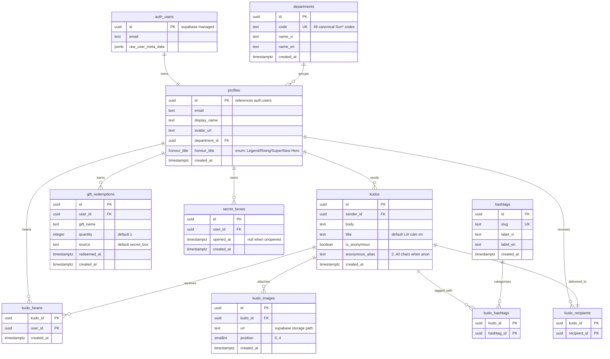

# Database Design — Sun\* Annual Awards 2025

Snapshot ERD of the public schema after all 21 migrations. Source of truth for table shapes and relationships lives in [database-schema.sql](database-schema.sql).

## Reading the diagram

- **`||--||`** = one-to-one (e.g. `auth_users` ↔ `profiles`, `kudos` ↔ `kudo_recipients` — current spec is single-recipient per kudo)
- **`||--o{`** = one-to-many (standard FK relationship)
- **`PK`** marks the primary key. On junction tables (`kudo_recipients` / `kudo_hashtags` / `kudo_hearts`) the composite PK columns are also foreign keys to their parent tables — Mermaid's `erDiagram` syntax only supports a single marker per row, so FK semantics are noted in the column comment where helpful.

## ERD

