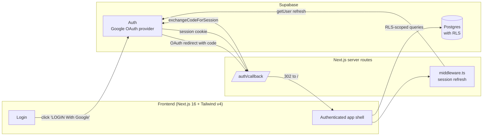

# Screen Flow Overview

## Project Info

- **Project Name**: Agentic Coding Hands-on (Sun Annual Awards 2025)
- **Figma File Key**: `9ypp4enmFmdK3YAFJLIu6C`
- **Figma URL**: https://www.figma.com/design/9ypp4enmFmdK3YAFJLIu6C
- **MoMorph URL**: https://momorph.ai/files/9ypp4enmFmdK3YAFJLIu6C
- **Created**: 2026-04-17
- **Last Updated**: 2026-04-17

---

## Scope

- **In scope**: Website (responsive web app, desktop-first per Figma 1440×1024
  design viewport — mobile/tablet breakpoints derived).
- **Out of scope**: iOS native app (37 `[iOS]`-prefixed frames), any native
  Android app.
- **Deferred (post-MVP)**: Admin area, secret box / giftbox event interactions,
  community standards pages, notification detail views. Kept in inventory for
  traceability but not part of Phase 1 delivery.
- **Hidden from this doc**: Design-system atoms (Button, Icon, Color,
  Typography, Frame 477-554, …) — 45 frames. Handled during per-screen style
  extraction, not as separate specs.

---

## Discovery Progress

| Metric | Count |
|--------|-------|
| Total web screens (in scope) | 29 |
| Discovered | 1 |
| Implemented | 1 |
| Remaining | 28 |
| Completion | 3% |

Out-of-scope frames (informational): iOS 37 · design-system 45 · deferred
overlays 42.

---

## MVP Screens (Phase 1 priority)

These are the screens required to ship a functional SAA 2025 website. Complete
these before touching the deferred groups.

| # | Screen Name | Frame ID | Type | Status | Detail File | Purpose |
|---|-------------|----------|------|--------|-------------|---------|
| 1 | Login | `GzbNeVGJHz` | screen | **implemented** | [login.md](login.md) · [spec](../../specs/GzbNeVGJHz-login/spec.md) · [page](../../../src/app/(public)/login/page.tsx) | Google OAuth entry point |
| 2 | Homepage SAA | `i87tDx10uM` | screen | pending | — | Post-login landing, event info, awards, kudos widget |
| 3 | Hệ thống giải | `zFYDgyj_pD` | screen | pending | — | Award categories list + detail cards |
| 4 | Sun* Kudos - Live board | `MaZUn5xHXZ` | screen | pending | — | Live kudos feed |
| 5 | Viết Kudo | `ihQ26W78P2` | screen | pending | — | Compose a kudo |
| 6 | Viết KUDO - Lỗi chưa điền đủ | `5c7PkAibyD` | screen | pending | — | Viết Kudo form error state |
| 7 | View Kudo | `onDIohs2bS` | screen | pending | — | Read a single kudo |
| 8 | Profile bản thân | `3FoIx6ALVb` | screen | pending | — | Own profile |
| 9 | Profile người khác | `w4WUvsJ9KI` | screen | pending | — | Other user's profile |
| 10 | Thể lệ UPDATE | `b1Filzi9i6` | screen | pending | — | Event rules |
| 11 | Countdown - Prelaunch page | `8PJQswPZmU` | screen | pending | — | Pre-event countdown |
| 12 | Tất cả thông báo | `6-1LRz3vqr` | screen | pending | — | Notification centre |
| 13 | Error page - 403 | `T3e_iS9PCL` | screen | stub | [page](../../../src/app/error/403/page.tsx) | Denied-domain redirect target |
| 14 | Error page - 404 | `p0yJ89B-9_` | screen | stub | [page](../../../src/app/error/404/page.tsx) | Not found |

MVP overlays (directly referenced by MVP screens):

| Overlay | Frame ID | Used by |
|---------|----------|---------|
| Dropdown-ngôn ngữ | `hUyaaugye2` | Login, Homepage header, every authenticated screen |
| Dropdown-profile | `z4sCl3_Qtk` | Header on authenticated screens |
| Dropdown Hashtag filter | `JWpsISMAaM` | Live board |
| Dropdown Phòng ban | `WXK5AYB_rG` | Live board |
| Dropdown list hashtag | `p9zO-c4a4x` | Compose kudo |
| Addlink Box | `OyDLDuSGEa` | Compose kudo / editor |
| Alert Overlay | `ZUofoTelpc` | Error handling site-wide |
| Floating Action Button | `_hphd32jN2` | Live board / homepage |

---

## Full Web Screen Inventory

All in-scope web screens including the MVP set above plus post-MVP items.

### Core user-facing (web)

| # | Screen Name | Frame ID | Status | MVP? |
|---|-------------|----------|--------|------|
| 1 | Login | `GzbNeVGJHz` | implemented | ✅ |
| 2 | Homepage SAA | `i87tDx10uM` | pending | ✅ |
| 3 | Countdown - Prelaunch page | `8PJQswPZmU` | pending | ✅ |
| 4 | Sun* Kudos - Live board | `MaZUn5xHXZ` | pending | ✅ |
| 5 | Viết Kudo | `ihQ26W78P2` | pending | ✅ |
| 6 | Viết KUDO - Lỗi chưa điền đủ | `5c7PkAibyD` | pending | ✅ |
| 7 | Gửi lời chúc Kudos (A) | `JsTvi8KVQA` | pending | — |
| 8 | Gửi lời chúc Kudos (B) | `RO7O6QOhfJ` | pending | — |
| 9 | View Kudo | `onDIohs2bS` | pending | ✅ |
| 10 | KUDO | `Qhg3SUg_8L` | pending | — |
| 11 | KUDO (b) | `49Qr2oIjMV` | pending | — |
| 12 | KUDO - Highlight | `n56Yyp7Klu` | pending | — |
| 13 | KUDO spam | `JYHZJyOwT-` | pending | — |
| 14 | Màn Sửa bài viết (edit mode) | `419VXmMy6I` | pending | — |
| 15 | Profile bản thân | `3FoIx6ALVb` | pending | ✅ |
| 16 | Profile người khác | `w4WUvsJ9KI` | pending | ✅ |
| 17 | Hệ thống giải | `zFYDgyj_pD` | pending | ✅ |
| 18 | Tất cả thông báo | `6-1LRz3vqr` | pending | ✅ |
| 19 | View thông báo | `gWBVcaSVIf` | pending | — |
| 20 | Notification | `D_jgDqvIc8` | pending | — |
| 21 | Thể lệ UPDATE | `b1Filzi9i6` | pending | ✅ |
| 22 | Tiêu chuẩn cộng đồng | `Dpn7C89--r` | pending | — |
| 23 | Chúc mừng | `SOzErYSp_S` | pending | — |
| 24 | Details | `AyMaiSOBqz` | pending | — |
| 25 | Ẩn danh | `p9vFVBE_tc` | pending | — |

### Errors

| # | Screen Name | Frame ID | Status | MVP? |
|---|-------------|----------|--------|------|
| 26 | Error page - 403 | `T3e_iS9PCL` | stub (placeholder) | ✅ |
| 27 | Error page - 404 | `p0yJ89B-9_` | stub (placeholder) | ✅ |

### Admin (deferred to Phase 2)

| # | Screen Name | Frame ID | Status |
|---|-------------|----------|--------|
| 28 | Admin - Overview | `9ja9g9iJLW` | deferred |
| 29 | Admin - Review content | `MTExSUSdUn` | deferred |
| 30 | Admin - Review content - Search | `kO5qYafrMh` | deferred |
| 31 | Admin - Setting | `fTCVEC9aV_` | deferred |
| 32 | Admin - Setting - add Campaign | `cb7kD3-Xr6` | deferred |
| 33 | Admin - Setting - add new Campaign | `FVA7A5f8z8` | deferred |
| 34 | Admin - Setting - Edit Campaign | `htgRaDTO2f` | deferred |
| 35 | Admin - User | `-u1lKib0JL` | deferred |

### Secret box / giftbox flow (deferred)

Animation-heavy sequence (11 frames for open states, standby 1–8, gift unwrap).
Deferred to Phase 2. Frames: `_YLVd7Ij6e`, `A3J33jY-Wp`, `hCRbDKyaoT`,
`K-LuEblC08`, `p0qHd6DJ6A`, `m0zV-VstXX`, `J3-4YFIpMM`, `iJqdwTEiDj`,
`P5b2MJQoW6`, `VsjjEDVgEx`, `iEhDBe3Id-`, `2i7DgydylV`, `cgeDZw-tDh`,
`sACeeoE6Ge`, `AzMhNg8aqW`.

### Legacy "Thể lệ - DONE" drafts

Frames `4TMyWyKO1U`, `tajvZVN9v7`, `EWoWPJkDtV` are earlier drafts of the
`Thể lệ UPDATE` screen (`b1Filzi9i6`). Use the UPDATE version; the DONE frames
are archive references only.

---

## Overlays (Dropdowns / Popovers / Alerts)

Implemented as components attached to their parent screens during detailed
analysis — not separate routes. MVP overlays are listed above; the table below
is the full inventory for reference.

| Overlay | Frame ID | Category |
|---------|----------|----------|
| Dropdown-ngôn ngữ | `hUyaaugye2` | language |
| Dropdown-profile | `z4sCl3_Qtk` | profile |
| Dropdown-profile Admin | `54rekaCHG1` | profile (admin) |
| Dropdown Hashtag filter | `JWpsISMAaM` | filter |
| Dropdown list hashtag | `p9zO-c4a4x` | hashtag list |
| Dropdown Phòng ban | `WXK5AYB_rG` | filter |
| Dropdown-filter đã nhận/gửi | `rQqxNoXoii` | filter |
| Dropdown chọn thời gian | `lJj0-WlUn5` | filter |
| Dropdown level | `hb4kPwSKkk` | filter |
| Dropdown-List | `MWNZNCBr8_` | generic |
| Dropdown list người đã gửi | `neIUcD-nc-` | recipient |
| Dropdown list người nhận | `zJzaC9GgXt` | recipient |
| Dropdown list người nhận muốn gửi lời chúc | `QIMJNgFb8K` | recipient |
| Dropdown list phòng ban | `eFStQCJZaQ` | filter |
| Dropdown list status | `UBeTfWM-AP` | filter |
| Dropdown Role | `GLgos3fOmz` | admin |
| Dropdown search user admin | `BFf3J-wRPk` | admin |
| Language Dropdown | `IiLVGkACbt` | language (duplicate) |
| Language | `IfiszsIS8J` | language (label only) |
| date picker | `uTv7uXESrg` | date |
| pick date | `MUBrftq_gD` | date |
| Addlink Box | `OyDLDuSGEa` | editor dialog |
| Alert Overlay | `ZUofoTelpc` | alert |
| Popup delete campaign | `ri1JUJwp3v` | admin confirm |
| Floating Action Button | `_hphd32jN2` | FAB |
| Floating Action Button 2 | `Sv7DFwBw1h` | FAB variant |
| Action - Campaign | `Nj4PY0mUJJ` | FAB action menu |
| Action - Public | `HvTGgQhpzx` | post action menu |
| Action - Spam | `bdfLU1n1Tt` | moderation menu |
| Hover Avatar info user | `Bf5XiTE7AO` | hover card |
| Hover campain | `gI07KYVJWE` | hover card |
| Hover danh hiệu Legend Hero | `XI0QKVv1qZ` | hover tooltip |
| Hover danh hiệu New Hero | `twC9br89ra` | hover tooltip |
| Hover danh hiệu Rising Hero | `IjeDnHmzou` | hover tooltip |
| Hover danh hiệu Super Hero | `d6zEZ9ccoX` | hover tooltip |
| Infor | `c9oN8CW9aa` | info panel |
| Infor - HoverAvatar (a) | `XERzyqz7lT` | hover card |
| Infor - HoverAvatar (b) | `Avr4N77jbF` | hover card |
| NOTE Highlight (a) | `5i_H9Pks2a` | highlight |
| NOTE Highlight (b) | `8cYoyqtAM6` | highlight |
| NOTE Highlight (c) | `gawvLLlQ-o` | highlight |
| C_Filter | `7zur22HAsh` | filter bar |

---

## Out-of-Scope (reference only)

### iOS native app — 37 frames, excluded from this project

The Figma file contains a full iOS design set under `[iOS]` prefix. These
screens are **not** part of this web project. If mobile support is needed,
address via responsive web design on the in-scope screens above.

<details>
<summary>iOS frame list (click to expand)</summary>

| Screen Name | Frame ID |
|-------------|----------|
| [iOS] Home | `OuH1BUTYT0` |
| [iOS] Login | `8HGlvYGJWq` |
| [iOS] Access denied | `k-7zJk2B7s` |
| [iOS] Not Found | `sn2mdavs1a` |
| [iOS] Notifications | `_b68CBWKl5` |
| [iOS] Profile bản thân | `hSH7L8doXB` |
| [iOS] Profile người khác | `bEpdheM0yU` |
| [iOS] Thể lệ | `zIuFaHAid4` |
| [iOS] Open secret box | `kQk65hSYF2` |
| [iOS] Open secret box - action bấm mở | `KUmv414uC9` |
| [iOS] Open secret box - Standby 1–7 | `-LIblaeusT`, `IXpGakYRm5`, `_cWAEarZPi`, `scvV-OQCAJ`, `wsI6gaO_yc`, `FvTOS7oCPU`, `xptNUunBS_` |
| [iOS] Sun*Kudos | `fO0Kt19sZZ` |
| [iOS] Sun*Kudos_All Kudos | `j_a2GQWKDJ` |
| [iOS] Sun*Kudos_dropdown hashtag | `V5GRjAdJyb` |
| [iOS] Sun*Kudos_dropdown phòng ban | `76k69LQPfj` |
| [iOS] Sun*Kudos_Gửi lời chúc Kudos | `PV7jBVZU1N` |
| [iOS] Sun*Kudos_Gửi lời chúc - dropdown hashtag | `aKWA2klsnt` |
| [iOS] Sun*Kudos_Gửi lời chúc - dropdown tên người nhận | `5MU728Tjck` |
| [iOS] Sun*Kudos_Lỗi chưa điền hết | `0le8xKnFE_` |
| [iOS] Sun*Kudos_Searching | `hldqjHoSRH` |
| [iOS] Sun*Kudos_Search Sunner | `3jgwke3E8O` |
| [iOS] Sun*Kudos_Tiêu chuẩn cộng đồng | `xms7csmDhD` |
| [iOS] Sun*Kudos_Viết Kudo_default | `7fFAb-K35a` |
| [iOS] Sun*Kudos_View kudo | `T0TR16k0vH` |
| [iOS] Sun*Kudos_View kudo ẩn danh | `5C2BL6GYXL` |
| [iOS] Award_Best Manager | `7y195PPTxQ` |
| [iOS] Award_MVP | `b2BuS8HYIt` |
| [iOS] Award_Signature 2025 - Creator | `O98TwiHaJe` |
| [iOS] Award_Top project | `FQoJZLkG_d` |
| [iOS] Award_Top project leader | `QQvsfK3yaK` |
| [iOS] Award_Top talent | `c-QM3_zjkG` |
| [iOS] Language dropdown | `uUvW6Qm1ve` |

</details>

### Design system atoms — 45 frames, excluded

Tokens, primitives, variants (Button, Icon, Color, Typography, Grid, LOGO,
Frame 477–554, etc.) are not separate screen specs. They feed the style
extraction phase — see [design-style.md](../../specs/GzbNeVGJHz-login/design-style.md)
for how tokens are handled per screen.

---

## Navigation Graph (web only)

```mermaid
flowchart TD
    subgraph Auth["Authentication (web)"]
        Login[Login\nGzbNeVGJHz\n✅ implemented]
        LangDrop[Dropdown-ngôn ngữ\nhUyaaugye2]
        Err403[Error 403\nT3e_iS9PCL\nstub]
        Err404[Error 404\np0yJ89B-9_\nstub]
    end

    subgraph Core["Core Application (web)"]
        Home[Homepage SAA\ni87tDx10uM]
        Awards[Hệ thống giải\nzFYDgyj_pD]
        Liveboard[Sun* Kudos Live board\nMaZUn5xHXZ]
        Compose[Viết Kudo\nihQ26W78P2]
        ComposeErr[Viết Kudo — error\n5c7PkAibyD]
        View[View Kudo\nonDIohs2bS]
        Profile[Profile bản thân\n3FoIx6ALVb]
        ProfileOther[Profile người khác\nw4WUvsJ9KI]
        Notifs[Tất cả thông báo\n6-1LRz3vqr]
        Rules[Thể lệ\nb1Filzi9i6]
        Countdown[Countdown\n8PJQswPZmU]
    end

    Login -- Google OAuth success --> Home
    Login -- click "VN" --> LangDrop
    Login -- denied domain --> Err403

    Home --> Awards
    Home --> Liveboard
    Home --> Rules
    Home --> Notifs
    Home --> Profile
    Home --> Countdown

    Awards -.-> Liveboard
    Liveboard --> View
    Liveboard --> Compose
    Compose --> ComposeErr
    Compose --> View
    View --> ProfileOther
    ProfileOther --> ProfileOther
```

Only edges verified for the `Login` screen are **High** confidence (Google
OAuth → Homepage; language toggle → Dropdown-ngôn ngữ). Other edges are
informed guesses pending per-screen node-tree analysis.

---

## Screen Groups (web-only)

### Group: Authentication

| Screen | Frame ID | Purpose | Entry Points |
|--------|----------|---------|--------------|
| Login | `GzbNeVGJHz` | Google OAuth entry | App launch, logout, 403 |
| Error page - 403 | `T3e_iS9PCL` | Forbidden / unauthorized | Auth failures |
| Error page - 404 | `p0yJ89B-9_` | Not found | Invalid routes |

### Group: Core App

| Screen | Frame ID | Purpose | Entry Points |
|--------|----------|---------|--------------|
| Homepage SAA | `i87tDx10uM` | Post-login landing | After login |
| Hệ thống giải | `zFYDgyj_pD` | Awards & heroes | Homepage |
| Sun* Kudos - Live board | `MaZUn5xHXZ` | Live kudos feed | Homepage, Awards |
| Viết Kudo | `ihQ26W78P2` | Compose kudo | FAB, menu |
| Viết Kudo - error | `5c7PkAibyD` | Form validation error | Compose submit |
| View Kudo | `onDIohs2bS` | Read a kudo | Live board |
| Profile bản thân | `3FoIx6ALVb` | Own profile | Header menu |
| Profile người khác | `w4WUvsJ9KI` | Other user profile | Kudo author click |
| Tất cả thông báo | `6-1LRz3vqr` | Notification centre | Header bell |
| View thông báo | `gWBVcaSVIf` | Single notification | Notification centre |
| Thể lệ UPDATE | `b1Filzi9i6` | Rules / terms | Homepage |
| Tiêu chuẩn cộng đồng | `Dpn7C89--r` | Community standards | Compose / footer |
| Countdown - Prelaunch | `8PJQswPZmU` | Pre-event countdown | Direct URL |
| Chúc mừng | `SOzErYSp_S` | Post-send celebration | After kudo submit |
| Ẩn danh | `p9vFVBE_tc` | Anonymous kudo mode | Compose |

### Group: Admin (deferred to Phase 2)

| Screen | Frame ID | Purpose |
|--------|----------|---------|
| Admin - Overview | `9ja9g9iJLW` | Admin dashboard |
| Admin - Review content | `MTExSUSdUn` | Moderation queue |
| Admin - Review content - Search | `kO5qYafrMh` | Moderation search |
| Admin - Setting | `fTCVEC9aV_` | Campaign/system settings |
| Admin - Setting - add Campaign | `cb7kD3-Xr6` | Campaign picker |
| Admin - Setting - add new Campaign | `FVA7A5f8z8` | Create campaign |
| Admin - Setting - Edit Campaign | `htgRaDTO2f` | Edit campaign |
| Admin - User | `-u1lKib0JL` | User management |

---

## API Endpoints Summary

Only endpoints with **high** or **medium** confidence are listed; the list
will grow as more screens are analyzed.

| Endpoint | Method | Screens Using | Purpose |
|----------|--------|---------------|---------|
| Supabase Auth `/auth/v1/authorize?provider=google` | POST / redirect | Login | Initiate Google OAuth |
| `/auth/callback` (Next.js Route Handler) | GET | Login | Exchange OAuth code for session |
| `/auth/session` (Supabase SSR) | GET | Login, every authenticated screen | Read current session |
| `setLocale` Server Action | POST (form) | Every screen (header) | Persist `NEXT_LOCALE` cookie |

---

## Data Flow (web)



---

## Technical Notes

### Authentication Flow

- Google OAuth via **Supabase Auth**. No username/password, no custom auth
  logic (constitution Principle V).
- Session cookie managed by `@supabase/ssr` (HttpOnly, Secure, SameSite=Lax).
- Session re-verified on the server for every protected route; the root
  `middleware.ts` calls `updateSession` on every request.

### State Management

- Server state comes from Server Components + Server Actions (no client data
  fetcher library in the base stack).
- Client state: React hooks only, per `constitution.md` Principle V. No
  global store introduced yet.

### Routing

- Next.js App Router (`src/app/`). Route-level UX uses `loading.tsx`,
  `error.tsx`, `not-found.tsx`.
- Public routes: `/login`, `/error/403`, `/error/404`.
- Post-login: `/` (Homepage), `/awards`, `/kudos/*`, `/profile/*`, etc. (wire
  as screens get implemented).

### i18n

- Two locales in-scope: `vi` (default) and `en`.
- Locale held in `NEXT_LOCALE` cookie, written by the `setLocale` Server
  Action, consumed by `getMessages()` server-side.
- Message catalogs live in [src/messages/](../../../src/messages/).

### Responsive strategy

Since iOS is out of scope, the "platform-appropriate UI" principle from the
constitution reduces to **responsive web design**:

- Mobile-first Tailwind utilities (`sm:`, `md:`, `lg:`, `xl:`, `2xl:`).
- Layouts usable from 320 px to 1920 px wide.
- Touch targets ≥ 44 × 44 px on touch viewports.
- WCAG 2.2 AA; axe-core automated sweep gated in CI per spec SC-003.

---

## Discovery Log

| Date | Action | Screens | Notes |
|------|--------|---------|-------|
| 2026-04-17 | Initial discovery + inventory | 1 of 165 raw frames | Seeded SCREENFLOW. Processed Login. |
| 2026-04-17 | Login shipped | 1 implemented | Full Phase 1 + 2 + 3 + 4 + 5 delivered; 74/77 tasks done. |
| 2026-04-17 | Scope narrowed to web-only | — | Dropped 37 iOS frames + 45 design-system frames from the inventory. Web scope: 29 screens + 42 overlays. |

---

## Next Steps

1. **Process `Homepage SAA` (`i87tDx10uM`)** via `/momorph.specify` — it's the
   immediate post-login landing and unblocks `Hệ thống giải`, `Live board`,
   `Profile`, `Notifications`.
2. **Process `Dropdown-ngôn ngữ` (`hUyaaugye2`)** — Login already references it;
   a real spec replaces the prototype in
   [src/components/login/LanguageDropdown.tsx](../../../src/components/login/LanguageDropdown.tsx).
3. **Process `Sun* Kudos - Live board` (`MaZUn5xHXZ`)** + **`Viết Kudo`
   (`ihQ26W78P2`)** — the central product features.
4. **Process `Hệ thống giải` (`zFYDgyj_pD`)** — awards listing with scroll-spy
   navigation per the notes in earlier discovery.
5. **Flesh out `Error 403` / `Error 404` Figma frames** (`T3e_iS9PCL`,
   `p0yJ89B-9_`) — current implementations are minimal stubs.
6. **Defer Admin group** until the public-facing MVP is shipped.
