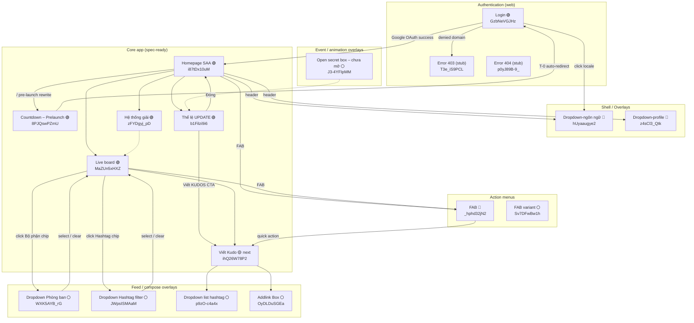
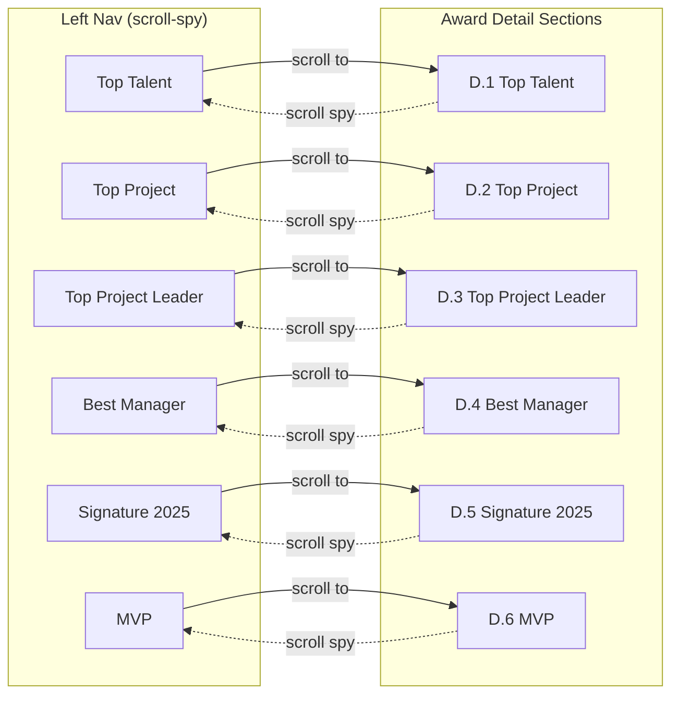
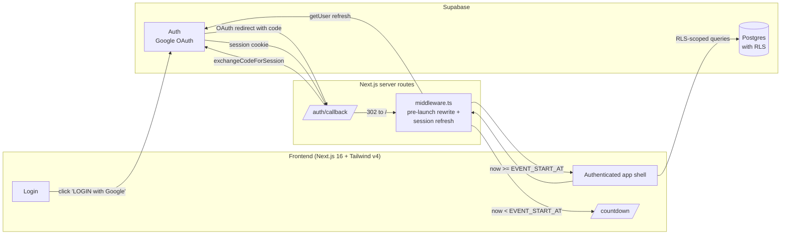

# Screen Flow Overview

## Project Info
- **Project Name**: Sun* Annual Awards (SAA) 2025
- **Figma File Key**: `9ypp4enmFmdK3YAFJLIu6C`
- **Figma URL**: https://www.figma.com/design/9ypp4enmFmdK3YAFJLIu6C
- **MoMorph URL**: https://momorph.ai/files/9ypp4enmFmdK3YAFJLIu6C
- **Created**: 2026-04-17
- **Last Updated**: 2026-04-21 (formally added `Dropdown Phòng ban` `WXK5AYB_rG` as a Live-board popover sibling of the Hashtag filter at row #13 — 18 frames tracked)

---

## Scope

This document tracks **only the Website deliverable** and **only frames
whose design has been finalised and whose spec has been prepared on
MoMorph**. Source of truth: the Figma sidebar's `Screens > With design`
group (verified 2026-04-19 against a user screenshot — 16 frames).

- **In scope**: 18 spec-ready frames (5 shipped screens + 2 next-up
  screens + 1 compose-editor overlay + 8 dropdown overlays + 2 FAB
  overlays + 1 secret-box animation overlay).
- **Out of scope / not tracked here**: iOS native app (37 `[iOS]` frames),
  design-system atoms (~45 frames), Admin full screens (Phase 2, 8
  frames), remaining secret-box animation sequence (Phase 2, ~14 frames
  — only the one in the `With design` group is tracked below), and any
  web frame without a MoMorph spec (Profile, Notifications, View Kudo,
  Chúc mừng, Ẩn danh, Tiêu chuẩn cộng đồng, KUDO variants, hover cards,
  etc.).
- **Error pages** (`T3e_iS9PCL` 403, `p0yJ89B-9_` 404) — listed below as
  code stubs; they have a Figma frame but no MoMorph spec yet.

### Identifier choice — screen_id vs node_id

**Recommendation: keep using `screen_id`** (e.g. `MaZUn5xHXZ`) as the
primary tracking key. Both are listed in the table below so you can
deep-link into Figma when needed.

| Aspect | `screen_id` (e.g. `MaZUn5xHXZ`) | `node_id` (e.g. `2940:13431`) |
|--------|----------------------------------|--------------------------------|
| MoMorph MCP tools input | ✅ required by every tool (`list_frame_styles`, `get_frame_node_tree`, `get_frame_image`, …) | ❌ not accepted |
| Existing repo layout | ✅ `.momorph/specs/{screenId}-{name}/` — already the convention | ❌ not used |
| Stability | ✅ stable across Figma renames / re-exports | ⚠️ can change if a frame is deleted + re-inserted |
| Figma deep-linking | ⚠️ indirect — go via MoMorph URL | ✅ works natively (`?node-id=2940-13431` in Figma URL) |
| Human readability | ⚠️ opaque string | ✅ slightly more recognisable when browsing Figma directly |

Net: the friction is all on the MoMorph/tooling side if we switch to
node_id, zero-friction if we stay on screen_id. We'll keep `screen_id`
as the key and surface `node_id` in the table as a convenience column
for Figma-side work.

---

## Discovery Progress

| Metric                              | Count |
|-------------------------------------|-------|
| Spec-ready web frames (in scope)    | 18    |
| Shipped                             | 8     |
| Locally spec'd, impl pending        | 0     |
| Next up (implementation pending)    | 1     |
| Overlays pending implementation     | 9     |
| Error-page stubs (awaiting spec)    | 2     |
| Actionable completion               | 50%   |

---

## Screens

All 18 web frames from the Figma `Screens > With design` group. Primary
key is `screen_id`; `node_id` is the Figma-native identifier, provided
as a convenience for deep-linking into Figma
(`?node-id=<node_id>` in the file URL).

Status legend: 🟢 shipped · 🟡 next up · 📋 spec'd (local spec
authored, implementation not started) · ⚪ spec-ready pending (overlay
component not yet built) · 🔵 prototype (component exists in code but
spec has not been reconciled against it).

| # | Screen Name | screen_id | node_id | MoMorph Link | Status | Detail File | Predicted APIs | Navigations To |
|---|-------------|-----------|---------|--------------|--------|-------------|----------------|----------------|
| 1 | Login | `GzbNeVGJHz` | `662:14387` | [Link](https://momorph.ai/files/9ypp4enmFmdK3YAFJLIu6C/screens/GzbNeVGJHz) | 🟢 shipped | [login.md](login.md) · [spec](../../specs/GzbNeVGJHz-login/spec.md) · [page](../../../src/app/(public)/login/page.tsx) | Supabase `POST /auth/v1/authorize?provider=google`, `GET /auth/callback` | Homepage SAA, Dropdown-ngôn ngữ, Error 403 |
| 2 | Homepage SAA | `i87tDx10uM` | `2167:9026` | [Link](https://momorph.ai/files/9ypp4enmFmdK3YAFJLIu6C/screens/i87tDx10uM) | 🟢 shipped | [spec](../../specs/i87tDx10uM-homepage-saa/spec.md) · [design-style](../../specs/i87tDx10uM-homepage-saa/design-style.md) · [page](../../../src/app/page.tsx) | `GET /events/current`, `GET /awards`, `GET /kudos/summary`, `GET /notifications/unread`, `GET /users/me` | Hệ thống giải, Thể lệ UPDATE, Live board, Countdown (pre-launch rewrite), Dropdown-ngôn ngữ, Dropdown-profile, Viết Kudo (FAB) |
| 3 | Countdown – Prelaunch page | `8PJQswPZmU` | `2268:35127` | [Link](https://momorph.ai/files/9ypp4enmFmdK3YAFJLIu6C/screens/8PJQswPZmU) | 🟢 shipped | [countdown.md](countdown.md) · [spec](../../specs/8PJQswPZmU-countdown/spec.md) · [page](../../../src/app/countdown/page.tsx) | `GET /events/current` (env-var sourced for MVP) | Login (at T-0 auto-redirect) |
| 4 | Hệ thống giải | `zFYDgyj_pD` | `313:8436` | [Link](https://momorph.ai/files/9ypp4enmFmdK3YAFJLIu6C/screens/zFYDgyj_pD) | 🟢 shipped | [spec](../../specs/zFYDgyj_pD-awards-system/spec.md) · [design-style](../../specs/zFYDgyj_pD-awards-system/design-style.md) · [page](../../../src/app/awards/page.tsx) | `GET /awards`, `GET /notifications/unread`, `GET /users/me` | Homepage SAA, Sun* Kudos Live board, Dropdown-ngôn ngữ, Dropdown-profile |
| 5 | Thể lệ UPDATE | `b1Filzi9i6` | _(fetch via MoMorph)_ | [Link](https://momorph.ai/files/9ypp4enmFmdK3YAFJLIu6C/screens/b1Filzi9i6) | 🟢 shipped | [the-le.md](the-le.md) · [spec](../../specs/b1Filzi9i6-the-le/spec.md) · [page](../../../src/app/the-le/page.tsx) | None (static content, MVP) | Homepage SAA (Đóng), Viết Kudo (CTA) |
| 6 | Sun* Kudos – Live board | `MaZUn5xHXZ` | `2940:13431` | [Link](https://momorph.ai/files/9ypp4enmFmdK3YAFJLIu6C/screens/MaZUn5xHXZ) | 🟢 shipped | [spec](../../specs/MaZUn5xHXZ-kudos-live-board/spec.md) · [design-style](../../specs/MaZUn5xHXZ-kudos-live-board/design-style.md) · [plan](../../specs/MaZUn5xHXZ-kudos-live-board/plan.md) · [tasks](../../specs/MaZUn5xHXZ-kudos-live-board/tasks.md) · [DEPLOY](../../specs/MaZUn5xHXZ-kudos-live-board/DEPLOY.md) · [page](../../../src/app/kudos/page.tsx) | `GET /kudos`, `GET /kudos?hashtag=…`, `GET /kudos?department=…`, `POST /kudos/:id/hearts` | Viết Kudo, Dropdown Phòng ban, Dropdown Hashtag filter, View Kudo (parked) |
| 7 | Viết Kudo | `ihQ26W78P2` | `520:11602` | [Link](https://momorph.ai/files/9ypp4enmFmdK3YAFJLIu6C/screens/ihQ26W78P2) | 🟡 next up | — | `POST /kudos`, `GET /users?search=…`, `GET /hashtags` | Live board, Dropdown list hashtag, Addlink Box, Viết Kudo error state (fold into same spec) |
| 8 | Dropdown-ngôn ngữ | `hUyaaugye2` | `721:4942` | [Link](https://momorph.ai/files/9ypp4enmFmdK3YAFJLIu6C/screens/hUyaaugye2) | 📋 spec'd (prototype) | [spec](../../specs/hUyaaugye2-dropdown-ngon-ngu/spec.md) · [design-style](../../specs/hUyaaugye2-dropdown-ngon-ngu/design-style.md) · [prototype](../../../src/components/login/LanguageDropdown.tsx) | `setLocale` Server Action | Parent: Login, Homepage header, every authenticated screen |
| 9 | Dropdown-profile | `z4sCl3_Qtk` | `721:5223` | [Link](https://momorph.ai/files/9ypp4enmFmdK3YAFJLIu6C/screens/z4sCl3_Qtk) | 🔵 prototype | [src/components/homepage/ProfileMenu.tsx](../../../src/components/homepage/ProfileMenu.tsx) | `signOut` Server Action | Parent: Authenticated header |
| 10 | Dropdown-profile Admin | `54rekaCHG1` | `721:5277` | [Link](https://momorph.ai/files/9ypp4enmFmdK3YAFJLIu6C/screens/54rekaCHG1) | ⚪ pending (admin) | — | `signOut` Server Action | Parent: Admin header (Phase 2) |
| 11 | Dropdown list hashtag | `p9zO-c4a4x` | `1002:13013` | [Link](https://momorph.ai/files/9ypp4enmFmdK3YAFJLIu6C/screens/p9zO-c4a4x) | ⚪ pending | — | `GET /hashtags` | Parent: Viết Kudo |
| 12 | Dropdown Hashtag filter | `JWpsISMAaM` | _(fetch via MoMorph)_ | [Link](https://momorph.ai/files/9ypp4enmFmdK3YAFJLIu6C/screens/JWpsISMAaM) | ⚪ pending | — | `GET /hashtags` | Parent: Live board (FilterBar) — popover; select → apply + close, outside / ESC → close, click selected → clear |
| 13 | Dropdown Phòng ban | `WXK5AYB_rG` | `721:5684` | [Link](https://momorph.ai/files/9ypp4enmFmdK3YAFJLIu6C/screens/WXK5AYB_rG) | ⚪ pending | — | `GET /departments` | Parent: Live board (FilterBar) — popover sibling of Hashtag filter; click Bộ phận chip → open, select department → apply + close, outside / ESC → close, click selected → clear |
| 14 | Addlink Box | `OyDLDuSGEa` | `1002:12917` | [Link](https://momorph.ai/files/9ypp4enmFmdK3YAFJLIu6C/screens/OyDLDuSGEa) | ⚪ pending | — | None (client-side link-insert dialog) | Parent: Viết Kudo editor |
| 15 | Floating Action Button – phím nổi chức năng (collapsed) | `_hphd32jN2` | `313:9137` | [Link](https://momorph.ai/files/9ypp4enmFmdK3YAFJLIu6C/screens/_hphd32jN2) | 🟢 shipped | [spec](../../specs/_hphd32jN2-fab-collapsed/spec.md) · [design-style](../../specs/_hphd32jN2-fab-collapsed/design-style.md) · [plan](../../specs/_hphd32jN2-fab-collapsed/plan.md) · [page](../../../src/components/shell/QuickActionsFab.tsx) | None | Toggles to `Sv7DFwBw1h` expanded |
| 16 | Floating Action Button – phím nổi chức năng 2 (expanded menu) | `Sv7DFwBw1h` | `313:9139` | [Link](https://momorph.ai/files/9ypp4enmFmdK3YAFJLIu6C/screens/Sv7DFwBw1h) | 🟢 shipped | [spec](../../specs/Sv7DFwBw1h-fab-quick-actions/spec.md) · [design-style](../../specs/Sv7DFwBw1h-fab-quick-actions/design-style.md) · [page](../../../src/components/shell/QuickActionsFab.tsx) | None (pure navigation) | Thể lệ UPDATE, Viết Kudo |
| 17 | Open secret box – chưa mở | `J3-4YFIpMM` | `1466:7676` | [Link](https://momorph.ai/files/9ypp4enmFmdK3YAFJLIu6C/screens/J3-4YFIpMM) | ⚪ pending (animation, Phase 2-ish) | — | `POST /secret-boxes/:id/open` (predicted) | Parent: Profile bản thân (parked) |

**Discrepancy resolved (2026-04-20)**: `Dropdown Hashtag filter`
(`JWpsISMAaM`) is now tracked as a Live-board popover (row #12). It
opens from the Kudos Live board (`/kudos`) when the user clicks the
"Hashtag" chip in the `FilterBar`; it is not a route.

**Sibling added (2026-04-21)**: `Dropdown Phòng ban` (`WXK5AYB_rG`) is
now tracked as the other Live-board popover (row #13) — same popover
pattern as the Hashtag filter, different content (department codes
like `SVN-ENG` / `SVN-DES` / … with locale-resolved VN/EN labels). It
opens from the Kudos Live board (`/kudos`) when the user clicks the
"Bộ phận" chip in the `FilterBar`; it is not a route.

Error-page stubs (code live, but awaiting a real MoMorph spec before we
call them finished):

| # | Screen | Frame ID | MoMorph Link | Status | Detail File |
|---|--------|----------|--------------|--------|-------------|
| E1 | Error page – 403 | `T3e_iS9PCL` | [Link](https://momorph.ai/files/9ypp4enmFmdK3YAFJLIu6C/screens/T3e_iS9PCL) | stub | [page](../../../src/app/error/403/page.tsx) |
| E2 | Error page – 404 | `p0yJ89B-9_` | [Link](https://momorph.ai/files/9ypp4enmFmdK3YAFJLIu6C/screens/p0yJ89B-9_) | stub | [page](../../../src/app/error/404/page.tsx) |

---

## Navigation Graph

Legend: 🟢 shipped · 🟡 next up · ⚪ spec-ready pending · 🔵 prototype in
code (spec not reconciled). Edges from shipped screens are High
confidence (verified in code). Edges from 🟡/⚪ items are informed
predictions until we run `/momorph.specify` on them.

---

## In-Page Navigation (Hệ thống giải)

---

## Screen Groups

### Group: Authentication
| Screen | Frame ID | Status | Purpose | Entry Points |
|--------|----------|--------|---------|--------------|
| Login | `GzbNeVGJHz` | 🟢 shipped | Google OAuth entry | App launch, logout, Error 403 |
| Error page – 403 | `T3e_iS9PCL` | stub | Denied domain / unauthorized | Auth failure |
| Error page – 404 | `p0yJ89B-9_` | stub | Not found | Invalid routes |

### Group: Core App
| Screen | Frame ID | Status | Purpose | Entry Points |
|--------|----------|--------|---------|--------------|
| Homepage SAA | `i87tDx10uM` | 🟢 shipped | Post-login landing (event info + awards + kudos promo + countdown) | After login |
| Countdown – Prelaunch | `8PJQswPZmU` | 🟢 shipped | Full-bleed D/H/M tiles pre-event | Middleware rewrite `/` pre-launch, direct URL |
| Hệ thống giải | `zFYDgyj_pD` | 🟢 shipped | Awards listing with scroll-spy | Homepage, header nav |
| Thể lệ UPDATE | `b1Filzi9i6` | 🟢 shipped | Event rules / tiers / collectible badges / Kudos Quốc Dân | Homepage footer nav |
| Sun* Kudos – Live board | `MaZUn5xHXZ` | 🟢 shipped | Live kudos feed | Homepage, Awards |
| Viết Kudo | `ihQ26W78P2` | 🟡 next up | Compose a kudo | FAB, header menu, Rules CTA |

### Group: Dropdowns & Overlays
| Screen | Frame ID | Status | Purpose | Entry Points |
|--------|----------|--------|---------|--------------|
| Dropdown-ngôn ngữ | `hUyaaugye2` | 📋 spec'd (prototype) | Locale toggle (vi / en) | Every screen header |
| Dropdown-profile | `z4sCl3_Qtk` | 🔵 prototype | User menu + sign out | Authenticated header |
| Dropdown-profile Admin | `54rekaCHG1` | ⚪ pending (admin) | Admin user menu | Admin header (Phase 2) |
| Dropdown Hashtag filter | `JWpsISMAaM` | ⚪ pending | Filter Live board feed by hashtag (popover from FilterBar); select → apply + close, click outside → close, clear → reset | Live board FilterBar |
| Dropdown Phòng ban | `WXK5AYB_rG` | ⚪ pending | Filter Live board feed by department (popover sibling of Hashtag filter); click Bộ phận chip → open, select department → apply + close, outside / ESC → close, click selected → clear | Live board FilterBar |
| Dropdown list hashtag | `p9zO-c4a4x` | ⚪ pending | Hashtag picker while composing | Viết Kudo |
| Addlink Box | `OyDLDuSGEa` | ⚪ pending | Link-insert dialog for editor | Viết Kudo |

### Group: Actions & animations
| Screen | Frame ID | Status | Purpose | Entry Points |
|--------|----------|--------|---------|--------------|
| FAB – phím nổi chức năng (collapsed) | `_hphd32jN2` | 📋 spec'd (prototype) | Quick-actions pill, entry state; toggles the expanded menu | Homepage / Live board |
| FAB – phím nổi chức năng 2 (expanded) | `Sv7DFwBw1h` | 📋 spec'd | Expanded menu with Thể lệ + Viết KUDOS + Cancel | Toggled from the collapsed FAB |
| Open secret box – chưa mở | `J3-4YFIpMM` | ⚪ pending (Phase 2-ish) | Pre-open state of the secret-box gamification | Profile own (parked) |

---

## API Endpoints Summary

Only endpoints with high or medium confidence are listed — more will be
added once Live board and Viết Kudo specs are run.

| Endpoint | Method | Screens Using | Purpose |
|----------|--------|---------------|---------|
| Supabase `/auth/v1/authorize?provider=google` | POST / redirect | Login | Initiate Google OAuth |
| `/auth/callback` (Next.js Route Handler) | GET | Login | Exchange OAuth code for session |
| `/auth/session` (Supabase SSR) | GET | Every authenticated screen | Read current session |
| `setLocale` Server Action | POST (form) | Dropdown-ngôn ngữ | Persist `NEXT_LOCALE` cookie |
| `signOut` Server Action | POST (form) | Dropdown-profile | Destroy Supabase session |
| `/events/current` | GET | Homepage SAA, Countdown – Prelaunch | Event info + launch timestamp (env var for MVP) |
| `/awards` | GET | Homepage SAA, Hệ thống giải | List award categories |
| `/kudos/summary` | GET | Homepage SAA | Kudos initiative preview |
| `/kudos` | GET | Live board (predicted) | Kudo feed (hashtag/department filters) |
| `/kudos` | POST | Viết Kudo (predicted) | Create a kudo |
| `/kudos/:id/hearts` | POST | Live board / View Kudo (predicted) | React / heart |
| `/hashtags` | GET | Dropdown Hashtag filter, Dropdown list hashtag (predicted) | List hashtags |
| `/departments` | GET | Dropdown Phòng ban (predicted) | List departments |
| `/notifications/unread` | GET | Homepage, Hệ thống giải, shell | Bell badge count |
| `/users/me` | GET | Shell | Current user profile |

---

## Data Flow

---

## Technical Notes

### Authentication Flow
- Google OAuth via **Supabase Auth**. No username/password, no custom auth
  (constitution Principle V).
- Session cookie managed by `@supabase/ssr` — HttpOnly, Secure,
  SameSite=Lax.
- Re-verified on the server for every protected route via
  `middleware.ts` → `updateSession`.

### Pre-launch routing
- `middleware.ts` rewrites `/` → `/countdown` while
  `Date.now() < NEXT_PUBLIC_EVENT_START_AT`. Documented trade-off: the
  rewrite branch skips session refresh (accepted risk for MVP).
- `/countdown` itself is chromeless + public; a server-side
  `redirect("/login")` fires if someone opens it after T-0.

### State Management
- Server state = Server Components + Server Actions. No client data
  fetcher in the base stack.
- Client state = React hooks only (no global store).

### Routing
- Next.js App Router (`src/app/`). Route-level UX uses `loading.tsx`,
  `error.tsx`, `not-found.tsx`.
- Public routes: `/login`, `/countdown`, `/error/403`, `/error/404`.
- Authenticated routes: `/`, `/awards`, `/the-le` (more to come with
  Live board + Viết Kudo).

### i18n
- Two locales in scope: `vi` (default) and `en`.
- Locale held in `NEXT_LOCALE` cookie, written by the `setLocale`
  Server Action, consumed by `getMessages()` server-side.
- Catalogs in [src/messages/](../../../src/messages/).

### Responsive strategy
Website only — iOS frames are out of scope. Responsive breakpoints per
constitution §II:
- Mobile-first Tailwind utilities (`sm:`, `md:`, `lg:`, `xl:`).
- Touch targets ≥ 44 × 44 px on touch viewports.
- WCAG 2.2 AA; axe-core automated sweep gated in CI.

---

## Discovery Log

| Date | Action | Screens | Notes |
|------|--------|---------|-------|
| 2026-04-17 | Initial discovery | Login | Migrated/seeded from previous SCREENFLOW. Login shipped (74/77 tasks). |
| 2026-04-17 | Homepage SAA specs drafted + shipped | `i87tDx10uM` | Full 8-phase delivery including hero, countdown, awards, Kudos promo, header nav, profile menu. |
| 2026-04-18 | Awards System specs drafted + shipped | `zFYDgyj_pD` | Scroll-spy left nav + 6 award sections + shared FAB/header/footer. |
| 2026-04-18 | Thể lệ UPDATE discovered | `b1Filzi9i6` | Rules panel with Hero tier badges + 6 collectible badges + Kudos Quốc Dân. |
| 2026-04-19 | Thể lệ UPDATE shipped (MVP) | `b1Filzi9i6` | Route-mode `/the-le`; PrimaryButton extended (md/lg × primary/secondary); 2 new tokens; 3 analytics events. |
| 2026-04-19 | Countdown – Prelaunch discovered | `8PJQswPZmU` | Public/chromeless D/H/M LED countdown; shared `useCountdown()` hook extracted from Homepage. |
| 2026-04-19 | Countdown – Prelaunch shipped (MVP) | `8PJQswPZmU` | DSEG7 Classic 7-segment font self-hosted; middleware rewrite for `/`; 2 new analytics events. |
| 2026-04-19 | SCREENFLOW redefined (website-only + spec-ready) | — | Cross-checked `list_frames` tags. 13 spec-ready web frames (5 shipped + 2 next-up + 5 overlays + 1 admin overlay). Moved all non-spec'd in-scope frames out of the tracker (Profile, Notifications, View Kudo, KUDO variants, Chúc mừng, Ẩn danh, Tiêu chuẩn cộng đồng, FAB, hover cards) — awaiting Design to produce specs on MoMorph. Next up: Live board + Viết Kudo (paired sprint). |
| 2026-04-19 | Reconciled scope against Figma `Screens > With design` | — | User provided Figma sidebar screenshot showing 16 frames in the `With design` group. Added 4 frames I'd parked: **Addlink Box** (`OyDLDuSGEa`), **FAB** (`_hphd32jN2`), **FAB variant** (`Sv7DFwBw1h`), **Open secret box – chưa mở** (`J3-4YFIpMM`). Flagged a discrepancy: `Dropdown Hashtag filter` (`JWpsISMAaM`) has MoMorph `"Spec Created"` tag but is NOT in the Figma With-design group — needs Design reconciliation. Also added `node_id` column for Figma deep-linking, and a short comparison explaining why we keep `screen_id` as the primary key. |
| 2026-04-19 | FAB expanded (variant 2) specs drafted | `Sv7DFwBw1h` | Created [spec.md](../../specs/Sv7DFwBw1h-fab-quick-actions/spec.md) + [design-style.md](../../specs/Sv7DFwBw1h-fab-quick-actions/design-style.md). 6 user stories (3 × P1, 2 × P2, 1 × P3 reduced-motion), 11 FRs, 6 TRs, 4 SCs. Zero APIs (pure navigation). 3 tiles — A (Thể lệ → `/the-le`), B (Viết KUDOS → `/kudos/new`), C (red circular Cancel). Reuses `saa`/`pencil`/`close` icons from `Icon.tsx`; reuses `--color-accent-cream*` + `--color-nav-dot` tokens (no new tokens). Implementation will **replace** the current single-item dark-dropdown `QuickActionsFab` in `src/components/homepage/` — design diverges significantly. Open questions: EN translations, whether Thể lệ tile's icon should be `saa` or a generic info/book icon. |
| 2026-04-20 | Sun\* Kudos – Live board shipped | `MaZUn5xHXZ` | Full 11-phase delivery (US1..US9, 114 tasks). Ships feed + hashtag/department filters + optimistic heart (300 ms debounce) + copy-link + highlight carousel (5-slide pan/zoom) + spotlight word-cloud (pan/zoom, search, reduced-motion) + personal stats sidebar. Supabase-from-day-one (7 tables + RLS + 4 migrations + generated types), 11 new design tokens, ~70 i18n leaves × 2 locales, 8 typed analytics events. Test count 256 → 275 after Phase 10 motion + focus-visible sweep; axe-core + responsive E2E files added (gated on `SUPABASE_TEST_SESSION_TOKEN`). See [DEPLOY.md](../../specs/MaZUn5xHXZ-kudos-live-board/DEPLOY.md) for prod runbook. |
| 2026-04-20 | FAB collapsed (variant 1) specs drafted | `_hphd32jN2` | Created [spec.md](../../specs/_hphd32jN2-fab-collapsed/spec.md) + [design-style.md](../../specs/_hphd32jN2-fab-collapsed/design-style.md). 6 user stories (3 × P1, 2 × P2, 1 × P3 reduced-motion), 11 FRs, 7 TRs, 5 SCs. Zero APIs. Pill 106×64 `rounded-full`, three glyphs inside: pen + "/" + saa. Composite `box-shadow` (black drop + warm cream `#FAE287` glow) — new token `--shadow-fab-trigger`. Current `QuickActionsFab.tsx` prototype matches visually but missing glow layer and hover lift. Now that both FAB frames are spec'd, implementation bundles them as a single `<QuickActionsFab>` relocated to `src/components/shell/`. |
| 2026-04-20 | Dropdown Hashtag filter added to tracker | `JWpsISMAaM` | Reconciled the earlier discrepancy by formally adding the popover as row #12 under Dropdowns & Overlays. Sub-screen of Live board (`MaZUn5xHXZ`, `/kudos`): opens from `FilterBar` "Hashtag" chip; exit transitions are select-hashtag (filters feed + closes), click-outside (closes), clear-selection (resets filter). Predicted API: `GET /hashtags`. Still ⚪ pending — spec to be drafted via `/momorph.specify`. |
| 2026-04-21 | Dropdown Phòng ban added to tracker | `WXK5AYB_rG` | Formally added the popover as row #13 under Dropdowns & Overlays, sibling of the Hashtag filter. Sub-screen of Live board (`MaZUn5xHXZ`, `/kudos`): opens from `FilterBar` "Bộ phận" chip; department codes (e.g. `SVN-ENG`, `SVN-DES`, …) with locale-resolved VN/EN labels. Exit transitions: select-department (filters feed by department + closes), click-outside / ESC (closes), click-selected (clears filter). Predicted API: `GET /departments`. Mermaid Navigation Graph now wires `Liveboard -- click Bộ phận chip --> DeptFilter` and `DeptFilter -- select / clear --> Liveboard`. Frame count 17 → 18; overlays pending 8 → 9. Still ⚪ pending — spec to be drafted via `/momorph.specify`, paired with `JWpsISMAaM` so the Live board FilterBar gets both filter dropdowns in one pass. |
| 2026-04-21 | Dropdown-ngôn ngữ specs drafted | `hUyaaugye2` | Reconciled the existing prototype ([src/components/login/LanguageDropdown.tsx](../../../src/components/login/LanguageDropdown.tsx)) against Figma via `/momorph.specify`. Created [spec.md](../../specs/hUyaaugye2-dropdown-ngon-ngu/spec.md) + [design-style.md](../../specs/hUyaaugye2-dropdown-ngon-ngu/design-style.md). 4 user stories (2 × P1 — switch locale + dismiss-without-select; 2 × P2 — keyboard nav + prototype reconciliation), 12 FRs, 5 TRs, 4 SCs. Zero APIs (reuses existing `setLocale` Server Action). Zero new design tokens — reuses `--color-panel-surface` / `--color-border-secondary` / `--color-accent-cream` already landed for Thể lệ + Kudos. Key divergences from the current prototype: (a) visible labels MUST be 2-letter codes `"VN"` / `"EN"` not full names (full name moves to `aria-label`), (b) panel surface switches from `--color-brand-800` to `--color-panel-surface` with the gold `--color-border-secondary` border, (c) EN row needs a new `flag-gb-nir` Icon (currently falls back to `globe`), (d) re-selecting the active locale MUST be a no-op (FR-006). Row #8 flipped from 🔵 prototype to 📋 spec'd (prototype). Paired with `z4sCl3_Qtk` Dropdown-profile as the two header-dropdown reconciliations still pending. |

---

## Next Steps

- [x] **Live board** (`MaZUn5xHXZ`) — shipped 2026-04-20. 114-task,
      11-phase delivery; 275 unit/integration tests; Supabase-from-day-one
      (migrations + RLS + generated types). See
      [DEPLOY.md](../../specs/MaZUn5xHXZ-kudos-live-board/DEPLOY.md).
- [ ] **Viết Kudo** (`ihQ26W78P2`) — same pipeline, paired with Live board
      so compose → post → see-on-board lands in one coherent sprint. Fold
      the `Viết KUDO – Lỗi chưa điền đủ` (`5c7PkAibyD`) error variant into
      this spec.
- [ ] **Feed + compose overlays** (`WXK5AYB_rG`, `JWpsISMAaM`,
      `p9zO-c4a4x`, `OyDLDuSGEa`) — spec them together with their parent
      screens, not as separate routes. `JWpsISMAaM` is the Live-board
      hashtag filter popover; pair it with `WXK5AYB_rG` so the Live
      board FilterBar gets both filter dropdowns in one pass.
- [ ] **Header dropdowns** (`hUyaaugye2`, `z4sCl3_Qtk`) — reconcile existing
      prototypes against their specs via `/momorph.specify`.
- [ ] **FAB — both states as one component** (`_hphd32jN2` + `Sv7DFwBw1h`) —
      both local specs + design styles drafted. Next: run `/momorph.plan`
      once covering both frames (they are two phases of one
      `<QuickActionsFab>`), then `/momorph.tasks` + `/momorph.implement`.
      Replaces the existing single-item dark dropdown prototype in
      [src/components/homepage/QuickActionsFab.tsx](../../../src/components/homepage/QuickActionsFab.tsx);
      relocates the component to `src/components/shell/`.
- [x] **Reconcile `Dropdown Hashtag filter`** (`JWpsISMAaM`) — resolved
      2026-04-20 by adding the frame as a Live-board popover (row #12).
- [ ] **Chase Design for the parked list** — especially Profile own/other
      (`3FoIx6ALVb`, `w4WUvsJ9KI`) and Notifications (`6-1LRz3vqr`,
      `gWBVcaSVIf`). These are MVP-level but blocked on a MoMorph spec.
- [ ] **Error pages** — ask Design for real specs for 403/404 before we
      consider those screens finished.
- [ ] **Dropdown-profile Admin** (`54rekaCHG1`) — spec-ready on MoMorph
      but Admin group is Phase 2. Keep on ice.
- [ ] **Open secret box – chưa mở** (`J3-4YFIpMM`) — gamification animation.
      Low priority; depends on Profile-own (`3FoIx6ALVb`) which is parked.
