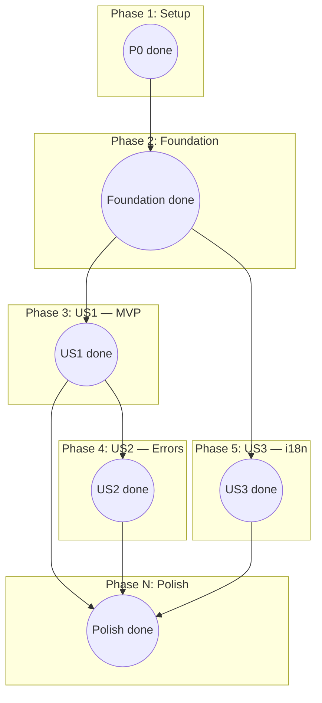

# Tasks: Login (Sun Annual Awards 2025)

**Frame**: `GzbNeVGJHz-Login`
**Prerequisites**: [plan.md](plan.md) (required), [spec.md](spec.md) (required),
[design-style.md](design-style.md) (required), [research.md](research.md) (recommended)
**Stack**: Next.js 16 App Router · React 19 · TypeScript (strict) · Tailwind CSS 4 ·
Supabase Auth (`@supabase/ssr`) · Cloudflare Workers (`@opennextjs/cloudflare`) · Yarn v1

---

## Task Format

```
- [ ] T### [P?] [Story?] Description | file/path.ts
```

- **[P]**: Can run in parallel — different files, no dependencies on incomplete tasks
  in the same phase.
- **[Story]**: `[US1]`, `[US2]`, `[US3]` — required for user-story phases only.
- **|**: Primary file path affected by the task. Related test paths are listed
  inline.
- **TDD (per constitution Principle III)**: For tasks that involve logic (utils,
  services, components with state, route handlers), **write the failing test first**,
  then the implementation. Purely static markup components may skip the test-first
  dance but should still ship with a smoke test.

---

## Phase 1: Setup (Shared Infrastructure) — maps to plan.md Phase 0

**Purpose**: Align the repo with the constitution (move to `src/`, switch to Yarn v1,
install Supabase + Workers adapter + test harness), fix the embedded GitHub token,
and download all six Figma assets. These tasks are repo-wide prerequisites.

- [~] T001 ~~Rotate the plaintext GitHub token~~ — **won't-fix** (dự án học, risk thấp).
      `.mcp.json` đã gitignored, token chưa vào git history. Revisit nếu repo chuyển sang
      sản xuất hoặc account GitHub có private/company code. | (no code change)
- [x] T002 Delete `package-lock.json` and `node_modules/`; run `yarn install`; commit
      `yarn.lock` (Yarn v1 classic per constitution) | `package-lock.json` (delete),
      `yarn.lock` (new)
- [x] T003 [P] Update `.gitignore`: add `.env`, `.env.*`, `!.env.example`, `.env.local`,
      `.wrangler/`, `.open-next/`, `playwright-report/`, `test-results/` | `.gitignore`
- [x] T004 [P] Create `.env.example` with `NEXT_PUBLIC_SITE_URL`,
      `NEXT_PUBLIC_SUPABASE_URL`, `NEXT_PUBLIC_SUPABASE_ANON_KEY`,
      `SUPABASE_SERVICE_ROLE_KEY`, `ALLOWED_EMAIL_DOMAINS` (comma-separated) | `.env.example`
- [x] T005 Move `app/` → `src/app/`; update imports; verify `yarn dev` still serves the
      scaffold page | `src/app/layout.tsx`, `src/app/page.tsx`, `src/app/globals.css`,
      `src/app/favicon.ico`
- [x] T006 Update `tsconfig.json` paths: `"@/*": ["./src/*"]`; verify `yarn tsc --noEmit`
      passes | `tsconfig.json`
- [x] T007 [P] Install Supabase runtime deps: `yarn add @supabase/supabase-js
      @supabase/ssr zod` | `package.json`
- [x] T008 [P] Install Cloudflare Workers dev deps: `yarn add -D @opennextjs/cloudflare
      wrangler` | `package.json`
- [x] T009 [P] Install test deps: `yarn add -D vitest @vitejs/plugin-react
      @testing-library/react @testing-library/jest-dom @testing-library/user-event
      happy-dom @playwright/test` | `package.json`
- [x] T010 [P] Install polish deps: `yarn add -D @axe-core/playwright
      @next/bundle-analyzer eslint-plugin-jsx-a11y prettier plaiceholder` | `package.json`
- [x] T011 [P] Create `wrangler.toml` (name, compat_date, routes placeholder, env vars
      placeholder) | `wrangler.toml`
- [x] T012 [P] Create `open-next.config.ts` per `@opennextjs/cloudflare` template |
      `open-next.config.ts`
- [x] T013 [P] Update `next.config.ts`: add `images.remotePatterns` (if any) and any
      Workers-specific flags | `next.config.ts`
- [x] T014 [P] Create `Makefile` with targets `up`, `dev`, `down`, `test`, `e2e`, `check`
      (`lint + typecheck + test`), `analyze` | `Makefile`
- [x] T015 [P] Download bitmap assets via `mcp__momorph__get_media_files`
      (`MM_MEDIA_Root Further Logo` `2939:9548`, `C_Keyvisual` child `662:14389`,
      `MM_MEDIA_Logo` `I662:14391;178:1033;178:1030`) | `public/images/root-further.png`,
      `public/images/login-bg.jpg`, `public/images/saa-logo.svg` (SVG if available else PNG)
- [x] T016 [P] Download icon assets via `mcp__momorph__get_media_files`
      (`MM_MEDIA_VN` `178:1020`, `MM_MEDIA_Down` `186:1862`, `MM_MEDIA_Google`
      `662:14662`) | `src/icons/flag-vn.svg`, `src/icons/chevron-down.svg`,
      `src/icons/google.svg`
- [x] T017 [P] Author `src/icons/globe.svg` placeholder for non-VI locales (per plan
      Q-P5; replace with country flag once design decides) | `src/icons/globe.svg`
- [x] T018 Verify Phase-1 exit criteria: `yarn install` clean, `yarn dev` serves
      `src/app/page.tsx`, `yarn build` produces a Workers bundle, `.mcp.json` token
      rotated, six Figma assets present | (verification only)

---

## Phase 2: Foundation (Blocking Prerequisites) — maps to plan.md Phase 1

**Purpose**: Build the shared rails every user story depends on (design tokens,
fonts, UI primitives, Supabase client factories, i18n, test harness, CI).

**⚠️ CRITICAL**: No user story work can begin until this phase is complete.

- [x] T019 [P] Extend `tailwind.config.ts` with brand tokens (`brand.900=#00101A`,
      `brand.800=#0B0F12`, `accent.cream=#FFEA9E`, `divider=#2E3940`) and font families
      (`montserrat`, `montserrat-alt`) per [design-style.md](design-style.md#L590) |
      `tailwind.config.ts`
- [x] T020 [P] Replace Geist with Montserrat + Montserrat Alternates via
      `next/font/google` (weights 400 + 700, subsets `latin` + `vietnamese`,
      `display: "swap"`) | `src/app/layout.tsx`
- [x] T021 [P] Author `src/types/auth.ts`: `OAuthErrorCode` enum (`access_denied`,
      `network`, `session_exchange_failed`, `cookie_blocked`), `AllowedDomain` type |
      `src/types/auth.ts`
- [x] T022 [P] Test + impl `Icon` component with sprite/file loader + spinner variant
      (role="img", aria-label required) | `src/components/ui/Icon.tsx`,
      `src/components/ui/__tests__/Icon.spec.tsx`
- [x] T023 [P] Test + impl `PrimaryButton` primitive with all states per
      [design-style.md §14](design-style.md#L354): default, hover (`#FFE586`), active
      (`#FFDD6B`), focus-visible, disabled, loading | `src/components/ui/PrimaryButton.tsx`,
      `src/components/ui/__tests__/PrimaryButton.spec.tsx`
- [x] T024 [P] Test + impl env validation with Zod at module load (throws on
      missing/malformed) | `src/libs/env.ts`, `src/libs/__tests__/env.spec.ts`
- [x] T025 [P] Test + impl Supabase server client factory (`createServerClient` with
      Next.js `cookies()`) per `@supabase/ssr` guide | `src/libs/supabase/server.ts`,
      `src/libs/supabase/__tests__/server.spec.ts`
- [x] T026 [P] Impl Supabase browser client factory (`createBrowserClient`) |
      `src/libs/supabase/client.ts`
- [x] T027 Test + impl Supabase middleware helper (`updateSession`) — depends on T025
      patterns | `src/libs/supabase/middleware.ts`,
      `src/libs/supabase/__tests__/middleware.spec.ts`
- [x] T028 Create root `middleware.ts` calling `updateSession`; matcher excludes
      `/_next/static`, `/_next/image`, `/favicon.ico`, `/images/*`, `/icons/*` —
      depends on T027 | `middleware.ts`
- [x] T029 [P] Author VI + EN message catalogs from [spec.md → i18n Message
      Keys](spec.md#L340) (`login.hero.line1/2`, `login.cta.default/loading`,
      `login.error.*`, `common.language.toggle.*`, `common.footer.copyright`) |
      `src/messages/vi.json`, `src/messages/en.json`
- [x] T030 Test + impl `getMessages` util reading `NEXT_LOCALE` cookie via
      `next/headers` | `src/libs/i18n/getMessages.ts`,
      `src/libs/i18n/__tests__/getMessages.spec.ts`
- [x] T031 [P] Test + impl typed analytics emitter (`screen_view`, `login_attempt`,
      `login_success`, `login_error`, `language_change`; PII-scrubbed — emails become
      domain-only) | `src/libs/analytics/track.ts`,
      `src/libs/analytics/__tests__/track.spec.ts`
- [x] T032 [P] Impl `SiteLogo` (server comp, `next/image` wrapper, 52×56 per
      design-style §6) | `src/components/layout/SiteLogo.tsx`
- [x] T033 [P] Impl `SiteFooter` (server comp, centered copyright per design-style §15
      with `justify-center`) | `src/components/layout/SiteFooter.tsx`
- [x] T034 Impl bare `SiteHeader` with `SiteLogo` + a placeholder-click `LanguageToggle`
      (full dropdown wiring lands in Phase 5 / US3) — depends on T032 |
      `src/components/layout/SiteHeader.tsx`,
      `src/components/layout/LanguageToggle.tsx`
- [x] T035 [P] Create Vitest config + setup + Supabase mock scaffold; alias
      `@ → ./src`; `happy-dom` environment | `vitest.config.ts`,
      `tests/setup/vitest.setup.ts`, `tests/setup/mockSupabase.ts`
- [x] T036 [P] Create Playwright config + Google OAuth mock fixture + user/session
      fixtures; baseURL = `http://localhost:3000`; retries = 1 | `playwright.config.ts`,
      `tests/e2e/fixtures/mockGoogleOAuth.ts`, `tests/fixtures/users.ts`,
      `tests/fixtures/sessions.ts`
- [x] T037 [P] Add `package.json` scripts: `lint`, `test`, `test:watch`, `e2e`, `build`,
      `analyze`, `typecheck`, `format` | `package.json`
- [x] T038 [P] Create GitHub Actions CI workflow: install Yarn v1 →
      `yarn lint → yarn typecheck → yarn test --run → yarn e2e →
      yarn build` | `.github/workflows/ci.yml`
- [x] T039 [P] Add ESLint a11y plugin to `eslint.config.mjs`
      (`eslint-plugin-jsx-a11y` flat-config extension) | `eslint.config.mjs`
- [x] T040 Verify Phase-2 exit criteria: `<Icon />` + `<PrimaryButton />` each have a
      passing test; Supabase factories build with OpenNext; `yarn test` reports 0
      failures; Playwright can launch Chromium on `/`; CI green on a throwaway PR |
      (verification only)

**Checkpoint**: Foundation ready — user stories can now be worked in parallel.

---

## Phase 3: User Story 1 — Sign in with Google and reach Home (P1) 🎯 MVP

**Goal**: A Sun\* employee clicks "LOGIN With Google", is redirected through Google
consent, and lands on `/` with a valid Supabase session cookie.

**Independent Test**: Fresh browser (no cookies) → open `/login` → click CTA →
(mocked) Google OAuth success with `@sun-asterisk.com` → callback handler exchanges
code → 302 to `/` → assert `sb-*-auth-token` cookie present.

### Auth primitives (US1)

- [x] T041 [P] [US1] Test + impl `isAllowedEmail` — reads
      `ALLOWED_EMAIL_DOMAINS` from env; true for `alice@sun-asterisk.com`, false for
      `bob@external.com`, case-insensitive, rejects missing `@` (FR-005) |
      `src/libs/auth/isAllowedEmail.ts`,
      `src/libs/auth/__tests__/isAllowedEmail.spec.ts`
- [x] T042 [P] [US1] Test + impl `validateNextParam` — accepts `/kudos/123`;
      rejects `//evil.com`, `http://x.test/`, `javascript:…`, empty; returns `/` as
      fallback (FR-004, TR-002) | `src/libs/auth/validateNextParam.ts`,
      `src/libs/auth/__tests__/validateNextParam.spec.ts`
- [x] T043 [P] [US1] Test + impl `callbackParams` — Zod schema for `code`, `state?`,
      `next?`, `error?` query params; rejects extra keys |
      `src/libs/auth/callbackParams.ts`,
      `src/libs/auth/__tests__/callbackParams.spec.ts`

### Callback route (US1)

- [x] T044 [US1] Test + impl `/auth/callback` GET Route Handler — parses params,
      short-circuits on `?error=`, calls `exchangeCodeForSession`, `getUser`,
      `isAllowedEmail`, `validateNextParam`, issues 302 (FR-003, FR-004, FR-005);
      depends on T041/T042/T043 | `src/app/auth/callback/route.ts`,
      `src/app/auth/callback/__tests__/route.spec.ts`

### UI — client islands (US1)

- [x] T045 [P] [US1] Test + impl `GoogleLoginButton` (`"use client"`) — sets
      `isSubmitting=true` before `await signInWithOAuth({ provider: "google",
      options: { redirectTo: <origin>/auth/callback }})`; renders
      `login.cta.loading` label + spinner in loading state (FR-003, FR-006) |
      `src/components/login/GoogleLoginButton.tsx`,
      `src/components/login/__tests__/GoogleLoginButton.spec.tsx`
- [x] T046 [P] [US1] Test + impl `DismissibleAlert` (`"use client"`) — accepts
      `children`, `onDismiss?`, `autoFocus?`; renders `<div role="alert"
      aria-live="assertive" tabIndex={-1}>`; on mount focuses if `autoFocus`; Esc →
      `onDismiss` (FR-007) | `src/components/ui/DismissibleAlert.tsx`,
      `src/components/ui/__tests__/DismissibleAlert.spec.tsx`

### UI — server components (US1)

- [x] T047 [US1] Impl `LoginErrorBanner` server comp — reads `?error=` searchParam,
      validates against `OAuthErrorCode`, resolves localized copy via `getMessages`,
      wraps in `<DismissibleAlert autoFocus>`; renders `null` when absent or invalid
      (FR-007) — depends on T046 | `src/components/login/LoginErrorBanner.tsx`,
      `src/components/login/__tests__/LoginErrorBanner.spec.tsx`
- [x] T048 [P] [US1] Impl `KeyVisualBackground` — full-bleed `<Image src="/images/
      login-bg.jpg" fill priority sizes="100vw" />` + Rectangle 57 gradient + Cover
      gradient per design-style §2–§4 | `src/components/login/KeyVisualBackground.tsx`
- [x] T049 [P] [US1] Impl `KeyVisual` — 451×200 "ROOT FURTHER" image via `next/image`
      per design-style §10 | `src/components/login/KeyVisual.tsx`
- [x] T050 [P] [US1] Impl `HeroCopy` — renders `login.hero.line1` + `login.hero.line2`
      with Montserrat 20/40/700/+0.5px, `text-white`, `<br/>` between lines per
      design-style §12 | `src/components/login/HeroCopy.tsx`
- [x] T051 [US1] Impl `LoginHero` — composes `KeyVisual` + `HeroCopy` +
      `GoogleLoginButton`; applies `motion-safe:` fade-in animation (spec Edge
      Case — Reduced motion) — depends on T045, T049, T050 |
      `src/components/login/LoginHero.tsx`

### Page + homepage (US1)

- [x] T052 [US1] Impl `LoginPage` (Server Component at `src/app/(public)/login/
      page.tsx`): (a) `createServerClient().auth.getUser()` → `redirect("/")` if
      session; (b) render `SiteHeader` + `KeyVisualBackground` + `LoginHero` +
      `LoginErrorBanner` + `SiteFooter`; (c) emits `screen_view` analytics (FR-001,
      FR-002, FR-007, FR-009) — depends on T044, T047, T048, T051 |
      `src/app/(public)/login/page.tsx`,
      `src/app/(public)/login/__tests__/page.spec.tsx`
- [x] T053 [US1] Impl Homepage stub: Server Component that redirects to `/login` when
      unauthenticated, renders `<h1>SAA 2025</h1>` placeholder when authenticated |
      `src/app/page.tsx`

### E2E (US1)

- [x] T054 [US1] Playwright E2E happy path: fresh browser → `/login` → click CTA →
      mocked Google OAuth success (`@sun-asterisk.com`) → `/auth/callback?code=mock` →
      302 to `/` → assert `sb-*-auth-token` cookie with `HttpOnly`, `SameSite=Lax`
      (US1 AC1-AC3, TR-003) | `tests/e2e/login.happy.spec.ts`
- [x] T055 [US1] Playwright E2E already-signed-in: seed session cookie → GET `/login`
      → expect 302 to `/` without rendering the login UI (US1 AC4 + spec Edge Case
      "browser back after OAuth") | `tests/e2e/login.happy.spec.ts` (same file, second
      test)

**Checkpoint**: US1 works end-to-end — MVP-complete and shippable.

---

## Phase 4: User Story 2 — Accurate error states (P1)

**Goal**: OAuth and post-auth failures produce localized, accessible error banners
(for recoverable errors) or a 403 redirect (for denied domains).

**Independent Test**: Deny consent on Google → return to `/login` with a localized
error banner and the CTA re-enabled. Separately, consent with a non-Sun\* account →
land on `/error/403` with no session cookie.

- [x] T056 [US2] Extend `/auth/callback` to emit each of the 4 `?error=` codes —
      `access_denied` (from Google's `?error=access_denied`),
      `session_exchange_failed` (exchangeCodeForSession throws), `cookie_blocked`
      (cookies() unreachable), `network` (Google 5xx/timeout); each branch gets an
      integration test (US2 AC1, AC3, AC4, spec Edge Case "cookie blocked") |
      `src/app/auth/callback/route.ts`,
      `src/app/auth/callback/__tests__/route.spec.ts`
- [x] T057 [US2] Verify `LoginErrorBanner` renders the exact VI copy from `vi.json`
      for each of the 4 codes (RTL test — no new component; i18n keys already in
      catalog) | `src/components/login/__tests__/LoginErrorBanner.spec.tsx`
- [x] T058 [US2] Extend `/auth/callback`: if `!isAllowedEmail(user.email)` →
      `supabase.auth.signOut()` then 302 to `/error/403` (no session cookie set)
      (US2 AC2) — depends on T041 | `src/app/auth/callback/route.ts`,
      `src/app/auth/callback/__tests__/route.spec.ts`
- [x] T059 [P] [US2] Create `src/app/error/403/page.tsx` — minimal server component,
      localized message, "Quay lại đăng nhập" link back to `/login`. Full visuals
      come from the 403 Figma spec | `src/app/error/403/page.tsx`
- [x] T060 [P] [US2] Create `src/app/error/404/page.tsx` — minimal placeholder;
      fleshed out in the 404 Figma spec | `src/app/error/404/page.tsx`
- [x] T061 [US2] Wire `login_error` analytics emission inside `LoginErrorBanner`
      with `{ provider: "google", error_code }` (PII-free, spec US2 AC5) —
      depends on T031, T047 | `src/components/login/LoginErrorBanner.tsx`
- [x] T062 [US2] Playwright E2E denied-consent: OAuth mock returns
      `?error=access_denied` → assert banner visible with VI copy, banner has focus,
      Esc dismisses banner and re-focuses the CTA | `tests/e2e/login.errors.spec.ts`
- [x] T063 [US2] Playwright E2E non-Sun\* domain: OAuth mock returns
      `email=outsider@gmail.com` → assert 302 to `/error/403`, no `sb-*-auth-token`
      cookie present | `tests/e2e/login.errors.spec.ts` (same file, second test)

**Checkpoint**: P1 user stories complete — Feature is safely shippable.

---

## Phase 5: User Story 3 — Switch UI language before signing in (P2)

**Goal**: Visitor opens the language toggle, selects EN (or VI), page re-renders in
the chosen language, preference persists via cookie across sessions.

**Independent Test**: Click "VN" toggle → dropdown opens with VI/EN → select EN →
hero copy flips to English, `NEXT_LOCALE=en` cookie set → reload → still English.

- [x] T064 [P] [US3] Test + impl `setLocale` Server Action — writes `NEXT_LOCALE`
      cookie (`Path=/; SameSite=Lax; Max-Age=31536000`), rejects unsupported locales,
      calls `revalidatePath("/")` (FR-008) | `src/libs/i18n/setLocale.ts`,
      `src/libs/i18n/__tests__/setLocale.spec.ts`
- [x] T065 [P] [US3] Test + impl `LanguageDropdown` overlay menu — accepts
      `currentLocale` + `onSelect`; renders two items (`VI`, `EN`) per
      `Dropdown-ngôn ngữ` frame `hUyaaugye2`; keyboard nav; prototype lives in
      `login/` (hoist to `ui/` when the dedicated Dropdown spec lands) |
      `src/components/login/LanguageDropdown.tsx`,
      `src/components/login/__tests__/LanguageDropdown.spec.tsx`
- [x] T066 [US3] Enhance `LanguageToggle` — aria-label from
      `common.language.toggle.vi`/`.en`, `aria-expanded`, `aria-controls`,
      Enter/Space/ArrowDown to open, Esc to close, `motion-safe:`
      chevron rotation 180° (FR-012, US3 AC4, AC5) — depends on T034, T065 |
      `src/components/layout/LanguageToggle.tsx`,
      `src/components/layout/__tests__/LanguageToggle.spec.tsx`
- [x] T067 [US3] Wire `LanguageDropdown.onSelect` → `setLocale` action →
      `language_change` analytics event with `{ from, to }` (US3 AC2, SC-005) —
      depends on T031, T064, T066 | `src/components/layout/LanguageToggle.tsx`
- [x] T068 [US3] Playwright E2E language toggle: click VN → open dropdown → select
      EN → assert hero copy flipped to English + cookie set → reload page → assert
      English persists → sign in → Homepage stub renders in English (US3 AC2, AC3) |
      `tests/e2e/login.language.spec.ts`

**Checkpoint**: All three user stories complete.

---

## Phase N: Polish & Cross-Cutting Concerns — maps to plan.md Phase 5

**Purpose**: Production hardening (a11y, performance, bundle, security headers,
analytics completeness, docs). Can run after any user story is shipped.

- [x] T069 [P] Accessibility sweep — `@axe-core/playwright` test at mobile + desktop
      viewports asserting zero serious/critical violations on `/login`; manual
      keyboard walk; VoiceOver + NVDA spot check (T-5.1) |
      `tests/e2e/login.a11y.spec.ts`
- [~] T070 [P] **Deferred** (cần Cloudflare Workers preview deploy) — Performance budget — preview deploy to Workers; Lighthouse mobile
      slow-4G profile; if LCP > 2.5 s, generate LQIP via `plaiceholder` and pass as
      `blurDataURL` to the `KeyVisualBackground` `<Image>` (SC-002) |
      `src/components/login/KeyVisualBackground.tsx`
- [x] T071 Bundle-size guard — add `@next/bundle-analyzer`; author check script that
      fails CI when `/login` client bundle > 30 720 bytes gzipped (TR-010); wire into
      CI | `scripts/check-bundle-size.mjs`, `.github/workflows/ci.yml`
- [x] T072 Secrets-in-bundle scan — author check script that greps `.open-next/` for
      `SUPABASE_SERVICE_ROLE_KEY`, `GITHUB_TOKEN`, `gho_`, `service_role`; fails CI on
      any hit (SC-006, TR-002) | `scripts/check-bundle-secrets.mjs`,
      `.github/workflows/ci.yml`
- [~] T073 **Deferred** (cần quyết định nơi đặt CSP: Next.js middleware vs wrangler.toml) — Security headers — configure CSP (allow `accounts.google.com` only),
      `Strict-Transport-Security: max-age=63072000; includeSubDomains; preload`,
      `X-Content-Type-Options: nosniff`, `Referrer-Policy:
      strict-origin-when-cross-origin`, `Permissions-Policy: camera=(), microphone=(),
      geolocation=()` via Cloudflare Workers response headers (default per plan Q8)
      (TR-004) | `wrangler.toml`, `open-next.config.ts`, optionally
      `tests/e2e/login.headers.spec.ts`
- [x] T074 [P] Cookie-flags integration test — assert `/auth/callback`'s `Set-Cookie`
      includes `HttpOnly`, `Secure` (prod env), `SameSite=Lax`, name prefix `sb-`;
      assert total `Set-Cookie` bytes < 4 KB (TR-003) |
      `src/app/auth/callback/__tests__/route.spec.ts`
- [x] T075 [P] Docs — author `docs/auth.md` with OAuth flow Mermaid diagram,
      how-to-add-an-allowed-domain, anon-key rotation, local Supabase setup; link
      from `README.md` (T-5.8) | `docs/auth.md`, `README.md`
- [x] T076 README note describing how to build the `login_error / login_attempt`
      rate dashboard once an analytics vendor is chosen (SC-004 operational
      prerequisite — not code) | `README.md`
- [x] T077 Update SCREENFLOW: mark Login row as `implemented` in `APIs` +
      `Navigations To` columns with the final artifacts | `.momorph/contexts/SCREENFLOW.md`

---

## Dependencies & Execution Order

### Phase Dependencies

- **Phase 1 (Setup)**: No dependencies — can start immediately.
- **Phase 2 (Foundation)**: Depends on Phase 1 completion (yarn workspace ready, Supabase
  + test deps installed, `src/` layout in place). **Blocks** all user stories.
- **Phase 3 (US1)**: Depends on Phase 2. Unblocks Phases 4 + 5.
- **Phase 4 (US2)**: Depends on Phase 3 (extends the callback route + `LoginErrorBanner`
  created in US1).
- **Phase 5 (US3)**: Depends on Phase 2 (foundation's `LanguageToggle` stub + i18n
  catalogs). Technically could run in parallel with Phase 3 if staffed, but the toggle's
  `SiteHeader` slot was scaffolded in T034, so it's natural to do US3 after US1.
- **Polish (Phase N)**: Depends on at least Phase 3 being complete; most tasks depend on
  all three stories being complete.

### Within a Phase

- **Tests MUST fail before implementation** (constitution Principle III).
- **Primitives before composers**: `Icon` → `PrimaryButton` → `GoogleLoginButton`;
  `DismissibleAlert` → `LoginErrorBanner`; `SiteLogo` → `SiteHeader`; `KeyVisual` +
  `HeroCopy` + `GoogleLoginButton` → `LoginHero`.
- **Route handler after its helpers**: T044 after T041/T042/T043.
- **Page after its children**: T052 after T044/T047/T048/T051.

### Dependency Graph (high level)



---

## Parallel Opportunities

### Phase 1 — highly parallel

- T003 + T004 + T007 + T008 + T009 + T010 + T011 + T012 + T013 + T014 + T015 + T016 +
  T017 all touch different files and have no intra-phase deps. A single developer can
  fan these out across terminals; a team can split them 1-per-person.
- T001 (rotate token) should run first — it gates the rest ethically but not
  technically.
- T002 (yarn install) gates T007/T008/T009/T010 (the `yarn add` tasks).

### Phase 2 — parallel in clusters

- **Tokens + fonts cluster**: T019 + T020 independent.
- **UI primitives cluster**: T022 + T023 independent.
- **Env + Supabase cluster**: T024 + T025 + T026 + T031 independent; T027 depends on
  T025; T028 depends on T027.
- **i18n cluster**: T029 + T030 (T030 reads T029's files at runtime but test-time can
  stub).
- **Layout cluster**: T032 + T033 independent; T034 depends on T032.
- **Infra cluster**: T035 + T036 + T037 + T038 + T039 independent.

### Phase 3 — three independent auth utils in parallel

- T041 + T042 + T043 in parallel (different files).
- T045 + T046 in parallel (different files).
- T048 + T049 + T050 in parallel (different files, no inter-deps).
- T044 must wait for T041/T042/T043.
- T047 must wait for T046.
- T051 must wait for T045/T049/T050.
- T052 must wait for T044/T047/T048/T051.

### Phase 4

- T059 + T060 independent.
- T056 + T058 touch the same file (`route.ts`) — sequential.
- T057 can run in parallel with T058/T059.

### Phase 5 — mostly parallel

- T064 + T065 in parallel.
- T066 depends on T034 + T065.
- T067 depends on T031 + T064 + T066.
- T068 depends on T067.

### Polish — highly parallel

- T069 + T070 + T074 + T075 can run in parallel (different files, different subject).
- T071 + T072 touch the same CI workflow — sequential.

---

## Implementation Strategy

### MVP First (Recommended)

1. Complete Phase 1 + Phase 2 (single PR or two small PRs — call it `chore/bootstrap`
   and `chore/auth-foundation`).
2. Complete Phase 3 (US1) — this is the MVP.
3. **STOP and VALIDATE**: run T054 + T055 on a preview deploy to Cloudflare Workers.
   If green, the product can sign people in.
4. Ship Phase 3 + minimum Polish (T069 a11y + T073 headers + T074 cookie flags as
   hard gates).

### Incremental Delivery

- PR 1: Phase 1 — constitution alignment + assets (`chore/bootstrap`).
- PR 2: Phase 2 — foundation primitives + Supabase + test harness + CI
  (`chore/auth-foundation`).
- PR 3: Phase 3 — `feat(auth): google login page` → deploy to preview → ship.
- PR 4: Phase 4 — `feat(auth): error states and 403 redirect`.
- PR 5: Phase 5 — `feat(i18n): language toggle on login`.
- PR 6+: Polish items as they become relevant.

### Recommended team split (if staffed)

- **Dev A**: Phase 1 (T001–T018) then Phase 2 foundation primitives (T019–T023).
- **Dev B**: Phase 2 Supabase + middleware (T024–T028) then US1 callback route
  (T041–T044).
- **Dev C**: Phase 2 i18n + analytics + test harness (T029–T031, T035–T038) then US3
  (T064–T068) after Foundation.
- Merging back: US1 (Dev A+B) then US2 (Dev B) then US3 (Dev C) then Polish (all).

---

## Notes

- **TDD enforced**: Tasks named "Test + impl …" must follow Red → Green → Refactor.
  Failing test first, then implementation, then refactor.
- **Commit cadence**: commit after each task or logical group; prefer small commits
  with Conventional Commits messages (constitution Workflow §Commits).
- **Constitution compliance gate**: every PR must check the "Constitution Compliance"
  section of [plan.md](plan.md#L40) before merge.
- **Open Questions**: Q-P1…Q-P5 (plan.md) and Q1…Q10 (spec.md) are tracked outside this
  list. Unanswered questions may attach advisory flags to specific tasks (e.g., Q-P5
  attaches to T017 `globe.svg`); they do not block starting the phase.
- **Security non-negotiables to not forget**: T001 (token rotation), T028 (middleware
  that refreshes Supabase session), T042 (open-redirect guard), T058 (domain re-check
  + signOut), T072 (secrets scan), T073 (security headers), T074 (cookie flags).
