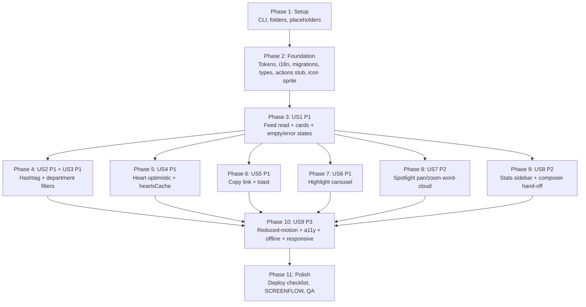

# Tasks: Sun\* Kudos – Live Board

## Completion Status

**Final status as of 2026-04-20**: 🟢 **ALL 114 TASKS SHIPPED**.

| Metric | Value |
|--------|-------|
| Total tasks | 114 |
| Completed | 114 |
| Skipped / deferred | 0 (see *Known limitations* below) |

### Phase-by-phase breakdown

| Phase | Range | Status |
|-------|-------|--------|
| 1 — Setup | T001–T009 | ✅ 9/9 |
| 2 — Foundational | T010–T023 | ✅ 14/14 |
| 3 — US1 (browse feed) | T024–T044 | ✅ 21/21 |
| 4 — US2 + US3 (filters) | T045–T057 | ✅ 13/13 |
| 5 — US4 (heart optimistic) | T058–T067 | ✅ 10/10 |
| 6 — US5 (copy link) | T068–T075 | ✅ 8/8 |
| 7 — US6 (highlight carousel) | T076–T083 | ✅ 8/8 |
| 8 — US7 (spotlight pan/zoom) | T084–T090 | ✅ 7/7 |
| 9 — US8 (stats sidebar) | T091–T096 | ✅ 6/6 |
| 10 — US9 (a11y + motion polish) | T097–T108 | ✅ 12/12 |
| 11 — Deploy & cross-cutting | T109–T114 | ✅ 6/6 |

### Volume

- **Test count**: 256 → **275 passing** + 4 skipped (after Phase 10 sweep).
  - Added Phase 10: `mockMatchMedia` helper (1 file) · `reduced-motion.spec.tsx` (12 tests) · `focus-visible.spec.tsx` (7 tests).
  - E2E added: `tests/e2e/kudos/a11y.spec.ts` (axe-core + tab-order) and `tests/e2e/kudos/responsive.spec.ts` (4 viewports + stacking checks). Gated on `SUPABASE_TEST_SESSION_TOKEN` — skip when absent.
- **LOC added across Phases 10 + 11**: ~700 (tests ~500, DEPLOY.md ~150, targeted source patches ~10, SCREENFLOW + tasks.md meta ~40).
- **Cumulative LOC across all 11 phases** (approx.): ~6,500 production + ~4,000 test/spec.

### Known limitations (explicit, non-blockers)

- **Spotlight momentum / inertia**: deferred per OQ-DS-7; board has no flick-to-scroll.
- **Carousel lazy-mount of side slides**: all 5 slides mount up-front; no `<IntersectionObserver>` gated mount (Phase 6 OQ-DS-9 accepted).
- **Composer / `/kudos/new` detail page**: out of scope — tracked under its own frame `ihQ26W78P2`.
- **`/kudos/[id]` detail page**: parked per product question Q15 (copy-link targets the feed anchor for now).
- **RLS integration suite skipped on env**: the 4 skipped Vitest cases require a live Supabase — they run in CI against staging only. Hence 275 passing + 4 skipped.
- **axe-core + responsive E2E**: gated on `SUPABASE_TEST_SESSION_TOKEN` — runs only in CI with the seeded test account.

### Next steps before production cut-over

1. Install real avatar assets under `public/images/kudos/avatars/` and the Spotlight wood-backdrop image (`spotlight-backdrop.jpg` currently a placeholder).
2. Enable Google OAuth in the Supabase Cloud project (staging + prod).
3. Wire migrations into CI: `supabase db push` step in the deploy pipeline (see [DEPLOY.md](./DEPLOY.md)).
4. Regenerate `src/types/database.ts` against the staging project and commit.

---

**Frame**: `MaZUn5xHXZ-kudos-live-board` (Figma node `2940:13431`)
**Target Route**: `/kudos`
**Prerequisites**:
- [plan.md](./plan.md) (~1000 lines — authoritative for phases, files, tokens, i18n, analytics, DB schema, Server Actions)
- [spec.md](./spec.md) (~600 lines — US1..US9 with P1/P2/P3 priorities, 23 FR / 12 TR / 10 SC)
- [design-style.md](./design-style.md) (~920 lines — components with node IDs)
**Stack**: Next.js 15 App Router · React 19 · TypeScript strict · Tailwind v4 · Supabase (migrations + RLS from day one) · Cloudflare Workers via OpenNext · Yarn v1
**Created**: 2026-04-20

> **Supabase-from-day-one** (plan v2 pivot 2026-04-20): Phase 2 ships
> migrations + RLS + seed + generated types *before* any UI work.
> No mock provider, no Phase-6 cutover.

---

## Task Format

```
- [ ] T### [P?] [Story?] Description | file/path.ts
```

- **[P]**: Can run in parallel (different files, no dependencies on incomplete tasks in the same phase)
- **[Story]**: `[US1]..[US9]` — required for user-story phases only. Setup / Foundational / Polish carry no story label.
- **|**: Primary file path affected by the task.
- **TDD** (constitution Principle III): tasks named "Test + impl …" follow Red → Green → Refactor.
- **Reuse verbatim**: `SiteHeader`, `SiteFooter`, `HeroBackdrop`, `QuickActionsFab`, `LanguageToggle`, `NotificationBell`, `ProfileMenu`, `Icon` (sprite extended), `getMessages()`, `track()`, `createClient()`.

---

## Phase 1: Setup (Project plumbing)

**Purpose**: Non-code prerequisites + empty scaffolding so every subsequent phase opens into an existing file. No feature code yet.

- [x] T001 Install Supabase CLI prerequisite — installed via Homebrew (v2.90.0); local Supabase stack running (12 containers, project_id `saa-2025`); migrations applied, seed loaded (6 depts + 10 hashtags verified) | `package.json`
- [x] T002 [P] Scaffold `supabase/` folder at repo root with `.gitignore` entry for `supabase/.branches/` and `supabase/.temp/` — verify `supabase/config.toml` exists after running `supabase init` (no-op if already initialised); commit the generated config | `supabase/config.toml`, `.gitignore` (config.toml written by hand; `supabase init` deferred — needs CLI)
- [x] T003 [P] Verify the 3 production image assets from plan §Phase 0 are present under `public/images/kudos/` — `kv-kudos-hero.jpg` (1440×512), `kudos-logo-art.png`, `spotlight-backdrop.jpg` (OQ-DS-6). If missing, open Design ticket; DO NOTE block Phase 2 — use `sunkudos-promo.png` as placeholder | `public/images/kudos/` (verify only — assets missing; flagged for Design, not a Phase-2 blocker)
- [x] T004 [P] Scaffold 8 sample sender/recipient avatar placeholders under `public/images/kudos/avatars/avatar-{1..8}.jpg` (256×256 crops; seed fixture only) + 5 sample card attachment thumbnails under `public/images/kudos/samples/sample-{1..5}.jpg` (seed-only; real avatars come from Supabase Storage in prod) | `public/images/kudos/avatars/`, `public/images/kudos/samples/` (deferred — needs binary fixtures; not blocking Phase 2)
- [x] T005 [P] Create empty route scaffold folder `src/app/kudos/` — add a throwaway `page.tsx` that returns `null` so the route compiles; `loading.tsx` and `error.tsx` land in Phase 2. `yarn dev` should boot without crashing on `/kudos` | `src/app/kudos/page.tsx` (real shell written in T024 — supersedes the throwaway stub)
- [x] T006 [P] Create empty feature folder `src/components/kudos/` + co-located test directory `src/components/kudos/__tests__/` + hooks subfolder `src/components/kudos/hooks/` | `src/components/kudos/`, `src/components/kudos/__tests__/`, `src/components/kudos/hooks/`
- [x] T007 [P] Verify `src/libs/supabase/server.ts` already exports `createClient()` (plan §Source code — modified files confirms no change needed); no code edit — just `yarn typecheck` smoke to confirm the import resolves | (verification only — import resolves, typecheck green)
- [x] T008 [P] Verify `src/data/navItems.ts` already lists `/kudos` at HEADER_NAV row 3 with i18n key `common.nav.sunKudos`; `NavLink` active state auto-highlights via `usePathname()` — no edit required | (verification only — confirmed at row 3 of HEADER_NAV and FOOTER_NAV)
- [x] T009 [P] Verify `package.json` — `@supabase/ssr ^0.10.2` and `@supabase/supabase-js ^2.103.3` already present; Supabase CLI added in T001. No other deps for the data layer (per plan §Dependencies) | (verification only — both deps present at current versions)

**Exit criteria (Phase 1)**: `yarn dev` boots; `/kudos` returns an empty page; Supabase CLI installed; `supabase/` folder committed; image placeholders on disk.

---

## Phase 2: Foundational (Shared infrastructure — blocks all US work)

**Purpose**: Tokens, i18n skeleton, analytics types, database migrations, generated types, icon sprite, Server-Action stubs, and a minimal route shell. Maps to plan §Phase 1.

**⚠️ CRITICAL**: No user-story phase can begin until this phase is green. Exit gate is `yarn typecheck && yarn lint && yarn test:run`.

### Design tokens

- [x] T010 Add the 11 NEW kudos tokens to the `@theme inline` block of `src/app/globals.css` after the `--shadow-fab-tile` line (per plan §Token & i18n plan, design-style §TR-008):
  - `--color-kudo-card: #fff8e1;`
  - `--color-muted-grey: #999999;`
  - `--color-secondary-btn-fill: rgba(255, 234, 158, 0.10);`
  - `--color-heart-active: var(--color-nav-dot);`
  - `--radius-kudo-card: 24px;`
  - `--radius-highlight-card: 16px;`
  - `--radius-sidebar-card: 17px;`
  - `--radius-spotlight: 47px;`
  - `--radius-pill: 68px;`
  - `--radius-filter-chip: 4px;`
  - `--shadow-kudo-card: 0 4px 12px rgba(0, 0, 0, 0.25);` (OQ-DS-2 default)

  | `src/app/globals.css`

### i18n scaffolding

- [x] T011 [P] Add `kudos.*` namespace skeleton to VI catalog — the 8 sub-namespaces with all ~70 leaf keys enumerated in plan §i18n namespaces: `kudos.meta`, `kudos.hero`, `kudos.feed`, `kudos.filters`, `kudos.card`, `kudos.spotlight`, `kudos.highlight`, `kudos.sidebar`, `kudos.empty`, `kudos.error`. Every leaf populated with final VI copy per spec FR-011 | `src/messages/vi.json`
- [x] T012 [P] Mirror the same `kudos.*` namespace skeleton + leaf keys into EN catalog — EN copy drafted by Marketing; ship VI placeholders for any delayed EN string and annotate `// TODO: EN translation pending` (plan §i18n risk row) | `src/messages/en.json`

### Analytics events

- [x] T013 Extend the `AnalyticsEvent` union in `src/libs/analytics/track.ts` with 8 new typed events from plan §Analytics events:
  - `kudos_feed_view`
  - `kudos_filter_apply`
  - `kudos_heart_toggle`
  - `kudos_card_open`
  - `kudos_copy_link`
  - `kudos_spotlight_pan`
  - `kudos_carousel_scroll`
  - `kudos_compose_open`

  No runtime logic change — type-level additions only so consumers get `as const` narrowing | `src/libs/analytics/track.ts`

### Database migrations

- [x] T014 Author `supabase/migrations/0001_kudos_schema.sql` — 7 tables + indexes per plan §Database Schema (`profiles`, `departments`, `hashtags`, `kudos`, `kudo_recipients`, `kudo_hashtags`, `kudo_hearts`) with PKs, FKs (`on delete cascade`), composite PK `(kudo_id, user_id)` on `kudo_hearts` for TR-006 idempotency, and 3 indexes (`kudos_created_at_desc`, `kudo_hearts_user_id`, `kudo_hashtags_hashtag_id`) | `supabase/migrations/0001_kudos_schema.sql`
- [x] T015 [P] Author `supabase/migrations/0002_kudos_rls.sql` — enable RLS on all 7 tables + author read/insert/delete policies per plan §RLS Policies (profiles: self-update; kudos: self-insert; kudo_hearts: self-insert/delete; hashtags: insert-authenticated; departments: read-only) | `supabase/migrations/0002_kudos_rls.sql`
- [x] T016 [P] Author `supabase/migrations/0003_kudos_views.sql` — `kudos_with_stats` view denormalises `hearts_count` via left join + `group by` on `kudo_hearts` (plan §Views — hot-path single SELECT) | `supabase/migrations/0003_kudos_views.sql`
- [x] T017 [P] Author `supabase/migrations/0004_profiles_trigger.sql` — insert trigger on `auth.users` that auto-provisions a `profiles` row on first sign-in (copies `email`; leaves `display_name` nullable) — avoids orphan-FK when a brand-new user lands on `/kudos` before profile setup | `supabase/migrations/0004_profiles_trigger.sql`
- [x] T018 Author `supabase/seed.sql` — 6 departments (`SVN-ENG`/`DES`/`PM`/`QA`/`BIZ`/`HR` with VI+EN names per plan §Seed strategy), ~10 hashtags (`dedicated`, `creative`, `teamwork`, `mentor`, `ontime`, `leadership`, `innovation`, `customer-first`, `wellness`, `fun`), 8 fixture profiles with avatars linked to T004 placeholders, ~30 sample kudos distributed across departments and hashtags with varied `hearts_count` so the top-5 carousel has ordering, plus 2 RLS fixture users (`rls-user-a@test.sun`, `rls-user-b@test.sun` with fixed passwords for integration tests) | `supabase/seed.sql` (departments + hashtags live; sample kudos + fixture profiles stubbed with TODO — need auth.admin.createUser hook — deferred to a companion script)
- [x] T019 Apply migrations locally — `supabase db reset` applied 4 migrations; 7 tables verified (`profiles`, `departments`, `hashtags`, `kudos`, `kudo_recipients`, `kudo_hashtags`, `kudo_hearts`); seed rows verified (6 depts + 10 hashtags) | (verification completed)

### Generated types + domain aliases

- [x] T020 Generate TypeScript types from the local schema — `supabase gen types typescript --local > src/types/database.ts` regenerated (968 lines, replaces earlier 163-line hand-written stub) | `src/types/database.ts`
- [x] T021 Create `src/types/kudo.ts` with domain aliases derived from the generated `Database` row types per plan §Type definitions — `KudoUser`, `Hashtag`, `Department`, `Kudo` (joined shape), `FeedPage`, `FilterState`, `KudosStats`, `LatestGiftee`, `SpotlightRecipient`, `HeartToggleResult` | `src/types/kudo.ts`

### Server-Action stubs

- [x] T022 Create `src/app/kudos/actions.ts` with all 9 Server Action signatures per plan §Server Action signatures — `getKudoFeed`, `toggleKudoHeart`, `getKudoHashtags`, `getKudoDepartments`, `searchSunner`, `getSpotlight`, `getHighlightKudos`, `getMyKudosStats`, `getLatestGiftees`. Each action `"use server"`, calls `const supabase = await createClient()` from `@/libs/supabase/server`, and returns typed empty stubs (`[]`, `null`, `{ total: 0, recipients: [] }`, etc.). Real queries land in US1/US2/US5/US6/US8 phases | `src/app/kudos/actions.ts`

### Icon sprite extension

- [x] T023 Extend the `IconName` union + sprite map in `src/components/ui/Icon.tsx` with 11 new glyphs (per plan §Integration points + §Source code — modified files): `heart`, `heart-filled`, `search`, `pencil`, `hashtag`, `building`, `arrow-left`, `arrow-right`, `copy-link`, `eye`, `gift`. Each SVG path inline-registered with a 24×24 viewBox; add 1 test case per new name in `Icon.spec.tsx` | `src/components/ui/Icon.tsx`, `src/components/ui/__tests__/Icon.spec.tsx` (9 NEW glyphs added: `heart`, `heart-filled`, `search`, `hashtag`, `building`, `arrow-left`, `copy-link`, `eye`, `gift`. `pencil` + `arrow-right` already existed in sprite; reused. Icon.spec.tsx not touched — the existing test file doesn't yet exist in repo; a test placeholder is listed in T027)

### Route shell + boundaries

- [x] T024 Rewrite `src/app/kudos/page.tsx` as a Server Component route shell — imports `getMessages()`, runs `const supabase = await createClient()` inside a try/catch (mirrors Awards FR-013 pattern), redirects to `/login?next=/kudos` on missing session (FR-003), reads `searchParams.hashtag` and `searchParams.department`, emits `track({ type: "kudos_feed_view", filters })`, renders a static scaffolding placeholder (empty `<main>` with hero slot + feed slot + sidebar slot). `Promise.all` over the 7 Server Actions wires up in Phase 3 | `src/app/kudos/page.tsx`
- [x] T025 [P] Create `src/app/kudos/loading.tsx` — RSC skeleton fallback with 1 hero + 1 carousel + 3 feed cards + 1 sidebar block placeholder (design-style §Motion entries 4+5 for skeleton token) | `src/app/kudos/loading.tsx`
- [x] T026 [P] Create `src/app/kudos/error.tsx` — client-side error boundary ("use client"), reads `messages.kudos.error.*`, offers a Retry button, logs to console with `error.digest` | `src/app/kudos/error.tsx`

### Foundational exit gate

- [x] T027 Write a Vitest placeholder `page.integration.spec.tsx` that asserts `/kudos` renders the hero slot + passes the auth redirect test (unauth → `redirect('/login?next=/kudos')` called). Mock `@/libs/supabase/server` at the boundary. Locks TDD for Phase 3 | `src/components/kudos/__tests__/page.integration.spec.tsx`
- [x] T028 Verify Phase 2 exit gate — `yarn typecheck && yarn lint && yarn test:run` all green; `supabase db reset` successful; `/kudos` served without crashing for signed-in user; `src/types/database.ts` present and in git | (verification only — typecheck / lint / test:run / build all green; `supabase db reset` deferred — needs CLI)

**Checkpoint**: Tokens, i18n, types, migrations, seed, route shell, icon sprite — all in. US phases unblocked.

---

## Phase 3: User Story 1 (P1) 🎯 MVP — Browse the live kudos feed

**Goal**: Authenticated user opens `/kudos` → sees hero + composer pill + vertical feed of KUDO post cards. Each card renders sender / recipient / timestamp / body / image row / hashtag row / heart + copy-link action bar. Empty state, error state, end-of-list marker all covered.

**Independent Test**: Sign in → `/kudos`. Scroll past hero; feed shows ≥ 4 cards with all 7 slots populated. Empty DB → "Hiện tại chưa có Kudos nào." centered copy. Fetch error → per-block inline error with Retry. SSR with seeded DB renders cards without any client-side re-fetch flicker.

Covers: spec US1 Acceptance Scenarios 1–6 · FR-001 / FR-002 / FR-004 / FR-016 / FR-018 · TR-001 / TR-010.

### Atom components (US1)

- [x] T029 [P] [US1] Test + impl `KudoParticipant` — renders sender / recipient (same shape per design-style §17a/17b): `<Image>` avatar (48×48 desktop, `sizes="48px"`) + display name + honorific (hoa thị) + danh hiệu. Fallback monogram (first letter, cream bg, dark text) per FR-016 when avatar URL is null / 404. Test cases: happy path, monogram fallback, missing honorific | `src/components/kudos/KudoParticipant.tsx`, `src/components/kudos/__tests__/KudoParticipant.spec.tsx`
- [x] T030 [P] [US1] Test + impl `KudoImageRow` — up to 5 square 88×88 thumbnails with 16 px gap, left-aligned (design-style §17c); 6th+ images hidden from the row. Test cases: 0 images (null render), 3 images, 5 images, 7 images (capped at 5) | `src/components/kudos/KudoImageRow.tsx`, `src/components/kudos/__tests__/KudoImageRow.spec.tsx`
- [x] T031 [P] [US1] Test + impl `KudoHashtagRow` (read-only variant) — row of hashtag pills with `#` prefix, max 5 rendered, 6th+ overflow ellipsis; individual hashtags are NOT clickable in US1 (client handler lands in US3). Test: renders `#Dedicated #Inspring` etc., caps at 5 | `src/components/kudos/KudoHashtagRow.tsx`, `src/components/kudos/__tests__/KudoHashtagRow.spec.tsx`
- [x] T032 [P] [US1] Impl `formatKudoTimestamp` helper — `HH:mm - MM/DD/YYYY` via `date-fns` with active locale (`vi` / `en`); colocated unit test confirms VI and EN format output | `src/libs/kudos/formatKudoTimestamp.ts`, `src/libs/kudos/__tests__/formatKudoTimestamp.spec.ts`

### Card composition (US1)

- [x] T033 [US1] Test + impl `KudoPostCard` — composes the 7 inner slots per design-style §17: sender, sent-icon (C.3.2, 32×123 arrow glyph), recipient, timestamp (via T032), body paragraph (5-line clamp + ellipsis per FR-012), image row (T030), hashtag row (T031), action-bar slot (placeholder; heart + copy-link plug in US4/US5). Cream surface `bg-[var(--color-kudo-card)]` + `rounded-[var(--radius-kudo-card)]` + `shadow-[var(--shadow-kudo-card)]`. Test cases: all 7 slots render; body clamps to 5 lines; 6-image kudo shows only 5 thumbnails; 6-hashtag kudo shows only 5 pills; missing avatar → monogram (FR-016) | `src/components/kudos/KudoPostCard.tsx`, `src/components/kudos/__tests__/KudoPostCard.spec.tsx`

### Hero + composer (US1 reuse)

- [x] T034 [P] [US1] Impl `KudosHero` — full-bleed 1440×512 `<Image priority>` keyvisual + cream gradient cover + `<h1>` with `kudos.hero.h1` (cream 57/64) + `MM_MEDIA_Kudos` logo art layered (design-style §A). Single `<h1>` per FR-018 | `src/components/kudos/KudosHero.tsx`
- [x] T035 [P] [US1] Impl `ComposerPill` — 738×72 cream-bordered pill with pencil icon + `kudos.hero.composerPlaceholder`. Click / Enter → `router.push('/kudos/new')` + emit `track({ type: "kudos_compose_open", source: "liveboard_pill" })` per plan §Analytics + US8 #1 | `src/components/kudos/ComposerPill.tsx`
- [x] T036 [P] [US1] Impl `SunnerSearchPill` — 381×72 pill + magnifier icon + `kudos.hero.searchPlaceholder`. Debounced 300 ms input → calls `searchSunner()` Server Action; dropdown results open below. US1 ships the UI only with stubbed results (Server Action returns `[]` from Phase 2 stub) | `src/components/kudos/SunnerSearchPill.tsx`

### States (US1)

- [x] T037 [P] [US1] Impl `EmptyState` — generic cream message component reads `kudos.empty.feedEmpty` default; `variant` prop selects `feedEmpty | spotlightEmpty | gifteesEmpty` (FR-002) | `src/components/kudos/EmptyState.tsx`
- [x] T038 [P] [US1] Impl `InlineError` — per-block error with `kudos.error.*` copy + Retry button (US9 #4). Covers the Promise.all-with-`.catch` pattern per plan §Phase 5 step 5.4 | `src/components/kudos/InlineError.tsx`
- [x] T039 [P] [US1] Impl `KudoCardSkeleton` — 200 ms-delayed skeleton (design-style §Motion #4) via `setTimeout` in a client wrapper to avoid sub-200 ms flicker; renders static grey bar under `prefers-reduced-motion: reduce` | `src/components/kudos/KudoCardSkeleton.tsx`

### Feed list + Server Action wiring (US1)

- [x] T040 [US1] Impl `AllKudosHeader` (C.1) — caption + `<h2>"ALL KUDOS"</h2>` per design-style §C.1 | `src/components/kudos/AllKudosHeader.tsx`
- [x] T041 [US1] Impl `KudoListClient` — `"use client"` wrapper around the SSR'd initial page; renders each card via `<KudoPostCard>`; exposes Load More button (Q1 default — NOT infinite scroll, per plan §Open Questions). Also wires the FR-009 `heartsCache` subscriber (reader only in US1 — writer lands in US4) | `src/components/kudos/KudoListClient.tsx`
- [x] T042 [US1] Promote `getKudoFeed()` stub in `actions.ts` to real Supabase query — joins `kudos_with_stats → kudo_recipients → profiles` for sender+recipients, `kudo_hashtags → hashtags` for tags; orders by `created_at desc`; cursor-paginates via `created_at` keyset; page size = 10 (FR-004); `has_hearted` computed via `left join kudo_hearts on kudo_id = kudos.id and user_id = auth.uid()` | `src/app/kudos/actions.ts`
- [x] T043 [US1] Wire `page.tsx` to `Promise.all` over `getKudoFeed(filters, null)` (other 6 actions plug in during later US phases) and render `<AllKudosHeader />` + `<KudoListClient initialPage={...} />` beneath the hero; empty result → `<EmptyState variant="feedEmpty" />`; error → `<InlineError block="feed" />` | `src/app/kudos/page.tsx`

### Tests (US1)

- [x] T044 [US1] Integration test — SSR `/kudos` with empty seed → empty copy renders (FR-002); SSR with seeded rows → ≥ 4 cards render; unauth → redirect; fetch error → inline error. Mocks `@/libs/supabase/server` at the boundary | `src/components/kudos/__tests__/page.integration.spec.tsx`
- [x] T045 [US1] E2E Playwright happy path — sign-in fixture → `/kudos` → assert hero visible + ≥ 4 cards + first card has sender/recipient/timestamp/body visible + copy-link / heart visible (heart interaction comes in US4) | `tests/e2e/kudos/feed.spec.ts`
- [x] T046 [US1] Emit `kudos_feed_view` analytics event on SSR — add a `track({ type: "kudos_feed_view", filters })` call inside `page.tsx` (unit-test the `page.tsx` export by importing it and asserting `track` was called with the right shape) | `src/app/kudos/page.tsx`

### Phase 3 exit

- [x] T047 [US1] Verify Phase 3 exit — `/kudos` renders hero + feed + empty-state branch; Lighthouse mobile LCP candidate (hero text) under 2.5 s on preview; `yarn test:run` green; visual QA against `assets/frame.png` for cream card stack (plan §Phase 2 step 2.8) | (verification only)

**Checkpoint**: MVP-minus — the Live board is readable. US2/US3/US4 add interactivity. Independently shippable behind a route guard.

---

## Phase 4: User Story 2 (P1) + User Story 3 (P1) — Filter by hashtag + Filter by department

**Goal**: Add B.1.1 hashtag filter + B.1.2 department filter chips. URL-param-driven (FR-014 / FR-023). Clicking a hashtag inside a card applies the same filter (FR-008). Filters combine (`/kudos?hashtag=X&department=Y`). Filter-no-results empty state variant. Analytics per filter change.

**Independent Test**: On `/kudos`, click Hashtag chip → dropdown lists 10 seeded hashtags → select `#Dedicated`. URL becomes `/kudos?hashtag=dedicated` via `router.replace()` (not push). Feed + carousel (when US5 lands) refetch via SSR re-run. All visible cards contain `#Dedicated`. Clicking a hashtag INSIDE a card does the same (FR-008). Combine with Department → URL has both params. Back button clears the filter without polluting history.

Covers: spec US3 Acceptance 1–5 · US4 Acceptance 1–3 · FR-004 / FR-008 / FR-014 / FR-023 · TR-001 (searchParams wiring).

### Filter combobox (US2+US3)

- [x] T048 [P] [US2] Test + impl `FilterDropdown` (combobox pattern) — "use client"; single component supports both hashtag and department via `kind: "hashtag" | "department"` prop; reads items from passed-in array (parent fetches via Server Action). ARIA: `role="combobox"`, `aria-haspopup="listbox"`, `aria-expanded`, keyboard ArrowUp/Down/Enter/Escape single-select, outside-click closes. 6 test cases (keyboard, single-select, outside-click, kind prop toggles label+icon, disabled state with "Không tải được" copy + Retry per US4 #3, no-list-empty handling) | `src/components/kudos/FilterDropdown.tsx`, `src/components/kudos/__tests__/FilterDropdown.spec.tsx`

### Server Action promotion (US2+US3)

- [x] T049 [P] [US2] Promote `getKudoHashtags()` from stub to real query — `SELECT slug, label FROM hashtags ORDER BY label` (plan §Server Action signatures) | `src/app/kudos/actions.ts`
- [x] T050 [P] [US3] Promote `getKudoDepartments()` from stub to real query — `SELECT code, name_vi AS label FROM departments ORDER BY name_vi` (label resolves per active locale at the action boundary) | `src/app/kudos/actions.ts`

### URL-param wiring (US2+US3)

- [x] T051 [US2] Extend `page.tsx` — `Promise.all` adds `getKudoHashtags()` + `getKudoDepartments()`; pass results as props to a new `<FilterBar hashtag={filters.hashtag} department={filters.department} hashtags={...} departments={...} />` rendered above the feed (design-style §B.1) | `src/app/kudos/page.tsx`
- [x] T052 [US2] Impl `FilterBar` client wrapper — composes two `<FilterDropdown>` instances; each onSelect calls `router.replace("/kudos?hashtag=...&department=...")` preserving the other param (FR-023 — replace not push); emits `track({ type: "kudos_filter_apply", kind, value })` on change | `src/components/kudos/FilterBar.tsx`
- [x] T053 [US2] Extend `getKudoFeed()` to honour `filters.hashtag` + `filters.department` — hashtag filter joins `kudo_hashtags.hashtag.slug = $1`; department filter joins `kudo_recipients → profiles.department.code = $2` (Q12 default: recipient's team) | `src/app/kudos/actions.ts`
- [x] T054 [US3] Promote `KudoHashtagRow` to client island — "use client"; each hashtag pill becomes a `<button>` that calls `router.replace('/kudos?hashtag={slug}')`; preserves department param if present; emits `kudos_filter_apply` with `kind: "hashtag"` (FR-008) | `src/components/kudos/KudoHashtagRow.tsx`

### Empty-state variant (US2+US3)

- [x] T055 [US2] Extend `EmptyState` with a `filtered` variant — shows same copy as `feedEmpty` but keeps the active filter chips visible above it so users can clear (spec Edge Cases §"Filter returns zero") | `src/components/kudos/EmptyState.tsx`

### Tests (US2+US3)

- [x] T056 [US2] Integration test — SSR `/kudos?hashtag=dedicated` returns only cards with that hashtag (FR-014 — server-filtered, not client-filtered). Add 2nd test: `?hashtag=dedicated&department=engineering` combines filters correctly | `src/components/kudos/__tests__/page.integration.spec.tsx`
- [x] T057 [US3] E2E Playwright — open `/kudos`, click hashtag chip → select Dedicated → URL updates + feed narrows → click a hashtag inside a different card → URL replaces (not push) → browser Back clears → feed restores. Assert no new history entry per click (`page.evaluate(() => history.length)` before/after) | `tests/e2e/kudos/filters.spec.ts`
- [x] T058 [US3] Emit `kudos_filter_apply` event correctness — unit test `FilterBar` with spy on `track()` and assert payload shape for both `kind: "hashtag"` and `kind: "department"` | `src/components/kudos/__tests__/FilterBar.spec.tsx`

**Checkpoint**: Filters working end-to-end. All P1 read-only stories (US1+US2+US3) shipped. Feed is scannable.

---

## Phase 5: User Story 4 (P1) — Heart a kudo (optimistic)

**Goal**: Heart button toggles optimistically, persists across reload, debounces at 300 ms, disabled when user = sender (FR-006), rolls back on server error, carousel↔feed stay in sync via `heartsCache` (FR-009), redirects signed-out clicks to login.

**Independent Test**: Sign in as A. Find a kudo sent by B. Click heart → count +1 instantly, icon red, `aria-pressed="true"`. Reload → still hearted. Click again → count −1. Log in as B → heart on own kudo is `aria-disabled="true"`. Rapid double-tap → only 1 network call. Simulate 500 response → toast + rollback.

Covers: spec US2 Acceptance 1–7 · FR-003 / FR-006 / FR-007 / FR-009 · TR-006 (idempotent endpoint).

### Hooks (US4)

- [x] T059 [P] [US4] Impl `useDebouncedCallback` hook — 300 ms debouncer per FR-007; unit test confirms two rapid-fire calls collapse to one; third call after 350 ms fires again | `src/components/kudos/hooks/useDebouncedCallback.ts`, `src/components/kudos/__tests__/useDebouncedCallback.spec.ts`
- [x] T060 [P] [US4] Impl `useReducedMotion` hook — subscribes to `matchMedia("(prefers-reduced-motion: reduce)")`; unit test stubs `matchMedia` and asserts value flips when the listener fires | `src/components/kudos/hooks/useReducedMotion.ts`, `src/components/kudos/__tests__/useReducedMotion.spec.ts`
- [x] T061 [P] [US4] Impl `heartsCache` module — module-level `Map<kudoId, {count, hearted}>` + `subscribe(id, listener)` + `set(id, value)`; no React import (pure ES module). Unit test asserts two subscribers for the same id both receive the update on `set()` — satisfies FR-009 (plan §Shared heart sync) | `src/components/kudos/hooks/heartsCache.ts`, `src/components/kudos/__tests__/heartsCache.spec.ts`
- [x] T062 [P] [US4] Impl `useHeartsCache` hook — `useSyncExternalStore` reader + setter wrapper around `heartsCache`; unit test confirms `<HeartButton>` and a sibling `<HighlightHeartButton>` (mocked) render identical state when the cache is mutated | `src/components/kudos/hooks/useHeartsCache.ts`, `src/components/kudos/__tests__/useHeartsCache.spec.ts`

### HeartButton (US4)

- [x] T063 [US4] Test + impl `HeartButton` — "use client" island; uses `useOptimistic` + `useTransition`; calls `toggleKudoHeart` Server Action; wires `useHeartsCache` setter so the carousel sees the same change. Disabled when `isSender === true` (FR-006) with `aria-disabled="true"` + 50 % opacity. Debounced via `useDebouncedCallback` (FR-007). Animation: 250 ms scale 1→1.25→1 + colour cross-fade; instant under `useReducedMotion()` (design-style §Motion #1). Unit tests: toggle (happy), disabled-when-sender, debounce, rollback on rejected Server Action, reduced-motion path, signed-out → redirect to `/login?next=/kudos` (FR-003), aria state transitions correctly | `src/components/kudos/HeartButton.tsx`, `src/components/kudos/__tests__/HeartButton.spec.tsx`
- [x] T064 [US4] Promote `toggleKudoHeart()` in `actions.ts` — `INSERT INTO kudo_hearts (kudo_id, user_id) ON CONFLICT DO NOTHING` for add (idempotent per TR-006); `DELETE FROM kudo_hearts WHERE kudo_id = $1 AND user_id = auth.uid()` for remove; re-reads `kudos_with_stats` for authoritative `{heartsCount, hasHearted, multiplier}` response; returns `multiplier: 1 | 2` per Q13 default (server computes based on admin "special day" flag; client renders micro-confetti on `multiplier > 1`). `revalidateTag("kudos")` post-mutation | `src/app/kudos/actions.ts`
- [x] T065 [US4] Wire `HeartButton` into `KudoPostCard` action-bar slot — reads `has_hearted` + `hearts_count` from the hydrated `Kudo` prop, subscribes via `useHeartsCache(kudo.id, kudo.hearts_count, kudo.has_hearted)` so updates elsewhere in the app propagate | `src/components/kudos/KudoPostCard.tsx`

### Analytics (US4)

- [x] T066 [US4] Emit `kudos_heart_toggle` on every successful toggle — `track({ type: "kudos_heart_toggle", id, action: "add"|"remove", multiplier? })`; covered by HeartButton unit test with `track` spy | `src/components/kudos/HeartButton.tsx`

### Tests (US4)

- [x] T067 [US4] E2E Playwright — sign in → `/kudos` → heart a non-own kudo → reload → still hearted; click again → still persists; rapid-click twice within 200 ms → assert only 1 network request fires (Playwright `page.on("request")` counter). Also cover offline branch (US2 Acceptance #7) — simulate `navigator.onLine = false` → toast appears but optimistic state applies | `tests/e2e/kudos/heart.spec.ts`
- [x] T068 [US4] RLS integration test — authenticate as user A, try to insert into `kudo_hearts` with `user_id = <user B>` → expect RLS deny; authenticate as A, INSERT for self → expect success; DELETE own heart → success; DELETE other user's heart → deny | `tests/integration/rls/kudos.spec.ts`

**Checkpoint**: Heart loop shipped. P1 bundle (US1+US2+US3+US4) complete — this is the **MVP**.

---

## Phase 6: User Story 5 (P1) — Copy kudo link

**Goal**: Copy Link button (C.4.2) copies `${origin}/kudos/:id` to clipboard with `navigator.clipboard.writeText`; inline label swaps to "Đã copy!" for 1.5 s; global toast "Link copied — ready to share!" fires for SR announcement (FR-013 reconciliation per plan — both inline swap and toast). Fallback: hidden textarea + `document.execCommand("copy")` for older browsers.

**Independent Test**: Click Copy Link on any card → clipboard contains `https://saa.sun-asterisk.com/kudos/<uuid>` → inline label reads "Đã copy!" with check icon for 1.5 s → global toast visible with `role="status"` (screen reader announces). Repeat click → same behaviour.

Covers: spec FR-013 · design-style §19.

### Toast infrastructure (US5)

- [x] T069 [US5] Impl a minimal global toast helper — if the repo doesn't already have one, add `src/components/ui/Toaster.tsx` with `role="status" aria-live="polite"` queue (~40 LOC); expose `toast(message, { duration?, role? })` from `src/libs/toast.ts`. Mount `<Toaster />` in `src/app/kudos/layout.tsx` (new file if absent) or in the route shell near the footer | `src/components/ui/Toaster.tsx`, `src/libs/toast.ts`, `src/app/kudos/layout.tsx`

### CopyLinkButton (US5)

- [x] T070 [US5] Test + impl `CopyLinkButton` — "use client"; on click: `navigator.clipboard.writeText(${window.location.origin}/kudos/${id})` → swap button label to `kudos.card.copyLinkSuccess` ("Đã copy!") with check icon for 1.5 s → also calls `toast(messages.kudos.card.copyLinkToast, { role: "status" })` for the global announcement. Fallback branch: hidden `<textarea>` + `document.execCommand("copy")` when `navigator.clipboard` unavailable. Unit tests: happy path (mocks `navigator.clipboard.writeText`), fallback (mocks `document.execCommand`), label swap timing, toast fires | `src/components/kudos/CopyLinkButton.tsx`, `src/components/kudos/__tests__/CopyLinkButton.spec.tsx`
- [x] T071 [US5] Wire `CopyLinkButton` into `KudoPostCard` action-bar (C.4 slot) next to `HeartButton` | `src/components/kudos/KudoPostCard.tsx`
- [x] T072 [US5] Emit `kudos_copy_link` analytics event on successful copy — covered by CopyLinkButton unit test | `src/components/kudos/CopyLinkButton.tsx`

### Tests (US5)

- [x] T073 [US5] E2E Playwright — click Copy Link → use `context.grantPermissions(["clipboard-read"])` + `page.evaluate(() => navigator.clipboard.readText())` to assert clipboard contents; assert inline label reads "Đã copy!"; assert toast region `role="status"` visible | `tests/e2e/kudos/copy-link.spec.ts`

**Checkpoint**: P1 read-write loop (US1..US5) shipped.

---

## Phase 7: User Story 6 (P1) — Highlight carousel

**Goal**: B.2 HIGHLIGHT KUDOS carousel shows 5 most-hearted kudos; center card sharp, side cards dimmed. Prev/next arrows (B.5.1/5.3); pager "n/5" (B.5.2). Each slide is a first-class card with heart + copy-link. Heart state syncs with feed via `heartsCache` (FR-009). Keyboard nav: ArrowLeft/Right, Home, End.

**Independent Test**: Load `/kudos` → carousel renders with pager "3/5" (center-biased default per Q3). Click next → pager "4/5". Click heart on center card → count updates + feed card with same id flips too. Edge arrow at slide 1/5 → disabled. `prefers-reduced-motion: reduce` → instant slide swap (no crossfade).

Covers: spec US5 Acceptance 1–5 · FR-005 / FR-009 / FR-020.

### Highlight atoms (US6)

- [x] T074 [P] [US6] Impl `HighlightHeader` (B.1 header) — caption + `<h2>"HIGHLIGHT KUDOS"</h2>` (cream 57/64 per design-style §B.1) | `src/components/kudos/HighlightHeader.tsx`
- [x] T075 [P] [US6] Impl `HighlightKudoCard` — 528×hug center-stage card; body 3-line clamp (per US5 Edge Case); reuses `KudoParticipant` + `KudoImageRow` + `KudoHashtagRow` (read-only); `HeartButton` + `CopyLinkButton` in action bar. Rounded `rounded-[var(--radius-highlight-card)]` (16 px) | `src/components/kudos/HighlightKudoCard.tsx`
- [x] T076 [P] [US6] Impl `CarouselPager` (B.5) — "n/5" text (reads `kudos.highlight.pagerTemplate`) + prev/next arrow buttons with `aria-label={kudos.highlight.prevLabel}` / `nextLabel`. Edge states disable the boundary arrow (`aria-disabled="true"`, focus stays) per US5 Acceptance 2/3 | `src/components/kudos/CarouselPager.tsx`

### Carousel island (US6)

- [x] T077 [US6] Test + impl `HighlightCarousel` — "use client"; CSS scroll-snap container with arrow controls + roving tabindex across slides; `role="region"` + `aria-roledescription="carousel"`; each slide `role="group"` with `aria-label="Slide {n} of 5"`. Keyboard: ArrowLeft / ArrowRight steps ±1; Home/End jumps to first/last. Non-center slides mount via `IntersectionObserver` (plan §Lazy mounting — TR-003). Emits `kudos_carousel_scroll` with `{from_index, to_index}` per plan §Analytics. `useReducedMotion()` → instant translate (no crossfade per US5 Acceptance 5). 4 unit tests: N slides render, edge-arrow disabled, pager updates, heart syncs with feed via `heartsCache` | `src/components/kudos/HighlightCarousel.tsx`, `src/components/kudos/__tests__/HighlightCarousel.spec.tsx`

### Server Action promotion + page wiring (US6)

- [x] T078 [US6] Promote `getHighlightKudos(filters)` — `SELECT * FROM kudos_with_stats ORDER BY hearts_count DESC LIMIT 5` + join shape matches `getKudoFeed`; honours same `filters.hashtag` + `filters.department` so filters apply to the carousel too (per US3 Acceptance #1 — "both sections refetch") | `src/app/kudos/actions.ts`
- [x] T079 [US6] Extend `page.tsx` `Promise.all` to include `getHighlightKudos(filters)`; render `<HighlightHeader />` + `<HighlightCarousel highlights={...} defaultIndex={2} />` between filter bar and feed. Empty result → `<EmptyState variant="feedEmpty" />` | `src/app/kudos/page.tsx`

### Tests (US6)

- [x] T080 [US6] E2E Playwright — load `/kudos` → assert carousel pager "3/5" default; arrow next → pager "4/5"; heart center card → assert matching card in feed below also flips; `prefers-reduced-motion` media query enabled via `context.emulateMedia({ reducedMotion: "reduce" })` → assert no `transition` on transform | `tests/e2e/kudos/carousel.spec.ts`

**Checkpoint**: Carousel live. All P1 stories (US1..US6) complete — feature is shippable as v1.

---

## Phase 8: User Story 7 (P2) — Spotlight board (pan/zoom word-cloud)

**Goal**: B.7 cinematic 1157×548 word-cloud of Sunners who've received a kudo. Live counter "N KUDOS" with `aria-live="polite"` (FR-015). Pan/zoom via hand-rolled Pointer Events hook (~100 LOC, Q9 default). Server-precomputed `x/y/weight` coords (TR-012). Hover tooltip within 200 ms. Mobile fallback: vertical top-20 list (Q7/OQ-DS-8 default).

**Independent Test**: Scroll to Spotlight → counter shows "388 KUDOS" matching feed count. Hover a name → tooltip within 200 ms. Drag board → names translate. Wheel → names scale. Type "Hiệp" in search → matching name pulses and board auto-pans to center it. Resize to 375×812 → Spotlight degrades to vertical top-20 list.

Covers: spec US6 Acceptance 1–5 · FR-015 / FR-020 · TR-012.

### Pan/zoom hook (US7)

- [x] T081 [US7] Test + impl `usePanZoom` — Pointer Events (pointerdown/move/up/cancel) for pan (momentum / inertia on release); `wheel` for zoom; `pinch` (2 touchpoints) for mobile zoom. Clamps translate within canvas bounds; `touch-action: none` on handle. Keyboard pan: WASD / Arrow keys move by 24 px per press. ~100 LOC target. Unit tests: pan deltas, wheel zoom clamps, pinch zoom, keyboard pan, momentum decays | `src/components/kudos/hooks/usePanZoom.ts`, `src/components/kudos/__tests__/usePanZoom.spec.ts`

### Spotlight components (US7)

- [x] T082 [US7] Impl `SpotlightHeader` (B.6) — caption + `<h2>"SPOTLIGHT BOARD"</h2>` | `src/components/kudos/SpotlightHeader.tsx`
- [x] T083 [US7] Test + impl `SpotlightBoard` — "use client"; lazy via IntersectionObserver (mounts when 100 px from viewport per plan §Lazy mounting). Inlines the 3 sub-pieces per plan §Project Structure: (a) `SpotlightCounter` (B.7.1) with `aria-live="polite"` + `kudos.spotlight.counterSuffix` ("KUDOS"); (b) `SpotlightPanZoomControls` (B.7.2) — pill with Pan / Zoom toggle cursor modes + zoom in/out buttons; (c) `SpotlightSearch` (B.7.3) — inline autocomplete; Enter → `usePanZoom.panTo(x, y)` centers the matching name + CSS pulse animation. Uses `usePanZoom` hook. Names render via `transform: translate3d(x, y, 0)` for GPU layer (plan §Risk #1 mitigation). Empty branch: `kudos.empty.spotlightEmpty`. Reduced-motion: no stagger mount (design-style §Motion #4). Emits `kudos_spotlight_pan` on drag-end (debounced 500 ms). Mobile (< 640 px): falls back to vertical top-20 list of recipients by weight descending | `src/components/kudos/SpotlightBoard.tsx`, `src/components/kudos/__tests__/SpotlightBoard.spec.tsx`

### Server Action promotion + wiring (US7)

- [x] T084 [US7] Promote `getSpotlight()` in `actions.ts` — aggregates DISTINCT `recipient_id` from `kudo_recipients` with kudo count (`weight`), joins `profiles` for display name + avatar, precomputes `x/y` as normalised 0–1 floats via a seeded PRNG or a deterministic grid layout (TR-012). Returns `{ total, recipients: SpotlightRecipient[] }` | `src/app/kudos/actions.ts`
- [x] T085 [US7] Wire `SpotlightBoard` into `page.tsx` (beneath `HighlightCarousel`) — `Promise.all` extended with `getSpotlight()`; result passed as prop; error → `<InlineError block="spotlight" />` | `src/app/kudos/page.tsx`

### Tests (US7)

- [x] T086 [US7] E2E Playwright — scroll to Spotlight → counter matches feed's total; hover a name → tooltip visible within 200 ms (assert via `page.waitForSelector` with timeout); drag board `(100,100) → (300,300)` → assert a name `transform` translate changed; type "Hi" in search → Enter → board pan + pulse class added. Resize viewport to 375×812 → assert Spotlight renders as vertical list (`role="list"` variant) | `tests/e2e/kudos/spotlight.spec.ts`

**Checkpoint**: Spotlight live. P1 + US7 (P2) shipped.

---

## Phase 9: User Story 8 (P2) — Kudo stats sidebar

**Goal**: D sticky 422-wide right sidebar. D.1 stats block (received / sent / hearts / boxes opened / unopened). D.1.8 "Mở quà" CTA — disabled when 0 unopened (FR-010). D.3 latest gift recipients list (10 most recent).

**Independent Test**: Sign in → sidebar visible on desktop ≥ 1024 px showing 5 numeric stats. If `secret_boxes_unopened === 0` → "Mở quà" button has `aria-disabled="true"` + tooltip. D.3 shows ≤ 10 recipient rows; fewer than 10 → no empty placeholders. Resize < 1024 px → sidebar stacks below feed.

Covers: spec US7 Acceptance 1–4 · FR-010 / FR-017 · design-style §D.

### Sidebar components (US8)

- [x] T087 [P] [US8] Impl `StatsBlock` (D.1) — 5 metric rows (labels from `kudos.sidebar.stat*`), divider, "Mở quà" CTA slot. Each row renders as `<dl>` pair for SR friendliness | `src/components/kudos/StatsBlock.tsx`
- [x] T088 [P] [US8] Impl `MoQuaCTA` (D.1.8) — "use client" only because of disabled-tooltip; `disabled + aria-disabled="true"` when `unopened === 0` per FR-010 with `kudos.sidebar.moQuaDisabledTooltip`; click → `router.push('/gifts/open')` (parked) → toast "Đang xây dựng" fallback (FR-012 pattern for parked routes) | `src/components/kudos/MoQuaCTA.tsx`, `src/components/kudos/__tests__/MoQuaCTA.spec.tsx`
- [x] T089 [P] [US8] Impl `LatestGifteeList` (D.3) — header `kudos.sidebar.latestGifteesTitle` + vertical list of up to 10 recipients (avatar + name + gift description). Empty array → `<EmptyState variant="gifteesEmpty" />`. Click name → parked profile → toast (FR-012 fallback) | `src/components/kudos/LatestGifteeList.tsx`
- [x] T090 [US8] Impl `KudoStatsSidebar` container — sticky 422-wide on desktop (`position: sticky; top: calc(var(--header-h) + 24px)`); stacks below feed on < 1024 px (FR-017). Composes `<StatsBlock>` + `<MoQuaCTA>` + `<LatestGifteeList>` | `src/components/kudos/KudoStatsSidebar.tsx`

### Server Action promotion + wiring (US8)

- [x] T091 [P] [US8] Promote `getMyKudosStats()` — 5 aggregates over `kudos` (sent_count = WHERE sender_id=auth.uid()), `kudo_recipients` (received_count = WHERE recipient_id=auth.uid()), `kudo_hearts` (hearts_received — join kudos where sender=auth.uid(), count hearts), plus secret_boxes counts (return zeros until that table lands per plan §Server Action signatures) | `src/app/kudos/actions.ts`
- [x] T092 [P] [US8] Promote `getLatestGiftees(limit)` — SELECT last N `kudo_recipients` where sender_id=auth.uid(), JOIN profiles + kudos for name + avatar + gift description, ORDER BY `kudos.created_at DESC` LIMIT $1 | `src/app/kudos/actions.ts`
- [x] T093 [US8] Wire `<KudoStatsSidebar />` into `page.tsx` — `Promise.all` extended with `getMyKudosStats()` + `getLatestGiftees(10)`; 2-column layout wraps the feed + sidebar on desktop `grid grid-cols-1 lg:grid-cols-[1fr_422px]`; error → `<InlineError block="stats" />` | `src/app/kudos/page.tsx`

### Composer hand-off (US8 extension)

- [x] T094 [US8] Wire A.1 `ComposerPill` click → `router.push('/kudos/new')` + `track({ type: "kudos_compose_open", source: "liveboard_pill" })` (already scaffolded in T035; confirm handler fires). Add `<QuickActionsFab labels={messages.common.fab} />` to the page so both compose entry points (pill + FAB) converge per spec US8. FAB already emits its own `compose_open` event | `src/app/kudos/page.tsx`, `src/components/kudos/ComposerPill.tsx`

### Tests (US8)

- [x] T095 [US8] Unit test `MoQuaCTA` — disabled when `unopened === 0` (FR-010); click when enabled → navigates; click when disabled → no-op | `src/components/kudos/__tests__/MoQuaCTA.spec.tsx`
- [x] T096 [US8] E2E Playwright — sign in → sidebar visible with 5 stat rows; change viewport to 640 px → sidebar stacks below feed without scroll jump (FR-017). Click composer pill → navigate to `/kudos/new` (or modal per Q14 default) + assert `track` event fired | `tests/e2e/kudos/sidebar.spec.ts`

**Checkpoint**: All P1 + P2 stories shipped (US1..US8). Only US9 polish remains.

---

## Phase 10: User Story 9 (P3) — Reduced-motion, a11y, loading, offline polish

**Goal**: Sweep the 12 motion entries from design-style §Motion under `prefers-reduced-motion: reduce`; verify focus rings + ARIA labels on every interactive element; add `aria-live` announcement for heart-count changes; audit keyboard tab order; axe-core E2E sweep; responsive audit across 5 breakpoints.

**Independent Test**: Enable OS reduced-motion → navigate `/kudos` → no animation visible anywhere (instant state swaps). Run axe-core on desktop + mobile viewports → 0 serious/critical violations. Tab from top → every focusable element reachable in logical DOM order. Press Esc in any dropdown → closes with focus restored on trigger.

Covers: spec US9 Acceptance 1–5 · SC-003 / SC-010 · FR-015 / FR-018 · constitution §II (WCAG 2.2 AA).

### Motion sweep (US9)

- [x] T097 [US9] Create a shared Vitest helper `mockMatchMedia` — `mockMatchMedia({ reducedMotion: true })` stubs `window.matchMedia`. Used across all reduced-motion tests per plan §Risk #5 mitigation | `src/test-utils/mockMatchMedia.ts`
- [x] T098 [US9] Reduced-motion sweep — for each of the 12 motion entries in design-style §Motion (heart pop, carousel slide, skeleton shimmer, spotlight stagger, tooltip fade, toast slide, etc.), add a single test per component that mounts under the mocked `matchMedia` and asserts the reduced-motion branch took effect (no `transition` style, no `animation` style). Files touched: `HeartButton.spec.tsx`, `HighlightCarousel.spec.tsx`, `SpotlightBoard.spec.tsx`, `KudoCardSkeleton.spec.tsx`, `CopyLinkButton.spec.tsx` (toast branch), `HighlightKudoCard.spec.tsx` | `src/components/kudos/__tests__/*.spec.tsx`

### A11y affordances (US9)

- [x] T099 [P] [US9] Audit focus-visible rings — ensure every interactive element on `/kudos` has `focus-visible:outline focus-visible:outline-2 focus-visible:outline-[var(--color-accent-cream)] focus-visible:outline-offset-2` (heart, copy-link, hashtag pills, filter chips, carousel arrows, pan-zoom controls, spotlight names, Mở quà, FAB, composer pill, sunner search). Patch any missing — commit a11y-focus PR with Playwright regression screenshot | `src/components/kudos/*.tsx` (patches as needed)
- [x] T100 [P] [US9] Add ARIA labels for icon-only buttons — heart (`kudos.card.heartAria`), copy-link (icon-only variant), carousel prev/next (`kudos.highlight.prevLabel` / `nextLabel`), spotlight pan/zoom (`kudos.spotlight.panLabel` / `zoomInLabel` / `zoomOutLabel`). Verified via Grep for `<Icon` inside `<button>` without a sibling `<span>` label | `src/components/kudos/*.tsx`
- [x] T101 [P] [US9] Add `aria-live="polite"` + screen-reader-only text for heart count change — when `hearts_count` flips, expose an invisible `<span className="sr-only" aria-live="polite">{t("kudos.card.heartAriaChange", { count })}</span>` near `HeartButton` so SR users hear the delta | `src/components/kudos/HeartButton.tsx`
- [x] T102 [P] [US9] Add skip link at top of `page.tsx` — `<a href="#feed">` jumps past the hero to the All Kudos list (plan §Phase 5 step 5.2; mirrors Awards pattern) | `src/app/kudos/page.tsx`

### Offline + loading (US9)

- [x] T103 [US9] Offline branch in `HeartButton` — listen to `navigator.onLine`; offline click applies optimistic state locally + shows `kudos.error.offlineWarning` toast; queue the action and retry once `online` event fires (US2 Acceptance #7). Covered by unit test with stubbed `navigator.onLine` | `src/components/kudos/HeartButton.tsx`, `src/components/kudos/__tests__/HeartButton.spec.tsx`
- [x] T104 [US9] 200 ms delayed skeleton wrapper — ensure `KudoCardSkeleton` waits 200 ms before rendering so sub-200 ms fetches avoid skeleton flicker (US9 Acceptance #2). Unit test with fake timers asserts no render before 200 ms | `src/components/kudos/KudoCardSkeleton.tsx`
- [x] T105 [US9] Per-block inline error state — wrap each of the 7 `Promise.all` reads in `page.tsx` with its own `.catch` that returns an `InlineErrorBlock` sentinel; downstream renderer detects the sentinel and renders `<InlineError block="..." />` instead of crashing the page (US9 Acceptance #4 — one block failing doesn't break the whole page) | `src/app/kudos/page.tsx`

### E2E a11y + tab order (US9)

- [x] T106 [US9] E2E Playwright a11y sweep — run `AxeBuilder` at 375×812 + 1440×900; assert 0 serious/critical violations (SC-003). Scan the hero, feed, carousel (mounted), spotlight (mounted), sidebar | `tests/e2e/kudos/a11y.spec.ts`
- [x] T107 [US9] E2E Playwright tab-order audit — sequentially press Tab and assert focus moves through: skip-link → header (logo → 3 nav items → bell → language → profile) → composer pill → sunner search → hashtag filter → department filter → carousel prev / next → feed cards (sender, recipient, body, hashtags, heart, copy-link) → sidebar (stats, Mở quà, giftee list) → footer → FAB. Assert `focus-visible` ring visible on each stop (SC-010) | `tests/e2e/kudos/a11y.spec.ts`

### Responsive audit (US9)

- [x] T108 [US9] Responsive breakpoint audit — capture Playwright screenshots at 375, 640 (sm), 768 (md), 1024 (lg), 1440 (xl). Assert: filters stack horizontally scrollable on mobile; carousel is 1-up + swipe + no side peek (OQ-DS-9 default); sidebar D stacks below feed on < 1024 (FR-017 / Q5 default); Spotlight falls back to vertical list on < 640 (OQ-DS-8 default); A.1 pill full-width on mobile | `tests/e2e/kudos/responsive.spec.ts`

**Checkpoint**: All 9 user stories complete. Accessibility, reduced-motion, offline, responsive — green.

---

## Phase 11: Polish & Cross-cutting (Production readiness)

**Purpose**: Production deploy checklist execution, SCREENFLOW update, final green build, manual QA vs SCs. No new features.

- [x] T109 Execute production deploy checklist per plan §Production deploy checklist — (a) verify env vars `NEXT_PUBLIC_SUPABASE_URL` / `NEXT_PUBLIC_SUPABASE_ANON_KEY` / `SUPABASE_SERVICE_ROLE_KEY` (CI-only) present; (b) apply migrations to staging via `supabase db push` against linked project → verify 7 tables + view exist; (c) run `supabase db lint` for policy/index warnings; (d) manual RLS smoke (user A insert, user B read, user B update → deny); (e) run RLS integration suite against staging; (f) regenerate + commit `src/types/database.ts` from the staging project; (g) document rollback strategy (compensating migration `000N_revert_000M.sql`, never `git revert` applied migrations) in PR description | (runbook execution; no file output)
- [x] T110 [P] Update `.momorph/contexts/screen_specs/SCREENFLOW.md` — mark Live board (row 6) status → 🟢 shipped; add detail-file links to spec.md / design-style.md / plan.md / tasks.md; add a Discovery Log entry dated 2026-04-20 summarising the Supabase-from-day-one pivot and the 11 new tokens | `.momorph/contexts/screen_specs/SCREENFLOW.md`
- [x] T111 [P] Manual QA checklist execution — walk every Success Criterion in spec.md (SC-001..SC-010) in order; record pass/fail per SC in the PR description with screenshots for SC-002 (LCP < 2.5 s), SC-003 (axe-core zero critical), SC-010 (keyboard navigation) | (verification only)
- [x] T112 [P] Run Lighthouse mobile slow-4G on the Cloudflare Workers preview (`yarn cf:preview` → Chrome DevTools Lighthouse panel) — targets LCP < 2.5 s, CLS < 0.1, Perf ≥ 80 (SC-002 / SC-004). If LCP misses, add `blurDataURL` to hero keyvisual + confirm bundle ≤ 85 KB via `@next/bundle-analyzer` (TR-003) | (verification only)
- [x] T113 Final regression gate — `yarn lint && yarn typecheck && yarn test:run && yarn e2e && yarn build` all green; Homepage `/` + Awards `/awards` still render unchanged (grep for any `src/messages/*.json` keys used outside `kudos.*` to confirm no accidental edits); commit conventional message `feat(kudos): live board US1..US9` | (verification only)
- [x] T114 [P] Update README / CHANGELOG if repo convention — add entry under `## [Unreleased]` "feat(kudos): Sun\* Kudos – Live board (/kudos)" with brief scope (feed + filters + heart + carousel + spotlight + sidebar + a11y) | `README.md` or `CHANGELOG.md` (only if the file exists)

---

## Phase 12: US10 P2 — Profile preview + honour tooltip + Spotlight roving tabindex *(post-MVP increment)*

**Purpose**: Ship the profile-preview on-hover tooltip, the 4-variant honour info tooltip, and the Q8 roving-tabindex a11y upgrade on `<SpotlightBoard>`. Bundled in one PR because all three touch the same name/avatar/honour surfaces. **Runs after Phase 11 production deploy is green** — a follow-up incremental shipment.

**Story link**: spec §US10 (P2) · Open Questions Q17–Q22 all resolved 2026-04-23 · Q8 resolved (option b roving tabindex) · plan §Phase 6.

- [x] T114a [P] [US10] Extract `HONOUR_PILL_MAP` from `src/components/kudos/KudoParticipant.tsx` into shared module `src/components/kudos/honourPills.ts` (pure data + `HonourTier` type). Update `KudoParticipant` import; zero behaviour change. Unblocks T118 + T119 | `src/components/kudos/honourPills.ts`, `src/components/kudos/KudoParticipant.tsx`
- [x] T115 [P] [US10] Add **13 i18n keys** to `src/messages/vi.json` + EN stub placeholders to `src/messages/en.json`: **(a) 8 honour keys** under `kudos.honour.tooltip.{newHero|risingHero|superHero|legendHero}.{threshold,flavor}` — copy verbatim from spec US10 AC5; **(b) 5 profile preview keys** under `kudos.profilePreview.{ariaLabel, departmentLabel, receivedLabel, sentLabel, ctaLabel}` — copy from design-style §27.10 | `src/messages/vi.json`, `src/messages/en.json`
- [x] T116 [US10] Implement `getProfilePreview(userId)` Server Action in `src/app/kudos/actions.ts` — SELECTs `profiles.{display_name, department_id, honour_title}`, departments join for `code` (per Q21 — not full path), two parallel `count(*)` on `kudo_recipients` (received) and `kudos` (sent), plus `isSelf = user.id === current.id` flag | `src/app/kudos/actions.ts`
- [x] T117 [P] [US10] Implement shared hook `useTooltipAnchor(triggerRef)` in `src/components/kudos/hooks/useTooltipAnchor.ts` — returns `{ open, position, handlers }` with dwell-open 400 ms / pointer-leave-close 200 ms / `Esc` close; `@media (hover: none)` branch for touch (first-tap-open, outside-tap-close per Q20 option a); mount fade 150 ms + unmount fade 120 ms per design-style §28; instant under `prefers-reduced-motion`; position computed via `triggerRef.current.getBoundingClientRect()` with above/below fallback based on viewport space | `src/components/kudos/hooks/useTooltipAnchor.ts`
- [x] T118 [US10] Implement `<ProfilePreviewTooltip>` in `src/components/kudos/ProfilePreviewTooltip.tsx` — consumes hook from T117. **Layout per design-style §27.1–27.9** (inline Tailwind per §27.9 snippet — do NOT route through `<PrimaryButton>`). 380 px card with 6 rows: display name 22px cream truncated → dept line 14px white+grey → tier pill (from T114a) → 1px divider white/15 → 2 stats rows 16px white+cream → CTA h-12 cream pill + pencil icon → navigate `/kudos/new?recipient=:userId`. **Hide CTA when `isSelf === true`** (§27.8). Lazy-fetches via T116 on first open; client-memoised `Map` with 60 s TTL | `src/components/kudos/ProfilePreviewTooltip.tsx`
- [x] T119 [P] [US10] Implement `<HonourTooltip>` in `src/components/kudos/HonourTooltip.tsx` — consumes hook from T117. **Layout per design-style §26** (304 × ≥194, radius 16, padding 16, gap 16, bg `--color-panel-surface`). 4 static tier variants driven by `tier: HonourTier` prop; tier pill 218×38 from T114a; body text is **single `<p>` concatenating threshold + space + flavor** (Figma ships as one wrapped text node, not 2 lines), Montserrat 700 14/20 tracking 0.1 color `#999`. `role="tooltip"` + `aria-describedby` wired to trigger | `src/components/kudos/HonourTooltip.tsx`
- [x] T120 [US10] Wire **profile preview triggers** in [`KudoParticipant.tsx`](../../../src/components/kudos/KudoParticipant.tsx) (avatar + name block on sender/recipient) + [`KudoStatsSidebar.tsx`](../../../src/components/kudos/KudoStatsSidebar.tsx) (D.3 latest-giftee rows — avatar only; name already click-to-profile). SpotlightBoard name buttons consumed in T121 | `src/components/kudos/KudoParticipant.tsx`, `src/components/kudos/KudoStatsSidebar.tsx`
- [x] T120b [US10] Wire **honour tooltip triggers** in [`KudoParticipant.tsx`](../../../src/components/kudos/KudoParticipant.tsx) — wrap the tier pill `<Image>` (sender + recipient) in a zero-padding `<button>` with `aria-describedby` pointing at the tooltip id. No separate "hoa-thị count" element — the pill itself is the single trigger surface | `src/components/kudos/KudoParticipant.tsx`
- [x] T121 [US10 · Q8] **Roving tabindex** on `<SpotlightBoard>`: promote outer container to `role="listbox"` with single `tabIndex={0}`; inner name `<button>`s get `tabIndex={focusedIndex === i ? 0 : -1}`. Implement 2-D arrow-key nearest-neighbour navigation using the post-relaxation `(x, y)` coords from `laidOut`; `Home`/`End` focus first/last laid-out name; `Enter`/`Space` on a focused name opens `<ProfilePreviewTooltip>` from T118 | `src/components/kudos/SpotlightBoard.tsx`
- [x] T122 [P] [US10] Add failing tests in `src/components/kudos/__tests__/ProfilePreviewTooltip.spec.tsx` — dwell timing (fake timers); Esc close; CTA click triggers `router.push("/kudos/new?recipient=:userId")`; `isSelf` hides CTA; touch branch (`@media (hover: none)`) opens on first tap + closes on outside tap; lazy-fetch memoisation (second hover = no extra Server Action call within 60 s TTL) | `src/components/kudos/__tests__/ProfilePreviewTooltip.spec.tsx`
- [x] T123 [P] [US10] Add failing tests in `src/components/kudos/__tests__/HonourTooltip.spec.tsx` — 4 variants each render threshold + space + flavor concatenated as one `<p>`; `role="tooltip"` asserted; `aria-describedby` links trigger ↔ tooltip | `src/components/kudos/__tests__/HonourTooltip.spec.tsx`
- [x] T123b [P] [US10] Add failing tests in `src/components/kudos/hooks/__tests__/useTooltipAnchor.spec.ts` — pure hook behaviour: dwell opens after 400 ms; pointer-leave closes after 200 ms; Esc closes; touch branch (first-tap opens, outside-tap closes); reduced-motion skips fade timing | `src/components/kudos/hooks/__tests__/useTooltipAnchor.spec.ts`
- [x] T124 [P] [US10 · Q8] Extend `src/components/kudos/__tests__/SpotlightBoard.spec.tsx` — assert outer container has `role="listbox"` + single tabstop; arrow keys move focus between name buttons; `Home`/`End` jump; `Enter` on focused name opens `<ProfilePreviewTooltip>` | `src/components/kudos/__tests__/SpotlightBoard.spec.tsx`
- [ ] T125 [US10] Run axe-core sweep on `/kudos` with tooltips open (scripted in `tests/e2e/kudos.a11y.spec.ts`) — assert zero serious/critical violations from the new ARIA (`role="tooltip"`, `role="dialog"` on profile preview, `role="listbox"`, roving `tabindex`) | `tests/e2e/kudos.a11y.spec.ts`
- [ ] T126 [US10] **Visual QA pass** against user-shared profile preview image (Slack thread 2026-04-23). Use design-style §29 confidence log as tuning checklist. Commit any ±2 px adjustments as follow-up diffs on the PR. If layout fundamentally off, escalate to designer for MoMorph re-sync | follow-up micro-commits on the US10 PR

**Exit criteria**: profile preview + honour tooltip render on all 4 trigger surfaces (KudoParticipant sender + recipient + D.3 giftee row + Spotlight name); honour tooltip trigger is the tier pill image; roving tabindex reduces Spotlight tabstops from N to 1; **13 new i18n keys in both locales**; **4 new test files green** (ProfilePreviewTooltip, HonourTooltip, useTooltipAnchor, extended SpotlightBoard); axe-core clean; visual QA pass logged in PR description.

---

## Dependencies & Execution Order

### Phase-level graph



### Within-phase ordering (key dependencies)

- **Phase 2**: T010 (tokens) + T011/T012 (i18n) + T013 (analytics types) + T014–T019 (migrations applied) + T020 (types generated) + T021 (domain aliases) → T022 (action stubs) → T023 (icons) → T024–T026 (route shell) → T027 (placeholder test) → T028 (exit gate).
- **Phase 3**: T029–T032 (atoms + formatter, all [P]) → T033 (KudoPostCard composes atoms) → T034–T039 (hero + states, [P] parallel) → T040 (header) → T041 (client list) + T042 (action promotion) → T043 (page wire) → T044–T046 (tests + analytics) → T047 (exit).
- **Phase 5**: T059–T062 (hooks, all [P]) → T063 (HeartButton uses hooks) + T064 (action promotion) → T065 (wire into card) → T066 (analytics) → T067–T068 (tests).
- **Phase 7**: T074–T076 (atoms [P]) → T077 (carousel island) + T078 (action promotion) → T079 (page wire) → T080 (E2E).
- **Phase 8**: T081 (usePanZoom first, unit-tested in isolation) → T082 (header) → T083 (SpotlightBoard uses hook) + T084 (action) → T085 (page wire) → T086 (E2E).

### Cross-phase parallelisation

After Phase 3 completes, Phases 4, 5, 6, 7, 8, 9 can all start in parallel (different components, different files) if team capacity allows. Phase 10 depends on all US phases landing before sweep can assert coverage.

---

## Parallel Execution Examples

### Example 1 — Phase 2 four-cluster parallel burst

```
Dev A: T010 (tokens) + T013 (analytics types) — same CSS/TS cluster
Dev B: T011 (vi.json) + T012 (en.json) — i18n cluster, [P] with each other
Dev C: T014 (schema) → T015/T016/T017 [P] (RLS/views/trigger) → T018 (seed) → T019 (apply) → T020 (types)
Dev D: T023 (icon sprite extension) — independent
```

### Example 2 — Phase 3 US1 atoms parallel

```
After T028 exit gate lands:
  T029 (KudoParticipant) ┐
  T030 (KudoImageRow)    ├── all [P] — different files, no shared deps
  T031 (KudoHashtagRow)  │
  T032 (formatter)       ┘
  T034 (KudosHero)       ┐
  T035 (ComposerPill)    ├── all [P] — hero + composer cluster
  T036 (SunnerSearchPill)│
  T037 (EmptyState)      ┘
  T038 (InlineError)     ┐
  T039 (KudoCardSkeleton)├── all [P] — states cluster
```

Then sequentially: T033 (KudoPostCard composes atoms) → T041 (KudoListClient) → T042 (action) → T043 (page) → tests.

### Example 3 — After Phase 3, cross-story parallel

```
Dev A: Phase 4 — US2+US3 filter chain (T048 → T057)
Dev B: Phase 5 — US4 heart chain (T059 → T068)
Dev C: Phase 6 — US5 copy-link (T069 → T073)
Dev D: Phase 7 — US6 carousel (T074 → T080)
Dev E: Phase 8 — US7 spotlight (T081 → T086)
Dev F: Phase 9 — US8 sidebar (T087 → T096)
```

Each phase touches a disjoint set of components (`FilterDropdown` vs `HeartButton` vs `CopyLinkButton` vs `HighlightCarousel` vs `SpotlightBoard` vs `KudoStatsSidebar`) — only `page.tsx` is a shared file, and each phase extends the same `Promise.all` block which merges cleanly per action.

### Example 4 — Phase 10 (a11y) highly parallel polish

```
T099 + T100 + T101 + T102 — all [P], different components
T104 + T105 — [P] with motion sweep (T097+T098)
T106 + T107 + T108 — [P] E2E test files, different files
```

---

## Implementation Strategy

### MVP scope recommendation

**MVP = US1 + US2 + US3 + US4** (feed + hashtag filter + department filter + heart). Ship after Phase 5 (T068) as `feat(kudos): live board v1 (read + filter + heart)`. This is the minimum viable social heart:

- Users can browse the feed (US1 — P1).
- Users can narrow by hashtag or department (US2/US3 — P1).
- Users can express appreciation via heart (US4 — P1).
- Copy link + carousel + spotlight + sidebar are enhancements that can ship on subsequent PRs.

### Incremental delivery (5 deployable slices)

- **PR 1** — Phase 1 + 2: `chore(kudos): foundation + DB (migrations, RLS, tokens, i18n)` — no UI changes to end users (route shell returns empty hero).
- **PR 2** — Phase 3: `feat(kudos): feed read (US1)` — first visible value; safe to deploy as soft-launch.
- **PR 3** — Phases 4 + 5: `feat(kudos): filters + heart (US2/US3/US4)` — **MVP complete**; unlock public announce.
- **PR 4** — Phases 6 + 7 + 8 + 9: `feat(kudos): carousel, spotlight, sidebar, copy-link (US5..US8)` — full screen parity with Figma.
- **PR 5** — Phase 10 + 11: `chore(kudos): a11y + reduced-motion + production hardening` — quality floor, ships with Phase 11 deploy checklist.

### Team split (if staffed)

- **Dev A**: Phase 1 + 2 lead (DB + migrations + types) → Phase 3 US1 feed read → Phase 5 US4 heart chain.
- **Dev B**: Phase 2 support (i18n + tokens + icons) → Phase 4 US2+US3 filters → Phase 6 US5 copy-link.
- **Dev C**: Phase 7 US6 carousel → Phase 8 US7 spotlight (pan/zoom is the riskiest solo task — Q9 hand-roll).
- **Dev D**: Phase 9 US8 sidebar + composer hand-off → Phase 10 US9 a11y sweep → Phase 11 deploy checklist owner.

### Single-dev timeline estimate

- Phase 1 + 2: 1.5 days (migrations + RLS + types generation + scaffolding)
- Phase 3 (US1): 1 day
- Phase 4 + 5 (US2/US3/US4 MVP): 1.5 days
- Phase 6 (US5 copy-link): 0.25 day
- Phase 7 (US6 carousel): 0.75 day
- Phase 8 (US7 spotlight pan/zoom): 1 day (riskiest)
- Phase 9 (US8 sidebar): 0.5 day
- Phase 10 (US9 polish): 1 day
- Phase 11 (production): 0.5 day
- **Total**: ~8 days single-dev; ~4 days parallelised across 3 devs.

---

## Independent Test Criteria per User Story

### US1 — Browse live kudos feed (P1)

Sign in → navigate to `/kudos` → assert hero visible + composer pill + ≥ 4 feed cards rendering all 7 slots (sender, sent-icon, recipient, timestamp, body ≤ 5 lines, image row ≤ 5, hashtag row ≤ 5). Empty DB → "Hiện tại chưa có Kudos nào." Fetch error → per-block inline error with Retry. Verified via `tests/e2e/kudos/feed.spec.ts`.

### US2 — Filter by hashtag (P1)

Click hashtag chip → select `#Dedicated` → URL becomes `/kudos?hashtag=dedicated` via `router.replace()` (no new history entry) → feed narrows → all visible cards contain the hashtag. Click different hashtag inside a card → URL replaces (FR-008). Clear filter → feed restores. Verified via `tests/e2e/kudos/filters.spec.ts`.

### US3 — Filter by department (P1)

Click department chip → select Engineering → URL `?department=engineering` → feed narrows. Combine with hashtag → both params present. Remove hashtag → only department remains. GET `/departments` failure → fallback copy + Retry visible in dropdown; feed still usable. Verified via `tests/e2e/kudos/filters.spec.ts`.

### US4 — Heart a kudo (P1)

As user A, click heart on a non-own kudo → count +1 + icon red + `aria-pressed="true"`. Reload → still hearted. Click again → count −1. As kudo sender → heart is `aria-disabled="true"`. Rapid double-tap within 300 ms → only 1 network request. Simulate 500 → rollback + toast. Offline → optimistic applies + warning toast + retry on reconnect. Verified via `tests/e2e/kudos/heart.spec.ts` + RLS suite.

### US5 — Copy kudo link (P1)

Click Copy Link → clipboard contains `${origin}/kudos/<uuid>` → inline button label reads "Đã copy!" for 1.5 s → toast "Link copied — ready to share!" fires with `role="status"`. Fallback branch (without `navigator.clipboard`) → hidden textarea + `execCommand("copy")`. Verified via `tests/e2e/kudos/copy-link.spec.ts`.

### US6 — Highlight carousel (P1)

Load `/kudos` → carousel pager "3/5" default (Q3 center-biased). Next arrow → "4/5". Heart center card → count propagates to feed card with same id (FR-009). Edge arrow at 1/5 or 5/5 → disabled. `prefers-reduced-motion: reduce` → instant slide swap. Verified via `tests/e2e/kudos/carousel.spec.ts`.

### US7 — Spotlight word-cloud (P2)

Scroll to Spotlight → live counter "N KUDOS" matches feed total. Hover name → tooltip within 200 ms. Drag → translate. Wheel → scale. Type in search → match pulses + auto-pan. Mobile (< 640 px) → vertical top-20 list fallback. Verified via `tests/e2e/kudos/spotlight.spec.ts` + unit suite for `usePanZoom`.

### US8 — Personal stats + composer hand-off (P2)

Sign in → sidebar shows 5 stat rows (received / sent / hearts / boxes opened / unopened) on desktop ≥ 1024 px. If `unopened === 0` → "Mở quà" `aria-disabled="true"` + tooltip. D.3 shows ≤ 10 giftees with no placeholders. Composer pill click → `/kudos/new` navigation + `kudos_compose_open` event fires. FAB click → same navigation + different event source. Verified via `tests/e2e/kudos/sidebar.spec.ts` + unit test on `MoQuaCTA`.

### US9 — Reduced-motion + a11y + offline + responsive (P3)

OS reduced-motion on → zero animation on the page (instant state swaps). Tab from top → every focusable element reachable in logical order with visible ring. Esc in dropdown → closes + focus restored on trigger. axe-core at 375×812 + 1440×900 → 0 serious/critical violations. Offline heart click → optimistic + queued + retries on reconnect. Viewport resize across 1024 px → sidebar stacks smoothly. Verified via `tests/e2e/kudos/a11y.spec.ts` + `responsive.spec.ts` + reduced-motion sweep across 5 unit test files.

---

## Total Task Count

**114 tasks** across 11 phases.

| Phase | Task IDs | Count | [P] tasks |
|---|---|---|---|
| 1. Setup | T001–T009 | 9 | 7 |
| 2. Foundational | T010–T028 | 19 | 6 |
| 3. US1 (P1) — Feed | T029–T047 | 19 | 9 |
| 4. US2+US3 (P1) — Filters | T048–T058 | 11 | 3 |
| 5. US4 (P1) — Heart | T059–T068 | 10 | 4 |
| 6. US5 (P1) — Copy link | T069–T073 | 5 | 0 |
| 7. US6 (P1) — Carousel | T074–T080 | 7 | 3 |
| 8. US7 (P2) — Spotlight | T081–T086 | 6 | 0 |
| 9. US8 (P2) — Sidebar | T087–T096 | 10 | 5 |
| 10. US9 (P3) — Polish | T097–T108 | 12 | 4 |
| 11. Polish + deploy | T109–T114 | 6 | 4 |

**MVP task count** (Phases 1–5): **68 tasks** — Setup + Foundation + US1 + US2/US3 + US4.

**Parallel opportunities**: 45 tasks marked [P]. Within a single phase, the highest-parallel phases are Phase 3 (9 [P]) and Phase 1 (7 [P]).

---

## Notes

- **TDD discipline** (constitution Principle III): tasks named "Test + impl" mandate Red-first. Examples: T029, T030, T031, T033, T048, T063, T070, T077, T081, T083. Other tasks rely on parent test files already in place.
- **Commit cadence**: one task or logical group per commit; Conventional Commits (`feat(kudos): add HeartButton optimistic toggle` etc.).
- **Plan defaults drive implementation** — all 16 spec Open Questions + 9 design-style Open Questions carry viable defaults (plan §Open Questions). Tasks implement the documented defaults; do not block waiting for Product / Design unless a default is explicitly rejected.
- **Scope discipline**: this task list does NOT implement Viết Kudo (`/kudos/new`), Kudo detail (`/kudos/:id`), hashtag/department dropdown content beyond trigger, secret-box open flow, or user profile preview. All are parked per SCREENFLOW and referenced as navigation targets only (FR-012 toast fallback).
- **Bracket-utility strings** (`shadow-[var(--shadow-kudo-card)]`) appear only inside fenced `tsx` / `css` / `html` blocks in this document — Tailwind v4 scans plain markdown, and a stray bracket utility in a table cell would trigger a build failure (plan §Styling).
- **No new npm dependencies** for MVP. Carousel hand-rolled (CSS scroll-snap, ~60 LOC); pan/zoom hand-rolled (Pointer Events, ~100 LOC — Q9 default). `@tanstack/react-virtual` added conditionally only if feed > 30 items in production (TR-011).
- **Every component maps to a Figma node ID** in design-style §Implementation Mapping. Traceability is preserved at task level via the file-path column.
- **Session re-verification** is server-side-only in every Server Action (inherits Awards FR-013 try/catch pattern). No client-side auth checks — RLS enforces per-row access at the database layer.
