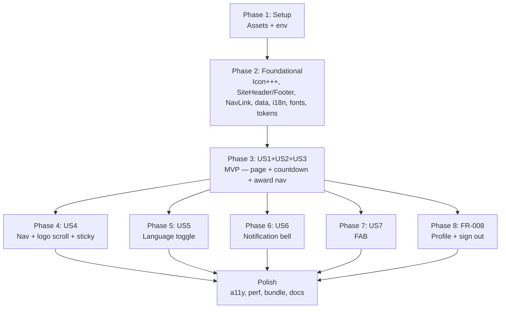

# Tasks: Homepage SAA 2025

**Frame**: `i87tDx10uM-homepage-saa`
**Prerequisites**: [plan.md](plan.md) (required), [spec.md](spec.md) (required),
[design-style.md](design-style.md) (required), [research.md](research.md) (recommended)
**Stack**: Next.js 16 App Router · React 19 · TypeScript strict · Tailwind v4 ·
Supabase Auth (`@supabase/ssr`, existing) · Cloudflare Workers (inherited) · Yarn v1

---

## Task Format

```
- [ ] T### [P?] [Story?] Description | file/path.ts
```

- **[P]**: Can run in parallel — different files, no deps on incomplete tasks
  in the same phase.
- **[Story]**: `[US1]`, `[US2]`, `[US3]`, `[US4]`, `[US5]`, `[US6]`, `[US7]` —
  required for user-story phases only. Setup / Foundational / FR-008 / Polish
  phases: **no story label**.
- **|**: Primary file path affected by the task.
- **TDD** (constitution Principle III): tasks named "Test + impl …" follow
  Red → Green → Refactor.
- **Login reuse**: where the task says "Extend …", the pattern is unchanged
  from Login; this just adds new props / cases.

---

## Phase 1: Setup (Assets + Env) — maps to plan.md Phase 0

**Purpose**: Gather all media + env values before code. Unblocks every
downstream task. Parallelizable except for the env schema update which
depends on the env file change.

- [x] T001 Inventory Figma media via `mcp__momorph__get_media_files
      screenId=i87tDx10uM`; record which assets resolve (hero BG expected to
      fail, same as Login) | (tool call — no file output)
- [x] T002 [P] Export Homepage hero background from Figma node `2167:9028`
      (Figma → Right-click → Export → PNG/JPG @1× or @2×) | `public/images/homepage-hero.jpg`
- [x] T003 [P] Export 6 award thumbnails from Figma cards `C2.1`–`C2.6`
      Picture-Award sub-instances | `public/images/awards/top-talent.png`,
      `top-project.png`, `top-project-leader.png`, `best-manager.png`,
      `signature-2025.png`, `mvp.png`
- [x] T004 [P] Export Sun\* Kudos promo illustration (includes decorative
      "KUDOS" SVN-Gotham text baked in) from `3390:10349` sub-node |
      `public/images/sunkudos-promo.png`
- [x] T005 [P] Export "2025" vertical decoration from `3204:10152` sub-node
      | `public/images/2025-decoration.svg`
- [x] T006 [P] Decide on Digital Numbers font (plan Q-P1): license + download,
      or ship fallback. If licensed, drop `.woff2` file | `public/fonts/digital-numbers.woff2`
      (or "DECISION: fallback only" noted in spec Q14)
- [x] T007 Add `NEXT_PUBLIC_EVENT_START_AT=2025-12-26T11:30:00Z` (placeholder
      — confirm exact time with Product per spec Q3) | `.env.example`
- [x] T008 Mirror the env var in local dev | `.env.local`
- [x] T009 Extend env schema: add `NEXT_PUBLIC_EVENT_START_AT:
      z.string().datetime().optional()` | `src/libs/env/client.ts`,
      `src/libs/env/__tests__/client.spec.ts` (new if not exists)
- [x] T010 Verify Phase 1 exit: `yarn typecheck` passes; all 8 assets present
      in `public/`; env loads without errors | (verification only — no file
      output)

---

## Phase 2: Foundational (Shared Infrastructure) — maps to plan.md Phase 1

**Purpose**: Extend the Login shell + add shared data/config so every US
phase can import what it needs. **⚠️ CRITICAL**: no US work can begin until
this phase is green.

- [x] T011 [P] Test + impl Icon extension — add 4 new cases: `bell`,
      `pencil`, `arrow-right`, `saa` (reuses SiteLogo vector at icon size) |
      `src/components/ui/Icon.tsx`,
      `src/components/ui/__tests__/Icon.spec.tsx`
- [x] T012 [P] Test + impl PrimaryButton `variant="outline"` prop (border 2px
      accent-cream, transparent bg, cream text, hover `bg-accent-cream/10`,
      active `bg-accent-cream/20`) — default `variant="solid"` stays unchanged
      for Login compat | `src/components/ui/PrimaryButton.tsx`,
      `src/components/ui/__tests__/PrimaryButton.spec.tsx`
- [x] T013 Test + impl SiteHeader extension — add optional `navItems?:
      NavItem[]`, `right?: ReactNode`, `sticky?: boolean`,
      `bgVariant?: "brand-800" | "brand-700"` props; keep default behavior
      identical to Login call site | `src/components/layout/SiteHeader.tsx`,
      `src/components/layout/__tests__/SiteHeader.spec.tsx`
- [x] T014 Test + impl SiteFooter extension — add optional `navItems?:
      NavItem[]` + `showLogo?: boolean` props; when `navItems` absent, render
      centered copyright (Login compat); when present, render logo + nav +
      copyright layout (Homepage) | `src/components/layout/SiteFooter.tsx`,
      `src/components/layout/__tests__/SiteFooter.spec.tsx`
- [x] T015 [P] Test + impl `<NavLink />` client component — `usePathname` for
      active-state (`aria-current="page"`), smooth `scrollTo({top:0,
      behavior:'smooth'})` on same-route click (FR-005), `next/link`
      navigation on different-route click, keyboard Enter/Space activation |
      `src/components/layout/NavLink.tsx`,
      `src/components/layout/__tests__/NavLink.spec.tsx`
- [x] T016 [P] Create frozen awards data file — 6 entries with `{ id, slug,
      titleKey, descKey, image }` | `src/data/awards.ts`
- [x] T017 [P] Create header + footer nav items config — typed constant with
      `{ href, labelKey }[]` for header (3 items) and footer (4 items) |
      `src/data/navItems.ts`
- [x] T018 [P] Extend Vietnamese message catalog with ~30 `homepage.*` +
      `common.nav.*` + `common.notification.*` + `common.profile.*` +
      `common.widget.*` keys per spec § i18n Message Keys | `src/messages/vi.json`
- [x] T019 [P] Mirror all new keys into English catalog | `src/messages/en.json`
- [x] T020 Update globals.css with new `@theme` tokens: `--color-brand-700:
      #101417`, `--color-card: #0B1419`, `--font-digital-numbers:
      var(--font-digital-numbers)` | `src/app/globals.css`
- [x] T021 Load Digital Numbers font in root layout via `next/font/local`
      (path `../../../public/fonts/digital-numbers.woff2`) — skip if T006 was
      "fallback only" | `src/app/layout.tsx`
- [x] T022 Verify Phase 2 exit: `yarn typecheck` clean; all extended-component
      tests green (4 Icon + 2 PrimaryButton + 3 SiteHeader + 2 SiteFooter + 4
      NavLink = 15 new cases); Login `/login` visual smoke + axe a11y
      unchanged | (verification only)

**Checkpoint**: Foundation ready — user story work can begin.

---

## Phase 3: User Stories 1 + 2 + 3 (P1, MVP) 🎯

**Goal**: Render the full Homepage (hero + Root Further + 6 awards + Kudos
promo + footer), with live countdown, and make award cards route to
`/awards#<slug>`. Ships US1 (landing), US2 (countdown), and US3 (award nav)
all together — they share the same scroll.

**Independent Test**: Authenticated user hits `/` → sees all sections with
correct content; countdown ticks; clicking "Top Talent" card navigates to
`/awards#top-talent`.

### Page shell + skip link (US1)

- [x] T023 [US1] Impl `<HomePage />` Server Component at `src/app/page.tsx`:
      skip-to-main link (first focusable), session check via
      `createServerClient().auth.getUser()`, redirect to `/login` if no
      session, extract role from `app_metadata.role`, ignore any `?next=`,
      wrap `getUser()` in try/catch for FR-016 graceful failure, render
      `<SiteHeader sticky bgVariant="brand-700" navItems={headerNav} right=
      {…}/>` + `<main id="main">…</main>` + `<SiteFooter navItems={footerNav}
      showLogo />` + `<QuickActionsFab />` | `src/app/page.tsx`

### Hero section (US1)

- [x] T024 [P] [US1] Impl `<HeroKeyVisual />` server comp — full-bleed
      `<Image src="/images/homepage-hero.jpg" fill priority sizes="100vw" />`
      + Rectangle 57 left gradient + Cover bottom gradient (design-style §2/§3/
      §4) | `src/components/homepage/HeroKeyVisual.tsx`
- [x] T025 [P] [US1] Impl `<EventInfo />` server comp — renders 3 i18n-keyed
      rows: `homepage.event.timeLabel/timeValue`, `locationLabel/locationValue`,
      `streamNote`. Labels white Montserrat 16/24/700/+0.15px; values cream
      Montserrat 24/32/700 | `src/components/homepage/EventInfo.tsx`
- [x] T026 [P] [US1] Impl `<HeroCtas />` server comp — 2 PrimaryButtons
      side-by-side wrapped in `<Link />`: "ABOUT AWARDS" (`variant="solid"`,
      `href="/awards"`), "ABOUT KUDOS" (`variant="outline"`, `href="/kudos"`).
      Gap 40px (FR-006) | `src/components/homepage/HeroCtas.tsx`
- [x] T027 [US1] Impl `<HeroSection />` server comp — composes
      `<HeroKeyVisual />` + Frame 487 content wrapper + hero title image
      (root-further asset) + "Comming soon" subtitle + `<Countdown />` +
      `<EventInfo />` + `<HeroCtas />`. Padding 96 144, gap 40 between blocks
      | `src/components/homepage/HeroSection.tsx`

### Root Further section (US1)

- [x] T028 [P] [US1] Impl `<RootFurtherCard />` server comp — dark card
      (`bg-card`, `rounded-lg`, `py-[120px] px-[104px]`), title image/text,
      body paragraph from `homepage.rootFurther.body` i18n key, right-side
      "2025" vertical decoration overlay | `src/components/homepage/RootFurtherCard.tsx`

### Awards section (US1 + US3)

- [x] T029 [P] [US1] Impl `<SectionHeader />` reusable server comp — props:
      `caption`, `title`, `description` i18n keys; renders Montserrat
      24/32/700 caption (white), 57/64/700/-0.25 title (cream), 16/24/400
      description (white) | `src/components/homepage/SectionHeader.tsx`
- [x] T030 [P] [US3] Impl `<AwardCard />` server comp — props: `award` (from
      `src/data/awards.ts`). Renders `next/image` thumbnail (aspect-square,
      `loading="lazy"`), title (Montserrat 24/32/**400** cream per design-style
      §9), description (`-webkit-line-clamp: 2`), `<Link href={'/awards#' +
      slug}>Chi tiết →</Link>`. Entire card is a clickable link wrapping all
      inner elements so image/title/button all navigate (FR-004) |
      `src/components/homepage/AwardCard.tsx`,
      `src/components/homepage/__tests__/AwardCard.spec.tsx`
- [x] T031 [US3] Impl `<AwardGrid />` server comp — maps `awards` data to 6
      `<AwardCard />`; responsive grid `grid-cols-1 sm:grid-cols-2 lg:grid-cols-3
      gap-6 lg:gap-8` | `src/components/homepage/AwardGrid.tsx`
- [x] T032 [US1] Impl `<AwardsSection />` server comp — composes
      `<SectionHeader caption="homepage.awards.caption" title="homepage.awards.title"
      description="homepage.awards.description"/>` + `<AwardGrid />`; gap 80px
      | `src/components/homepage/AwardsSection.tsx`

### Sun* Kudos promo (US1)

- [x] T033 [P] [US1] Impl `<KudosPromoBlock />` server comp — 2-column grid
      (text left, illustration right). Text: caption (`homepage.kudos.caption`),
      title (`homepage.kudos.title`), body (`homepage.kudos.description`),
      `<Link href="/kudos">` solid cream "Chi tiết →" CTA. Right:
      `<Image src="/images/sunkudos-promo.png" />` | `src/components/homepage/KudosPromoBlock.tsx`

### Countdown (US2)

- [x] T034 [P] [US2] Impl `<CountdownTile />` server comp — presentation only:
      props `digits: [string, string]` + `label: string`. Renders 2 tiles per
      digit with Digital Numbers 49.152px / 400 / white, label Montserrat
      24/32/700 uppercase white | `src/components/homepage/CountdownTile.tsx`
- [x] T035 [US2] Test + impl `<Countdown />` client — SSR-provided
      `eventStartAt` (ISO string), computes initial `remainingMs`, ticks
      every 60_000 ms, rolls over days/hours/minutes correctly, holds at
      `00/00/00` when `≤ 0`, hides "Comming soon" subtitle via an outer render
      prop, `aria-live="polite"` wrapper, `visibilitychange` listener
      recomputes on foreground, renders fallback when `eventStartAt` missing
      (FR-002/FR-003 + edge cases) | `src/components/homepage/Countdown.tsx`,
      `src/components/homepage/__tests__/Countdown.spec.tsx`
- [x] T036 [US2] Wire `<Countdown eventStartAt={env.NEXT_PUBLIC_EVENT_START_AT} />`
      into `<HeroSection />`. Pass an `onSubtitleVisible` callback (or just
      conditionally render subtitle server-side based on whether event time is
      in the future) so "Comming soon" hides correctly | `src/components/homepage/HeroSection.tsx`

### Placeholder routes (US1 — unblock navigation)

- [x] T037 [P] [US1] Create `/awards` stub server component — renders "Awards
      Information: coming soon" + link back to `/`. Note: URL hash is
      client-only; stub doesn't read it (plan Phase 2 note) |
      `src/app/awards/page.tsx`
- [x] T038 [P] [US1] Create `/kudos` stub | `src/app/kudos/page.tsx`
- [x] T039 [P] [US1] Create `/kudos/new` stub (FAB target) |
      `src/app/kudos/new/page.tsx`
- [x] T040 [P] [US1] Create `/notifications` stub |
      `src/app/notifications/page.tsx`
- [x] T041 [P] [US1] Create `/profile` stub | `src/app/profile/page.tsx`
- [x] T042 [P] [US1] Create `/standards` stub | `src/app/standards/page.tsx`
- [x] T043 [P] [US1] Create `/admin` stub — server-gates via
      `app_metadata.role === "admin"`, else `redirect("/error/403")` |
      `src/app/admin/page.tsx`

### E2E for US1/US2/US3

- [ ] T044 [US1] Playwright E2E homepage happy path: authenticated session
      cookie seeded → `/` renders hero, Root Further card, 6 award cards,
      Kudos promo, footer, FAB all visible | `tests/e2e/homepage.happy.spec.ts`
- [ ] T045 [US1] Playwright E2E: unauthenticated `/` → 302 to `/login` |
      `tests/e2e/homepage.happy.spec.ts` (same file)
- [ ] T046 [US2] Playwright E2E countdown — assert tiles render with
      reasonable day/hour/minute values for the seeded `EVENT_START_AT`;
      advance system clock via CDP → assert minute tick |
      `tests/e2e/homepage.countdown.spec.ts`
- [ ] T047 [US3] Playwright E2E: click each of 6 award cards → URL has
      `#<correct-slug>`, target page renders | `tests/e2e/homepage.happy.spec.ts`

**Checkpoint**: MVP shippable. US1, US2, US3 complete.

---

## Phase 4: User Story 4 (P1): Header nav + logo scroll + sticky header

**Goal**: Finish header navigation and logo click behaviors. (Hero CTAs
already ship in Phase 3.)

**Independent Test**: On Homepage, "About SAA 2025" link has
`aria-current="page"` + click scrolls to top; clicking "Award Information"
navigates to `/awards`.

- [x] T048 [US4] Wrap `<SiteLogo />` in client `<LogoLink />` OR enhance
      SiteLogo itself to support scroll-to-top on current route (FR-014) |
      `src/components/layout/SiteLogo.tsx`,
      `src/components/layout/__tests__/SiteLogo.spec.tsx`
- [ ] T049 [US4] Verify sticky-header z-index layering (header 40, FAB 50,
      content 20, vignettes 10) via Playwright visual test — FAB popover
      appears above header on open | `tests/e2e/homepage.nav.spec.ts`
- [ ] T050 [US4] Playwright E2E header nav: assert `aria-current` on active
      link; click "About SAA 2025" when on `/` → scrolls to top (assert
      `window.scrollY === 0`); click "Award Information" → navigates to
      `/awards` | `tests/e2e/homepage.nav.spec.ts` (same file)
- [ ] T051 [US4] Playwright E2E keyboard: focus nav link → Enter → fires
      same as click (navigate or scroll) | `tests/e2e/homepage.nav.spec.ts`
      (same file)

**Checkpoint**: P1 user stories all complete.

---

## Phase 5: User Story 5 (P2): Language toggle on Homepage

**Goal**: Confirm existing `<LanguageToggle />` from Login works inside
Homepage's header right-slot.

**Independent Test**: Click VN → dropdown → select EN → hero copy flips,
cookie set, reload persists EN.

- [x] T052 [US5] Mount `<LanguageToggle />` inside SiteHeader's `right` slot
      from the page (`src/app/page.tsx`) — no new component, just composition
      | `src/app/page.tsx` (update only)
- [ ] T053 [US5] Playwright E2E: open dropdown, select EN, assert homepage
      hero subtitle + event values + section title + Kudos promo all flip to
      EN copy; reload → stays EN | `tests/e2e/homepage.language.spec.ts`

---

## Phase 6: User Story 6 (P2): Notification bell

**Goal**: Bell icon with unread badge (mocked count) + navigation to
`/notifications`.

**Independent Test**: Bell shows no badge when count=0; shows "5" when
count=5; shows "99+" when count=150; click navigates.

- [x] T054 [US6] Test + impl `<NotificationBell />` client component — props
      `initialUnreadCount: number`; wraps `<Icon name="bell">` + red badge
      (cap at "99+"); wrapped in `<Link href="/notifications">`; `aria-label`
      from `common.notification.unread` i18n key with `{count}` interpolation
      | `src/components/layout/NotificationBell.tsx`,
      `src/components/layout/__tests__/NotificationBell.spec.tsx`
- [x] T055 [US6] Wire `<NotificationBell initialUnreadCount={0} />` into
      SiteHeader `right` slot (alongside LanguageToggle + ProfileMenu) from
      `src/app/page.tsx`. MVP hardcodes 0; real Supabase query deferred |
      `src/app/page.tsx`
- [ ] T056 [US6] Playwright E2E: bell visible, `aria-label` correct, click
      navigates to `/notifications` | `tests/e2e/homepage.nav.spec.ts` (same
      file)

---

## Phase 7: User Story 7 (P3): Widget Button (FAB)

**Goal**: Floating pill CTA at bottom-right with 1-item quick-actions menu.

**Independent Test**: FAB visible while scrolling; click opens popover with
"Viết Kudo →" item; click item → `/kudos/new`; Esc closes.

- [x] T057 [US7] Test + impl `<QuickActionsFab />` client component —
      `fixed bottom-6 right-6 z-50 h-16 px-4 rounded-full bg-accent-cream`;
      renders `<Icon name="pencil">` + `/` + `<Icon name="saa">`; click opens
      popover anchored below; Esc + outside-click close; 1 item "Viết Kudo →"
      linking to `/kudos/new`. `aria-label` from `common.widget.openMenu` |
      `src/components/homepage/QuickActionsFab.tsx`,
      `src/components/homepage/__tests__/QuickActionsFab.spec.tsx`
- [ ] T058 [US7] Playwright E2E: FAB visible while scrolling, click opens
      menu, click "Viết Kudo" → `/kudos/new`, Esc closes |
      `tests/e2e/homepage.fab.spec.ts`

---

## Phase 8: FR-008 Profile dropdown + Sign out (P2)

**Purpose**: Wire `<ProfileMenu />` with server-side sign out action and
admin-role branching. (Not a dedicated user story — implements FR-008; lands
alongside every logged-in screen.)

- [x] T059 Test + impl `signOut` Server Action — `"use server"`; calls
      `supabase.auth.signOut()`; `redirect("/login")`; handles error by still
      redirecting (user already signed out client-side) |
      `src/libs/auth/signOut.ts`,
      `src/libs/auth/__tests__/signOut.spec.ts`
- [x] T060 Test + impl `<ProfileMenu />` client component — props `user: {
      email, avatarUrl, displayName }`, `isAdmin: boolean`. Trigger button
      (avatar + `aria-haspopup="menu"` + `aria-expanded`). Dropdown items:
      Profile (link `/profile`) · Sign out (`<form action={signOut}><button
      type="submit">`) · Admin Dashboard (only when `isAdmin`, link
      `/admin`). Focus trap + Esc close + outside-click close |
      `src/components/layout/ProfileMenu.tsx`,
      `src/components/layout/__tests__/ProfileMenu.spec.tsx`
- [x] T061 Wire `<ProfileMenu user={user} isAdmin={role === "admin"} />`
      into SiteHeader right slot from `src/app/page.tsx`. Read `user` + role
      server-side in Homepage | `src/app/page.tsx`
- [ ] T062 Playwright E2E: profile button opens menu; as non-admin, 2 items
      visible; as admin (role seeded in mock Supabase response), 3 items
      including Admin Dashboard; click "Sign out" → redirects to `/login` |
      `tests/e2e/homepage.profile.spec.ts`

---

## Phase N: Polish & Cross-Cutting Concerns

**Purpose**: Production hardening (a11y, perf, bundle, docs, SCREENFLOW).

- [ ] T063 [P] axe-core a11y sweep at mobile + desktop viewports; zero
      serious/critical violations | `tests/e2e/homepage.a11y.spec.ts`
- [ ] T064 [P] Tab order verification Playwright test: logo → 3 nav → bell →
      language → profile → hero CTA 1 → hero CTA 2 → 6 award cards → Kudos
      promo CTA → 4 footer links → FAB. Skip-link first focus from cold load
      | `tests/e2e/homepage.a11y.spec.ts` (same file)
- [ ] T065 [P] Update bundle-size guard script to include `/` route with 40
      KB gzipped target per TR-003 | `scripts/check-bundle-size.mjs`
- [x] T066 [P] Emit `{ type: "screen_view", screen: "homepage" }` analytics
      event on Homepage server render (call from `<HomePage />`) |
      `src/app/page.tsx`
- [ ] T067 [P] Performance measurement on Cloudflare Workers preview via
      Lighthouse mobile slow-4G; if LCP > 2.5 s, add `blurDataURL` via
      `plaiceholder` to hero BG | `src/components/homepage/HeroKeyVisual.tsx`
- [x] T068 [P] Extend `docs/auth.md` with sections on sign-out Server Action
      + admin-role detection (`app_metadata.role`) contract | `docs/auth.md`
- [x] T069 [P] Update SCREENFLOW: mark Homepage as `implemented`; increment
      counters; add Discovery Log entry | `.momorph/contexts/screen_specs/SCREENFLOW.md`
- [ ] T070 Final verification: `yarn lint`, `yarn typecheck`, `yarn test:run`,
      `yarn e2e` all green; `yarn build` succeeds; Login `/login` still
      renders identically (zero regression) | (verification only)

---

## Dependencies & Execution Order

### Phase-level

- **Phase 1 (Setup)**: No upstream dependencies — can start immediately.
- **Phase 2 (Foundational)**: Depends on Phase 1 (env + assets). **Blocks
  all user stories.**
- **Phase 3 (US1+US2+US3)**: Depends on Phase 2. Unblocks Phases 4–8.
- **Phase 4 (US4)**: Depends on Phase 3 (NavLink exists + page composes
  SiteHeader).
- **Phase 5 (US5)**: Depends on Phase 2 (LanguageToggle exists). Can run
  alongside Phase 4 if staffed.
- **Phase 6 (US6)**: Depends on Phase 2 (Icon has `bell` case) + Phase 3
  (page composition). Can run in parallel with 4, 5, 7, 8.
- **Phase 7 (US7)**: Depends on Phase 2 (Icon has `pencil` + `saa`) +
  Phase 3 (page composition). Independent after that.
- **Phase 8 (FR-008)**: Depends on Phase 2 (Icon) + Phase 3. Independent
  after.
- **Polish**: Depends on all user stories being complete.

### Dependency graph



### Within a phase

- Tests (for TDD-flagged tasks) MUST fail before implementation.
- Primitives before composers: Icon → PrimaryButton → NavLink → SiteHeader
  extension; SectionHeader before AwardsSection; HeroKeyVisual + EventInfo
  + HeroCtas → HeroSection; CountdownTile before Countdown; then HomePage
  composes everything.
- Data before consumers: `awards.ts` and `navItems.ts` before components
  that read them.

---

## Parallel Opportunities

### Phase 1 — mostly parallel

- T002 + T003 + T004 + T005 + T006 all asset exports (different files,
  different Figma nodes). T001 inventory first.
- T007 + T008 both env files; can run in same edit.
- T009 env schema update depends on T007/T008.

### Phase 2 — three clusters

- **UI primitives** cluster: T011 (Icon) + T012 (PrimaryButton) — both [P],
  independent.
- **Layout shell** cluster: T013 (SiteHeader) + T014 (SiteFooter) — same
  folder but different files, run in parallel. T015 (NavLink) independent.
- **Data + config** cluster: T016 (awards.ts) + T017 (navItems.ts) + T018
  (vi.json) + T019 (en.json) + T020 (globals.css) all [P].
- T021 (font loading in layout.tsx) depends on T006 font decision.

### Phase 3 — heavy parallel after page shell exists

- T024 + T025 + T026 + T028 + T029 + T030 + T033 + T034 + T037–T043 all
  marked [P] — different component files. Wait for T023 page shell + T022
  Phase-2 exit.
- T031 AwardGrid depends on T030 AwardCard.
- T032 AwardsSection depends on T029 SectionHeader + T031 AwardGrid.
- T027 HeroSection depends on T024 + T025 + T026 + T035 Countdown.
- T035 Countdown depends on T034 CountdownTile.
- T036 wires Countdown into Hero — sequential after T035 + T027.
- T044–T047 E2E at phase end — sequential (share dev server) but can run
  all in same Playwright invocation.

### Phase 4–8 — mostly independent

- Each phase ships a small isolated feature — can stagger in time.
- Within a phase, unit test + impl sequential; E2E at end.

### Polish — highly parallel

- T063 + T064 + T065 + T066 + T067 + T068 + T069 all [P].
- T070 final verification last.

---

## Implementation Strategy

### MVP First (Recommended)

1. Complete Phase 1 + Phase 2 — one PR or two small PRs (`chore/homepage-
   setup`, `chore/homepage-foundation`).
2. Complete Phase 3 (US1+US2+US3) — one PR `feat(homepage): MVP`. Deploy
   to preview Workers; validate with design team.
3. Ship MVP if Product signs off. **STOP AND VALIDATE** — countdown
   accuracy, image asset pixel-match, a11y.
4. Phases 4–8 layer on incrementally. Polish last.

### Incremental Delivery

- PR 1: Phase 1 — assets + env (`chore/homepage-assets`)
- PR 2: Phase 2 — foundational extensions (`chore/homepage-foundation`)
- PR 3: Phase 3 — `feat(homepage): landing + countdown + awards` (US1+US2+US3)
- PR 4: Phase 4 — `feat(homepage): sticky nav + logo scroll`
- PR 5: Phase 5 — `feat(homepage): language toggle regression`
- PR 6: Phase 6 — `feat(homepage): notification bell`
- PR 7: Phase 7 — `feat(homepage): quick actions FAB`
- PR 8: Phase 8 — `feat(auth): profile dropdown + sign out`
- PR 9: Polish — `chore(homepage): a11y + perf + bundle + docs`

### Team split (if staffed)

- **Dev A**: Phase 1 assets (T001–T010), then Phase 2 shell extensions
  (T013, T014, T015).
- **Dev B**: Phase 2 primitives (T011, T012), then Phase 3 static components
  (T024, T028, T029, T033).
- **Dev C**: Phase 2 data + i18n (T016–T020), then Phase 3 awards cluster
  (T030, T031, T032).
- **Dev D**: Phase 3 countdown (T034, T035, T036) + E2E (T044–T047), then
  Phase 8 profile + signOut.
- Phases 4–7 can be distributed across devs once Phase 3 lands.

---

## Notes

- **TDD** (constitution Principle III): tasks named "Test + impl" follow
  Red → Green → Refactor.
- **Commit cadence**: after each task or logical group; conventional commits
  (`feat(homepage): add countdown tile`).
- **Visual verification**: after Phase 3 completes, capture a desktop +
  mobile Playwright screenshot and compare to
  [.momorph/specs/i87tDx10uM-homepage-saa/assets/frame.png](assets/frame.png)
  — pixel-perfect match for hero composition + award grid + Kudos promo.
- **Spec + plan open questions carry over**:
  - Spec Q1-Q14 (body copy, slugs, event time, typo, font license, etc.)
  - Plan Q-P1/Q-P2/Q-P3 (font license, awards in code, signout UX).
  - Document each as an assumption in the relevant task when unanswered.
- **Login regression guard**: every phase's exit criteria includes "Login
  `/login` still renders identically". Re-run Login's axe test after any
  shared-component change.
- **Security non-negotiables inherited from constitution Principle IV**:
  session re-verify server-side (T023), sign-out via Server Action (T059),
  admin-role server-gated (T043, T060), no secrets in client bundle
  (existing CI guard).
