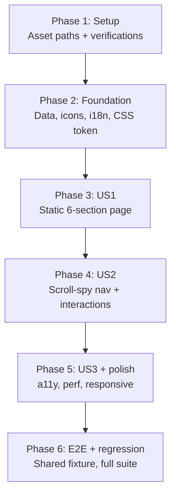

# Tasks: Awards System (Hệ thống giải thưởng SAA 2025)

**Frame**: `zFYDgyj_pD-awards-system`
**Prerequisites**: [plan.md](plan.md) (required), [spec.md](spec.md) (required),
[design-style.md](design-style.md) (required)
**Stack**: Next.js 16 App Router · React 19 · TypeScript strict · Tailwind v4 ·
Supabase Auth (`@supabase/ssr`, existing) · Cloudflare Workers (inherited) · Yarn v1

---

## Task Format

```
- [ ] T### [P?] [Story?] Description | file/path.ts
```

- **[P]**: Can run in parallel — different files, no deps on incomplete tasks in the same phase.
- **[Story]**: `[US1]`, `[US2]`, `[US3]` — required for user-story phases only. Setup / Foundational / Polish phases: **no story label**.
- **|**: Primary file path affected by the task.
- **TDD** (constitution Principle III): tasks named "Test + impl …" follow Red → Green → Refactor.
- **Reuse from Homepage**: SiteHeader, SiteFooter, HeroBackdrop, KudosPromoBlock, QuickActionsFab, LanguageToggle, NotificationBell, ProfileMenu — all imported unchanged.

---

## Phase 1: Setup (Asset Preparation) — maps to plan.md Phase 0

**Purpose**: Gather all non-code prerequisites so code phases are not blocked mid-flight. Parallelizable.

- [x] T001 [P] Fetch `target` icon SVG path via `mcp__momorph__get_design_item_image nodeId="I313:8467;214:2529"`, normalise to 24×24 viewBox, save snippet for Phase 2 use | (tool call — no file output)
- [x] T002 [P] Fetch `diamond` icon SVG path via `mcp__momorph__get_design_item_image nodeId="I313:8467;214:2535"`, normalise to 24×24 viewBox, save snippet | (tool call — no file output)
- [x] T003 [P] Fetch `license` icon SVG path via `mcp__momorph__get_design_item_image nodeId="I313:8467;214:2543"`, normalise to 24×24 viewBox, save snippet | (tool call — no file output)
- [x] T004 [P] Verify existing assets in `public/images/`: `homepage-hero.png`, `logo_footer_Kudos.png`, `sunkudos-promo.png`, `awards/award-frame.png`, `saa-logo.png` — all inherited from Homepage, spot-check dimensions | (verification only)
- [x] T005 Document asset fallback strategy: use shared `/images/awards/award-frame.png` for all 6 badges until design team ships 6 unique PNGs (tracked in `.momorph/specs/i87tDx10uM-homepage-saa/assets-to-export.md` item #2) | (documentation only)
- [x] T006 Verify `NEXT_LOCALE` cookie + `getMessages()` helper work as in Homepage (no new env vars) | (verification only)

**Exit criteria (Phase 1)**: 3 icon SVG paths in hand; all image paths verified; no env var changes needed.

---

## Phase 2: Foundational (Shared Infrastructure) — maps to plan.md Phase 1

**Purpose**: Extend shared code (data, icons, i18n, tokens) so every user-story phase can import what it needs. **⚠️ CRITICAL**: no US work can begin until this phase is green.

- [x] T007 Extend `Award` TypeScript type with new required fields `longDescKey`, `prizeCount`, `prizeUnit: "individual" | "team" | "either"`, `prizeValues: { suffixKey?: string; amountVnd: number }[]`; fill all 6 AWARDS entries with data from spec §Frozen Data Table (Top Talent 10/7M, Top Project 2/15M, TPL 3/7M, Best Manager 1/10M, Signature 2025 1/5M+8M, MVP 1/15M) | `src/data/awards.ts`
- [x] T008 [P] Test + impl Icon extension — add `"target" | "diamond" | "license"` to `IconName` union, add 3 `case` branches with inline SVG from T001-T003. TDD: write test cases first (render as SVG, size prop, aria-label), then implement | `src/components/ui/Icon.tsx`, `src/components/ui/__tests__/Icon.spec.tsx`
- [x] T009 [P] Extend Vietnamese i18n catalog with `awards.*` block: `hero.{caption,title}`, `nav.{topTalent,topProject,topProjectLeader,bestManager,signature2025,mvp}`, `card.{prizeCountLabel,prizeValueLabel,perPrize,unitIndividual,unitTeam,unitIndividualOrTeam,signatureIndividualSuffix,signatureTeamSuffix,navAriaLabel}`, `meta.{title,description}`, and 6 per-award `{titleKey,longDescKey}` blocks with VN descriptions verbatim from design-style.md §i18n Message Keys | `src/messages/vi.json`
- [x] T010 [P] Mirror all new `awards.*` keys into English catalog — EN long descriptions fall back to VN verbatim pending Q1; add `// TODO: Q1 EN translation pending` comment per key | `src/messages/en.json`
- [x] T011 [P] Add `--color-nav-dot: #D4271D` token to Tailwind `@theme` block | `src/app/globals.css`
- [x] T012 Verify `<HeroBackdrop />` is a standalone named export (no-op check since Homepage already imports from `@/components/homepage/HeroBackdrop`) | (verification only)
- [x] T013 Verify Phase 2 exit: `yarn typecheck` clean; `yarn lint` clean; `yarn test:run` all 60 existing + 3 new Icon tests pass; Homepage `/` still renders all 6 AwardCards correctly (manual 30s dev smoke) | (verification only)

**Checkpoint**: Foundation ready — user story work can begin.

---

## Phase 3: User Story 1 (P1) 🎯 MVP — Browse all 6 awards as static content

**Goal**: Render `/awards` with all 6 sections visible as long-form reference. Deep links from Homepage AwardCard (`/awards#<slug>`) land on the correct section via native browser anchor scrolling — no JS needed for the core read flow.

**Independent Test**: Authenticated user navigates to `/awards` → sees hero with "Hệ thống giải thưởng SAA 2025" title, scrolls through 6 award sections (Top Talent → MVP) each with golden badge, title, long description, prize count, prize value; clicking Homepage Top Talent card lands on `/awards#top-talent` scrolled into view.

### Phase 2 sub-components (US1 — can parallelize within DAG)

- [x] T014 [P] [US1] Test + impl `<AwardPrizeValueRow />` — renders ONE row with `<Icon name="diamond"|"license">`, label "Giá trị giải thưởng:", amount formatted as "X.XXX.XXX VNĐ", optional trailing suffix from `suffixKey`. Props: `amountVnd: number`, `suffixKey?: string`, `icon: "diamond" \| "license"`. 2 test cases: (a) with suffix renders trailing text, (b) without suffix renders no trailing text | `src/components/awards/AwardPrizeValueRow.tsx`, `src/components/awards/__tests__/AwardPrizeValueRow.spec.tsx`
- [x] T015 [US1] Impl `<AwardContent />` — composes h2 title (cream 36/44 700 + `target` icon prefix), long description paragraph (white 16/24 400 no line-clamp), prize-count row ("Số lượng giải thưởng: {n} {unit}" with `target` icon + bold number 36/44), and renders 1-or-2 `<AwardPrizeValueRow />` based on `prizeValues.length`. For Signature 2025 (length=2), first row icon=diamond with `signatureIndividualSuffix`, second row icon=license with `signatureTeamSuffix`. For single-value awards where `prizeCount > 1`, row uses `perPrize` suffix; where `prizeCount === 1`, suffix omitted | `src/components/awards/AwardContent.tsx`
- [x] T016 [US1] Impl `<AwardDetailSection />` — `<section id={award.slug}>` wrapper, 2-col alternating layout with `reverse` prop (odd=image-right, even=image-left). Desktop: image `w-[336px] h-[336px]` with cream/40% ring; tablet/mobile: image `w-full max-w-[336px] aspect-square mx-auto`, content stacks below. Always provide `width={336}` and `height={336}` on `<Image>` for CLS. Accept `priority: boolean` prop for first section only (LCP target). Content slot = `<AwardContent award={award} />` | `src/components/awards/AwardDetailSection.tsx`, `src/components/awards/__tests__/AwardDetailSection.spec.tsx`
- [x] T017 [P] [US1] Impl `<AwardsHeroBanner />` — composes `<HeroBackdrop />` (reused from `@/components/homepage/HeroBackdrop`) + decorative ROOT FURTHER wordmark `<div aria-hidden="true">` top-left with Montserrat display ~48-60px cream (size reduced vs Homepage hero) + center-bottom title block: caption `<p>` (white 24/32 700 from `awards.hero.caption`) + `<h1>` (cream 57/64 700 from `awards.hero.title`, responsive scale `text-4xl sm:text-5xl lg:text-[57px]`). This is the page's **only** `<h1>` per FR-016 | `src/components/awards/AwardsHeroBanner.tsx`

### Page composition (US1 — depends on T015–T017)

- [x] T018 [US1] Impl `/awards` page — Server Component; `generateMetadata()` async reads `awards.meta.{title,description}` via `getMessages()` and injects into `<head>`; skip link `<a href="#main">` from `messages.homepage.skipToMain`; session gate via `createClient().auth.getUser()` wrapped in try/catch → `redirect("/login")` on failure (FR-013); `track({ type: "screen_view", screen: "awards" })`; layout: `<SiteHeader navItems={HEADER_NAV} right={headerRight} sticky bgVariant="brand-700" />` + `<main id="main">` containing `<AwardsHeroBanner />` + `<AwardDetailSection award={award} reverse={i % 2 === 1} priority={i === 0} />` × 6 (mapped over AWARDS) + `<KudosPromoBlock />` (Homepage-reused) + `<SiteFooter navItems={FOOTER_NAV} showLogo />` + `<QuickActionsFab openMenuLabel={...} writeKudoLabel={...} />`. Header right slot = `<NotificationBell initialUnreadCount={0} /> + <LanguageToggle /> + <ProfileMenu />` (identical to Homepage) | `src/app/awards/page.tsx`

### Phase 3 exit

- [x] T019 [US1] Verify Phase 3 exit: `/awards` renders hero + 6 sections + Kudos promo + footer; Homepage `<AwardCard>` click on "Top Talent" lands on `/awards#top-talent` with browser-native anchor scroll (no JS required for deep link); `yarn typecheck` + `yarn lint` + `yarn test:run` green; mobile viewport (375×812) stacks single-column correctly; header nav "Award Information" shows `aria-current="page"` | (verification only)

**Checkpoint**: MVP shippable. US1 complete — users can browse all 6 awards and deep-link from Homepage.

---

## Phase 4: User Story 2 (P1) — Sticky left nav with scroll-spy

**Goal**: Add the sticky left navigation column with 6 items, IntersectionObserver scroll-spy, smooth-scroll on click, URL hash update via `history.replaceState`, keyboard support, reduced-motion + JS-disabled fallbacks.

**Independent Test**: On `/awards` desktop (≥1024px), left nav visible with 6 items in fixed order. Click any item → page smooth-scrolls to that section + URL hash updates + active item gets cream color + red dot + underline. Manually scroll → active state auto-updates. Deep link `/awards#best-manager` → auto-scrolls on load. Keyboard Enter on focused item → same as click.

### Nav component (US2)

- [x] T020 [US2] Scaffold `<AwardsCategoryNav />` client component — `"use client"`, props: `items: { slug: AwardSlug; label: string }[]` (6 pre-resolved labels), `ariaLabel: string`, `initialActiveSlug: AwardSlug`. Each nav item renders as `<a href="#<slug>">` (NOT `<button>`) so JS-off fallback scrolls natively via browser anchor. Inner `<li>` items separated by `space-y-6`. Sticky `top-[120px]` desktop; `hidden lg:block` on mobile/tablet. Wrap in `<nav aria-label={ariaLabel}>` with `<ul>` | `src/components/awards/AwardsCategoryNav.tsx`, `src/components/awards/__tests__/AwardsCategoryNav.spec.tsx`
- [x] T021 [US2] Impl nav item visual states in `<AwardsCategoryNav />`: default (white text, no dot), hover (bg `var(--color-nav-active-hover)` 10% cream + `translate-x-[2px]` 150ms ease-out; `translate-x` skipped when `prefers-reduced-motion: reduce`), active (cream text + 1px cream underline-bottom + 8px red dot `--color-nav-dot` before text, `aria-current="true"`), focus (cream outline 2px offset 2px) | `src/components/awards/AwardsCategoryNav.tsx`
- [x] T022 [US2] Impl click handler in `<AwardsCategoryNav />`: `event.preventDefault()`, call `scrollIntoView({ behavior: prefersReducedMotion ? "instant" : "smooth", block: "start" })` on target section, `history.replaceState(null, "", "#${slug}")` (NO new history entry), setState `activeSlug = slug` + `isProgrammaticScrolling = true` until `scrollend` fires (or 600ms `setTimeout` fallback detected via `'onscrollend' in window`) — feature-gates scroll-spy updates during programmatic scroll (FR-005a) | `src/components/awards/AwardsCategoryNav.tsx`
- [x] T023 [US2] Impl IntersectionObserver scroll-spy: observe all 6 `<section id="<slug>">` elements with `rootMargin: "-40% 0px -60% 0px"`; on entry, if `!isProgrammaticScrolling`, setState `activeSlug` = entry's slug. Does NOT rewrite `window.location.hash` (Q8 default) | `src/components/awards/AwardsCategoryNav.tsx`
- [x] T024 [US2] Impl `prefersReducedMotion` detection: `matchMedia("(prefers-reduced-motion: reduce)")`, subscribe to change events, swap `"smooth"` ↔ `"instant"` in scroll calls + skip `translateX` hover | `src/components/awards/AwardsCategoryNav.tsx`
- [x] T025 [US2] Impl initial hash-scroll on mount (FR-003): read `window.location.hash`, validate against valid slug list (from `AWARDS`), if valid → `scrollIntoView` after 1 RAF to ensure layout ready; also listen for `hashchange` event (TR-006) to re-trigger scroll when user navigates browser history | `src/components/awards/AwardsCategoryNav.tsx`
- [x] T026 [US2] Impl keyboard handlers on each nav `<a>`: `onKeyDown` → if Enter or Space, call the same handler as click; visible focus ring (cream 2px offset 2) | `src/components/awards/AwardsCategoryNav.tsx`

### Tests (US2)

- [x] T027 [US2] Unit tests for `<AwardsCategoryNav />` — 6 test cases: (1) click updates active + `window.location.hash` via mocked `replaceState`, (2) Enter/Space key activates same handler as click, (3) scroll-spy observer pauses during programmatic scroll (assert `activeSlug` does not change mid-scroll via mock IntersectionObserver), (4) `hashchange` event re-syncs active state, (5) `prefers-reduced-motion: reduce` swaps `"smooth"` → `"instant"` (mock matchMedia), (6) initial hash `#signature-2025-creator` on mount → scrollIntoView called with that section ref. Mocks: `vi.stubGlobal('IntersectionObserver', MockClass)`, `vi.stubGlobal('matchMedia', ...)`, mock `Element.prototype.scrollIntoView` | `src/components/awards/__tests__/AwardsCategoryNav.spec.tsx`

### Page wire-up (US2)

- [x] T028 [US2] Mount `<AwardsCategoryNav />` in `/awards` page — wrap the 6 `<AwardDetailSection>` list + nav in a 2-column `<div className="grid grid-cols-1 lg:grid-cols-[220px_1fr] lg:gap-8">`. Nav on left (`hidden lg:block sticky top-[120px]`), content column on right. Pre-resolve 6 labels from `messages.awards.nav.*` server-side, pass as `items` prop. Compute `initialActiveSlug` server-side = "top-talent" (no URL hash access on server; client adjusts on mount) | `src/app/awards/page.tsx`

### Phase 4 exit

- [x] T029 [US2] Verify Phase 4 exit: click each of 6 nav items → scroll + URL hash + active state correct; manually scroll → active state updates smoothly (threshold around 40% viewport); deep link `/awards#mvp` on cold load → auto-scrolls; keyboard Tab + Enter navigation works; browser back/forward through hashes fires `hashchange` → scroll + active update; `yarn test:run` green with all 6 new AwardsCategoryNav test cases | (verification only)

**Checkpoint**: US1 + US2 complete — P1 user stories all shipped.

---

## Phase 5: User Story 3 (P2) + a11y + perf + responsive

**Goal**: Verify Kudos promo reuse (US3), pass accessibility & performance bars, handle responsive resize cleanly.

**Independent Test**: Kudos promo block renders at bottom with "Chi tiết →" linking to `/kudos`. axe-core sweep returns 0 serious/critical violations. Lighthouse mobile slow-4G: LCP < 2.5s, CLS < 0.1. Drag viewport across 1024px breakpoint → no layout shift.

- [x] T030 [US3] Verify `<KudosPromoBlock />` renders at bottom of `/awards` page with correct text and "Chi tiết →" → `/kudos` (30-second dev smoke — no code change since it's Homepage-reused) | (verification only)
- [x] T031 [P] Responsive resize verification (FR-015): drag browser width across 1024px boundary → left nav shows/hides instantly without content-column reflow jump | (verification only)
- [x] T032 [P] axe-core a11y sweep at mobile (375×812) + desktop (1440×900) via `@axe-core/playwright` — zero serious/critical violations (SC-003) | `tests/e2e/awards.a11y.spec.ts`
- [x] T033 [P] Tab order verification via Playwright: skip-link → header (logo → About SAA 2025 → Award Information → Sun\* Kudos → bell → language toggle → profile) → left nav × 6 → Kudos CTA → footer × 4 → FAB. Confirm focus ring visible on each interactive element | `tests/e2e/awards.a11y.spec.ts` (same file)
- [x] T034 [P] Language toggle smoke: click VN→EN toggle, assert hero title, caption, all 6 award titles + descriptions, prize labels + suffixes, Kudos promo all flip to EN copy without layout shift (SC-005) | `tests/e2e/awards.language.spec.ts`
- [ ] T035 Lighthouse mobile slow-4G on Cloudflare Workers preview (option 1: `yarn cf:preview` + Chrome DevTools Lighthouse panel manually) — target LCP < 2.5s, CLS < 0.1, TBT < 200ms (SC-004). If LCP misses, add `blurDataURL` to first badge via `plaiceholder` | (verification only)
- [x] T036 [P] Visual verify: Playwright screenshot of `/awards` at 1440×900 desktop full-page, compare structure against `.momorph/specs/zFYDgyj_pD-awards-system/assets/frame.png` — manual visual review (pixel-diff not required for MVP) | `tests/e2e/awards.visual.spec.ts`

**Checkpoint**: US3 done; accessibility, performance, responsive all verified.

---

## Phase 6: Polish & Cross-Cutting (E2E, regression, docs)

**Purpose**: Production hardening — shared auth fixture, happy-path E2E, regression check, SCREENFLOW update.

- [x] T037 Create shared auth fixture `tests/e2e/fixtures/auth.ts` — Awards is the **first** feature to need it (Homepage MVP deferred E2E). Fixture constructs a mock Supabase session cookie valid for test project, injects via `page.context().addCookies({ name: "sb-<ref>-auth-token", value: <mock-jwt>, ...})`. Homepage E2E tasks T044–T064 will reuse this fixture later | `tests/e2e/fixtures/auth.ts`
- [x] T038 E2E Playwright suite covering: (a) unauthenticated `/awards` → 302 redirect to `/login?next=/awards`, (b) authenticated happy path renders hero + 6 sections + Kudos + footer, (c) click each of 6 nav items → URL hash + scroll, (d) deep link `/awards#best-manager` cold-load auto-scrolls, (e) keyboard Tab + Enter on nav activates same handler, (f) `hashchange` via browser back/forward updates active section | `tests/e2e/awards.spec.ts`
- [x] T039 Regression check: `yarn typecheck` + `yarn lint` + `yarn test:run` (60 existing + new tests) all pass after `src/data/awards.ts` extension. Manual dev smoke of `/` confirming 6 Homepage AwardCards render unchanged | (verification only)
- [x] T040 [P] Update `.momorph/contexts/screen_specs/SCREENFLOW.md` — mark Awards System as **implemented**; increment "Implemented" counter 2→3; add Discovery Log entry with date 2026-04-18 and summary of scope shipped | `.momorph/contexts/screen_specs/SCREENFLOW.md`
- [x] T041 [P] Update homepage `<AwardCard />` href assumption note (if any) — confirm `/awards#<slug>` lands correctly and document behaviour in code comment | `src/components/homepage/AwardCard.tsx` (comment only, no code change)
- [x] T042 Final verification: `yarn lint`, `yarn typecheck`, `yarn test:run`, `yarn e2e` all green; `yarn build` succeeds; `/awards` and `/` both render identically in dev (zero regression) | (verification only)

---

## Dependencies & Execution Order

### Phase-level

- **Phase 1 (Setup)**: No upstream dependencies — can start immediately. All 6 tasks parallelizable except T005/T006 are verification only.
- **Phase 2 (Foundation)**: Depends on Phase 1 T001-T003 (icon paths). **Blocks all user stories.**
- **Phase 3 (US1)**: Depends on Phase 2. Delivers MVP.
- **Phase 4 (US2)**: Depends on Phase 3 (needs `<section id>` wrappers from T016 + page composition from T018).
- **Phase 5 (US3 + polish)**: Depends on Phase 4. Most tasks parallelizable.
- **Phase 6 (E2E + regression)**: Depends on Phase 5. T037 (fixture) blocks T038.

### Dependency graph



### Within Phase 3 (US1) — task DAG

```
T014 (AwardPrizeValueRow)
    ↓
T015 (AwardContent)
    ↓
T016 (AwardDetailSection) ─┐
                           │
T017 (AwardsHeroBanner) ───┼──► T018 (page.tsx) ──► T019 (exit gate)
  [P — parallel with T014-T016]
```

### Within Phase 4 (US2) — sequential

T020 → T021 → T022 → T023 → T024 → T025 → T026 → T027 (tests) → T028 (wire) → T029 (exit). All client-side state concerns in the same file — naturally sequential.

---

## Parallel Opportunities

### Phase 1 — mostly parallel

- T001 + T002 + T003 (icon paths): different Figma nodes, different snippets. All [P].
- T004 + T005 + T006 (verifications): independent.

### Phase 2 — four clusters

- **Data** cluster: T007 (awards.ts) — must run before downstream tests assuming new fields.
- **UI primitive**: T008 (Icon) — [P], independent.
- **i18n**: T009 (vi.json) + T010 (en.json) — [P] with each other.
- **CSS**: T011 (globals.css) — [P].
- T012 verification can run anytime; T013 exit gate last.

### Phase 3 (US1) — heavy parallel

- **T017 AwardsHeroBanner** is fully [P] with T014-T016 sequential chain.
- T018 page composition depends on all 4 (T016 + T017).
- T019 exit gate last.

### Phase 4 (US2) — sequential within file

- All AwardsCategoryNav tasks (T020-T026) touch the same file → sequential.
- T027 tests can be written alongside (TDD Red before each impl step).
- T028 page wire-up after component done.

### Phase 5 — highly parallel

- T031 + T032 + T033 + T034 + T036 all [P] — different test files / verifications.
- T035 Lighthouse is manual, sequential after code complete.

### Phase 6 — mostly parallel

- T040 (SCREENFLOW) + T041 (AwardCard comment) [P] — different files.
- T037 (auth fixture) blocks T038 (E2E suite).
- T039 + T042 are verification-only.

---

## Implementation Strategy

### MVP First (Recommended)

1. Complete **Phase 1 + Phase 2** in one PR: `chore/awards-foundation`. Foundation ready for impl.
2. Complete **Phase 3 (US1)** in one PR: `feat(awards): static 6-section page`. Deploy to preview, validate with design team.
3. **STOP AND VALIDATE** — confirm Homepage deep-links work, visual parity with Figma frame.
4. Complete **Phase 4 (US2)** in one PR: `feat(awards): sticky nav + scroll-spy`.
5. **Phase 5 polish** + **Phase 6 E2E** can merge together or separately.

### Incremental Delivery

- PR 1: Phase 1 + 2 — `chore/awards-foundation` (data + icons + i18n + token)
- PR 2: Phase 3 — `feat(awards): 6-section static page (US1 MVP)`
- PR 3: Phase 4 — `feat(awards): scroll-spy nav (US2)`
- PR 4: Phase 5 — `chore(awards): a11y + perf + responsive verification`
- PR 5: Phase 6 — `test(awards): E2E suite + shared auth fixture`

### Team split (if staffed)

- **Dev A**: Phase 1 (asset fetch) → Phase 2 (data + i18n + CSS) → Phase 3 T014-T016 (content chain).
- **Dev B**: Phase 2 T008 (Icon) → Phase 3 T017 (hero banner) in parallel with Dev A.
- Both merge → Dev A picks up T018 page composition → T019 exit.
- **Dev A** continues: Phase 4 (nav component) sequential.
- **Dev B** picks up Phase 5 (a11y, perf, responsive) + Phase 6 T037 (fixture) + T038 (E2E suite).

### Single-dev timeline

- **Phase 1 + 2**: ~0.5 day
- **Phase 3 (US1)**: ~0.75 day
- **Phase 4 (US2)**: ~0.75 day
- **Phase 5 + 6**: ~1 day
- **Total**: 2.5–3 days single-dev; ~1–1.5 days if parallelised (Dev A + Dev B)

---

## Notes

- **TDD** (constitution Principle III): tasks named "Test + impl" follow Red → Green → Refactor. T008 (Icon extension) + T014 (AwardPrizeValueRow) are explicit TDD tasks.
- **Commit cadence**: after each task or logical group; Conventional Commits (e.g. `feat(awards): add AwardPrizeValueRow`).
- **Visual verification**: after Phase 3 completes, capture desktop + mobile Playwright screenshots and compare to [assets/frame.png](assets/frame.png) — structural match for hero + 6 sections + Kudos + footer.
- **Spec open questions carry over**: Q1 (EN translation), Q2 (tax note), Q3 (Signature eligibility), Q4 (default active), Q5 (final title), Q6 (SEO meta — default applied), Q7 (Signature 2025 nav wrap), Q8 (URL update on scroll — default applied). All non-blocking; document as inline TODO when applicable.
- **Homepage regression guard**: every phase's exit criteria includes "Homepage `/` still renders all 6 AwardCards". Re-run Homepage unit tests (60 passing) after `src/data/awards.ts` extension.
- **Security non-negotiables inherited from constitution Principle IV**: session re-verify server-side (T018), no XSS via i18n (authored trusted strings, JSX auto-escape), no mutations (no CSRF surface).
- **Asset fallback**: until design team ships 6 unique badge PNGs, all cards use `/images/awards/award-frame.png` with overlay text — identical to Homepage AwardCard current behavior.
- **No new npm dependencies**: native `IntersectionObserver`, `history.replaceState`, `matchMedia` handle all client behavior (TR-007).
