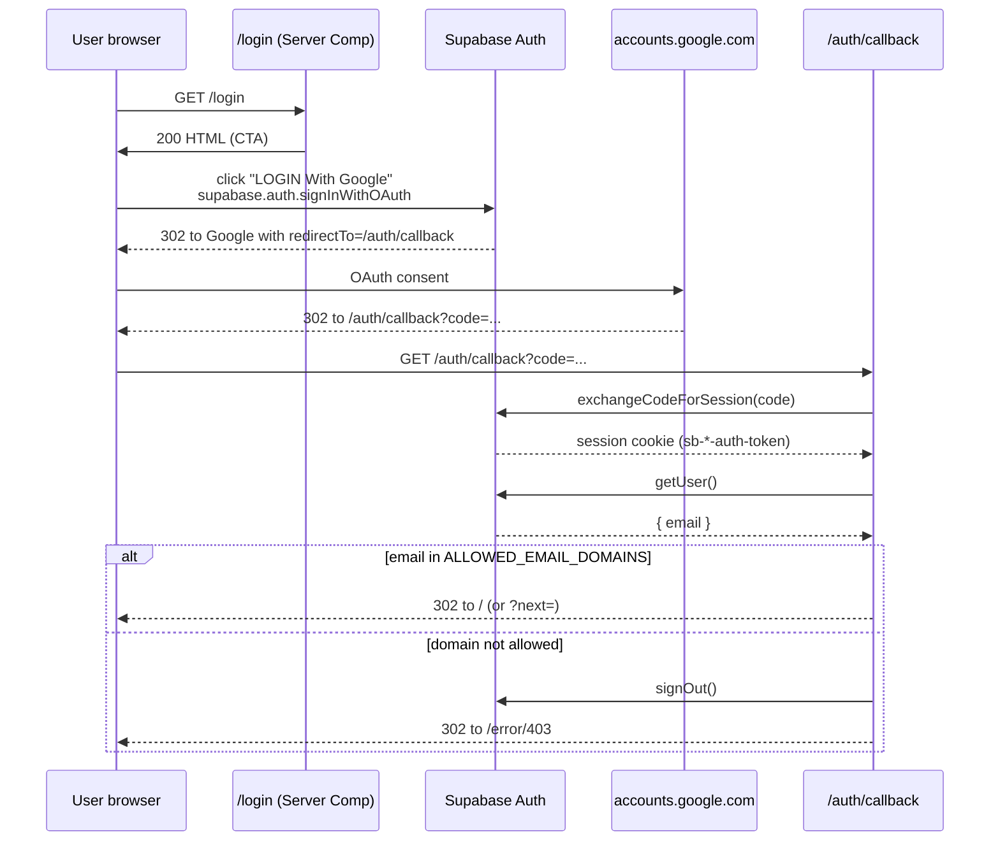

# Authentication — SAA 2025

All authentication in SAA is delegated to **Supabase Auth** with **Google** as the
sole identity provider. There are no passwords, no magic links, and no
self-registration. Access is gated by an email-domain allow-list.

## Flow overview



## Files

| Path | Role |
|---|---|
| [src/app/(public)/login/page.tsx](../src/app/(public)/login/page.tsx) | Server Component; redirects already-signed-in users to `/`, otherwise renders the login UI |
| [src/app/auth/callback/route.ts](../src/app/auth/callback/route.ts) | GET handler; exchanges OAuth code, allow-list check, 302 to `/` or `/error/403` |
| [src/libs/supabase/server.ts](../src/libs/supabase/server.ts) | Server client factory (cookie-aware, from `@supabase/ssr`) |
| [src/libs/supabase/client.ts](../src/libs/supabase/client.ts) | Browser client factory (anon key only) |
| [src/libs/supabase/middleware.ts](../src/libs/supabase/middleware.ts) | `updateSession` — called from root [middleware.ts](../middleware.ts) on every request |
| [src/libs/auth/isAllowedEmail.ts](../src/libs/auth/isAllowedEmail.ts) | Domain allow-list check |
| [src/libs/auth/validateNextParam.ts](../src/libs/auth/validateNextParam.ts) | Open-redirect guard for `?next=` |
| [src/libs/auth/mapOAuthError.ts](../src/libs/auth/mapOAuthError.ts) | Maps Google OAuth error codes onto our 4-state banner |

## How to add an allowed email domain

1. Open `.env.local` (and production env).
2. Update `ALLOWED_EMAIL_DOMAINS` — comma-separated, lowercase:

   ```env
   ALLOWED_EMAIL_DOMAINS=sun-asterisk.com,sun-asterisk.vn,partner-org.com
   ```

3. Restart the dev server (`yarn dev`) or redeploy production so the env schema
   re-validates.
4. Mirror the same list in the Supabase project's Auth → URL allow-list if the
   Supabase dashboard enforces it independently.
5. Add a unit test case in
   [isAllowedEmail.spec.ts](../src/libs/auth/__tests__/isAllowedEmail.spec.ts)
   covering the new domain.

## How to rotate the Supabase anon key

1. In the Supabase dashboard → Settings → API → **Project API keys** → click
   **Regenerate** on the `anon` key.
2. Update `NEXT_PUBLIC_SUPABASE_ANON_KEY` in `.env.local` (dev) and in your
   Cloudflare Workers secrets (prod):

   ```sh
   wrangler secret put NEXT_PUBLIC_SUPABASE_ANON_KEY
   ```

3. Redeploy. Existing session cookies signed with the old JWT secret remain valid
   until they expire (session cookies are signed with the JWT secret, **not** the
   anon key). If you also rotated the JWT secret, all users are logged out.

## Local Supabase setup

For local development (no hitting a real Supabase project):

```sh
# Install Supabase CLI (one-time)
brew install supabase/tap/supabase

# Start local stack — Postgres + Auth + Studio on :54321
make up          # wraps `supabase start`

# `.env.development` is auto-generated with local URLs + keys
# Point `.env.local` to them, OR copy values over:
#   NEXT_PUBLIC_SUPABASE_URL=http://localhost:54321
#   NEXT_PUBLIC_SUPABASE_ANON_KEY=<printed by supabase start>

make dev         # next dev --turbo
```

Google OAuth doesn't work out-of-the-box against local Supabase — for full auth
testing, use a dedicated test project on supabase.com with a Google OAuth client
configured against `http://localhost:54321/auth/v1/callback`.

## Sign out

Sign-out goes through a Server Action so the Supabase session cookie is
cleared server-side before the browser ever sees the next page. The
[`<ProfileMenu />`](../src/components/layout/ProfileMenu.tsx) dropdown in the
header wraps the "Sign out" item in a form whose `action` is
[`signOut`](../src/libs/auth/signOut.ts):

```tsx
<form action={signOut}>
  <button type="submit">{labels.signOut}</button>
</form>
```

`signOut` calls `supabase.auth.signOut()` and then `redirect("/login")`.
Errors from Supabase are swallowed: we still redirect because the intent was
"end this session", and the middleware session-refresh step will re-prompt on
the next request if the cookie is somehow still live.

## Admin role

The `<ProfileMenu />` dropdown conditionally renders an **Admin Dashboard**
link when the user has an admin role. The contract:

- Role source of truth lives in Supabase's `auth.users.app_metadata.role`.
- Servers (Server Components / Server Actions) read it via
  `supabase.auth.getUser()` and `user.app_metadata.role === "admin"`.
- `/admin/*` routes must re-verify server-side — never trust a client-rendered
  UI gate, even though the menu item is hidden for non-admins.

```ts
// src/app/admin/page.tsx (pattern)
const supabase = await createClient();
const { data } = await supabase.auth.getUser();
if (!data.user) redirect("/login");
const role = (data.user.app_metadata as { role?: string } | null)?.role;
if (role !== "admin") redirect("/error/403");
```

To grant admin:

1. In Supabase dashboard → Authentication → Users → pick the user → **User
   Metadata** → edit `app_metadata` → `{ "role": "admin" }`.
2. Or via SQL: `update auth.users set raw_app_meta_data = raw_app_meta_data ||
   '{"role":"admin"}'::jsonb where email = 'you@sun-asterisk.com';`
3. The next `getUser()` call reflects the change — no redeploy needed.

## Security notes

- The anon key is **safe** to expose to the browser as long as RLS is enabled on
  every public schema table (constitution Principle V).
- The **service-role key** (`SUPABASE_SERVICE_ROLE_KEY`) is NEVER sent to the
  client. It's optional in dev; set only when running admin tasks.
- The `NEXT_LOCALE` cookie contains no secret — it's just the user's language
  preference (`vi` or `en`).
- Session cookies are `HttpOnly`, `Secure`, `SameSite=Lax` — enforced by the
  `@supabase/ssr` default cookie writer.
- CSP must allow `accounts.google.com` for the OAuth redirect; the exact
  policy lives in Workers response headers once configured.
